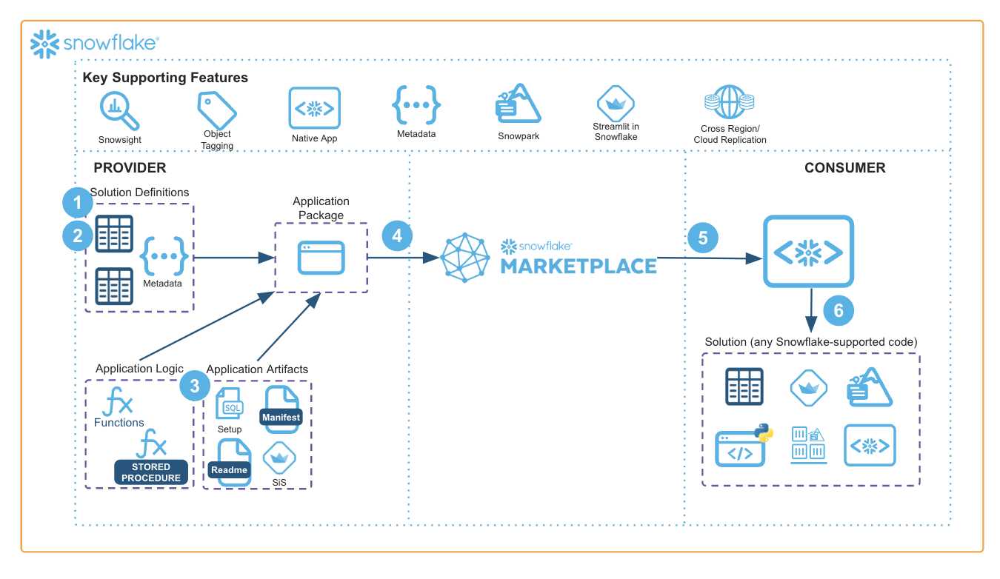

author: Snowflake Staff
id: accelerate-the-deployment-of-snowflake-native-code-using-solution-installation-wizard
summary: The Solution Installation Wizard helps package code (e.g. Native Apps, Streamlit UIs, and more) securely and safely into consumers’ Snowflake environments.
categories: snowflake-site:taxonomy/solution-center/certification/certified-solution
environments: web
language: en
status: Published
feedback link: https://github.com/Snowflake-Labs/sfguides/issues
fork repo link: https://github.com/Snowflake-Labs/sfquickstarts/tree/master/site/sfguides/src/accelerate-the-deployment-of-snowflake-native-code-using-solution-installation-wizard

# Advance Snowflake Native Code Deployment
<!-- ------------------------ -->
## Overview

The Solution Installation Wizard helps package code (e.g. Native Apps, Streamlit UIs, and more) securely and safely into consumers’ Snowflake environments. This wizard is listed in the Snowflake Marketplace for any consumer to install and leverage.

Examples of where one might want to implement the Solution Installation Wizard include:

* Deploying a Native App to a partner as a Provider back to your Snowflake account
* Deploying your Streamlit App to a Consumer through an easy wizard
* Sharing scripts, procedures, or functions that assist a Consumer in getting set up with logic that you wish to provide

<!-- ------------------------ -->
## Solution Architecture: Solution Installation Wizard

* The Provider configures script steps into metadata tables and wraps them into a Native App
* The Provider publishes the Native App to the Snowflake Marketplace
* The Consumer installs the Native App into their Snowflake instance
* The Consumer launches the included Streamlit interface and is walked through the installation process
