```markdown
author: Ali Alladin
id: bridging_semantic_models_snowflake_thoughtspot_coco
summary: Bridge a semantic model between a Snowflake Semantic View and a ThoughtSpot Model using Cortex Code (CoCo) and the open-source thoughtspot-agent-skills, then validate equivalence conversationally.
categories: getting-started, ai, cortex, semantic-views
environments: web
status: Published
feedback link: https://github.com/Snowflake-Labs/sfquickstarts/issues
tags: Cortex Agents, Cortex Code, CoCo, Semantic Views, ThoughtSpot, AI, Getting Started

# Bridging Semantic Models Between Snowflake and ThoughtSpot with Cortex Code (CoCo)
<!-- ------------------------ -->
## Overview
Duration: 2

A semantic model is the contract that lets analysts and AI ask the same business questions and get the same answers. Snowflake's **Semantic Views** and ThoughtSpot's **Models** both express that contract — but historically, keeping them in sync has been a manual chore.

In this quickstart, you'll **bridge a semantic model** between Snowflake and ThoughtSpot using **Cortex Code (CoCo)** — Snowflake's agentic coding experience inside Snowsight Workspaces — together with the open-source [`thoughtspot/thoughtspot-agent-skills`](https://github.com/thoughtspot/thoughtspot-agent-skills) skill pack. You'll generate a Snowflake Semantic View from natural language, push it to ThoughtSpot as a Model, build a Liveboard with one prompt, pull the model back into Snowflake, and let CoCo validate that round-trip conversationally.

### What You Will Learn
- How to install and use the `ts-*` CoCo skills from `thoughtspot-agent-skills`
- How to bootstrap a Snowflake Semantic View over TPC-H with a single CoCo prompt
- How to push a Semantic View to ThoughtSpot as a Model using `/ts-convert-from-snowflake-sv`
- How to generate an executive Liveboard from one SpotterViz prompt
- How to pull a ThoughtSpot Model back into Snowflake using `/ts-convert-to-snowflake-sv`
- How to validate round-trip equivalence conversationally with CoCo

### What You Will Build
- A Snowflake Semantic View `SALES_SV` over TPC-H sample data
- A ThoughtSpot Model derived from that Semantic View
- A multi-tab executive Sales Liveboard
- A round-tripped Semantic View pulled back from ThoughtSpot
- A conversational equivalence report comparing the original and round-tripped views

### Prerequisites
- A Snowflake account with **Snowsight Workspaces** and **Cortex Agents** enabled
- A role with either `SNOWFLAKE.CORTEX_USER` or `SNOWFLAKE.CORTEX_AGENT_USER` granted (the former is granted to `PUBLIC` by default in most accounts)
- Privileges to `CREATE DATABASE`, `CREATE SEMANTIC VIEW`, and run the `SNOWFLAKE_SAMPLE_DATA.TPCH_SF1` shared dataset
- A ThoughtSpot Cloud tenant with permission to create Models and Liveboards
- The four CoCo skills from [`thoughtspot/thoughtspot-agent-skills`](https://github.com/thoughtspot/thoughtspot-agent-skills) installed in your Snowsight Workspace per [`agents/coco/SETUP.md`](https://github.com/thoughtspot/thoughtspot-agent-skills/blob/main/agents/coco/SETUP.md)

| Skill | What it does |
|---|---|
| `ts-profile-thoughtspot` | Profiles your ThoughtSpot tenant so other skills know your endpoints, models, and tags. |
| `ts-setup-sv` | Installs or upgrades the stored procedures the conversion skills depend on. **Run once per Snowflake account.** |
| `ts-convert-from-snowflake-sv` | Converts a Snowflake Semantic View into a ThoughtSpot Model. |
| `ts-convert-to-snowflake-sv` | Converts a ThoughtSpot Model into a Snowflake Semantic View. |

<!-- ------------------------ -->
## Set Up the Source Data
Duration: 3

You'll use Snowflake's shared `SNOWFLAKE_SAMPLE_DATA.TPCH_SF1` dataset as the source for your semantic view. No data load required — just a working database and schema for your own objects.

Open a Snowsight worksheet and run:

```sql
USE ROLE SYSADMIN;
USE WAREHOUSE COMPUTE_WH;

CREATE DATABASE IF NOT EXISTS TS_AGENT_DEMO;
CREATE SCHEMA   IF NOT EXISTS TS_AGENT_DEMO.SALES;

-- Sanity check the source data
SELECT 'ORDERS'   AS tbl, COUNT(*) AS row_count FROM SNOWFLAKE_SAMPLE_DATA.TPCH_SF1.ORDERS
UNION ALL
SELECT 'LINEITEM',         COUNT(*)             FROM SNOWFLAKE_SAMPLE_DATA.TPCH_SF1.LINEITEM
UNION ALL
SELECT 'CUSTOMER',         COUNT(*)             FROM SNOWFLAKE_SAMPLE_DATA.TPCH_SF1.CUSTOMER
UNION ALL
SELECT 'NATION',           COUNT(*)             FROM SNOWFLAKE_SAMPLE_DATA.TPCH_SF1.NATION;
```

You should see roughly:

| tbl | row_count |
|---|---|
| ORDERS | 1,500,000 |
| LINEITEM | 6,001,215 |
| CUSTOMER | 150,000 |
| NATION | 25 |

Then confirm there are no semantic views in your target schema yet:

```sql
SHOW SEMANTIC VIEWS IN SCHEMA TS_AGENT_DEMO.SALES;
```

The result set should be empty.

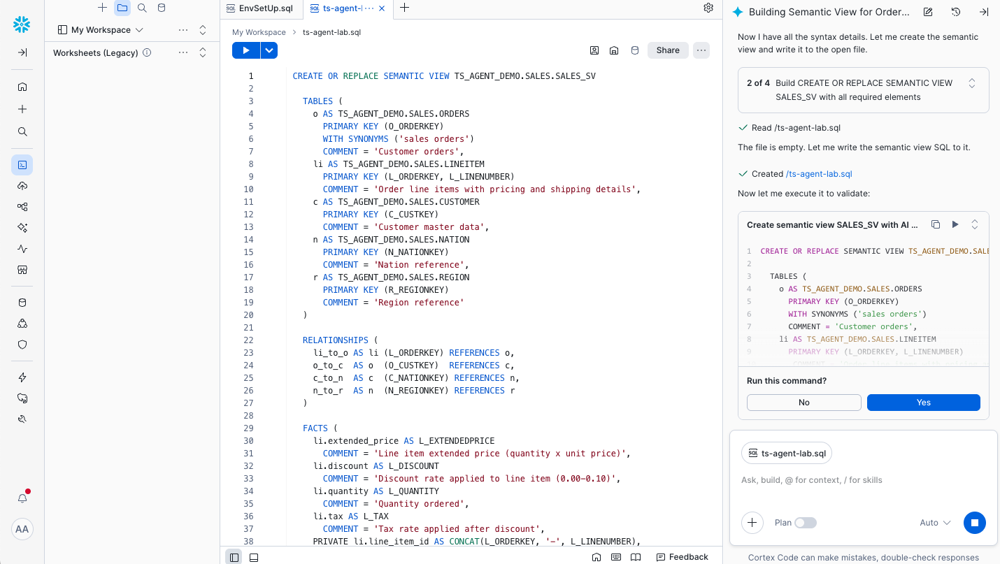

<!-- ------------------------ -->
## Open CoCo and Verify Skills
Duration: 3

In Snowsight, open a **Workspace** and start a **Cortex Code (CoCo)** session. In the Workspace file tree, confirm that the four skill folders are present under `.snowflake/cortex/skills/` per the Workspace file structure documented in [`agents/coco/SETUP.md`](https://github.com/thoughtspot/thoughtspot-agent-skills/blob/main/agents/coco/SETUP.md):

- `ts-profile-thoughtspot/`
- `ts-setup-sv/`
- `ts-convert-from-snowflake-sv/`
- `ts-convert-to-snowflake-sv/`

Each folder contains a `SKILL.md` that CoCo reads at session start.

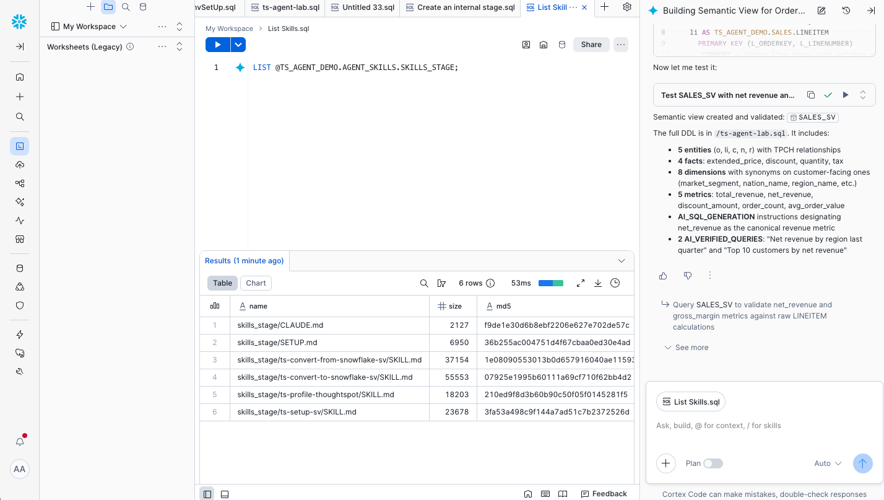

In the CoCo chat, type `/` to see the available slash commands; you should see all four `ts-*` skills listed.

<!-- ------------------------ -->
## Install the Stored Procedures (One-Time Setup)
Duration: 2

The conversion skills depend on stored procedures that ship with the skill pack. Install them once per Snowflake account before running any conversion:

```
/ts-setup-sv
```

CoCo will create or upgrade the supporting procedures in your designated database. Wait for the success message before continuing.

> aside negative
> **If you skip this step**, `/ts-convert-from-snowflake-sv` and `/ts-convert-to-snowflake-sv` will fail because their underlying procedures aren't installed.

<!-- ------------------------ -->
## Profile Your ThoughtSpot Tenant
Duration: 2

So that the conversion skills know how to talk to your ThoughtSpot tenant, profile it once:

```
/ts-profile-thoughtspot
```

CoCo will prompt you for your ThoughtSpot URL and authentication. Once complete, it stores the tenant profile in your Workspace so subsequent skills can use it without re-asking.

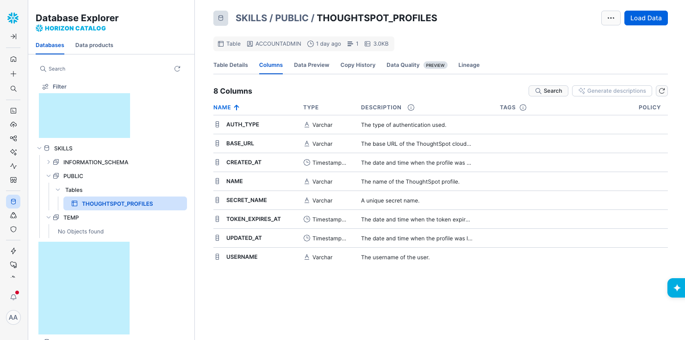

<!-- ------------------------ -->
## Create a Semantic View from a Prompt
Duration: 5

Now have CoCo author a `SALES_SV` Semantic View over TPC-H. Paste a prompt like:

> Create a Snowflake Semantic View named `SALES_SV` in `TS_AGENT_DEMO.SALES` over `SNOWFLAKE_SAMPLE_DATA.TPCH_SF1`. Use `LINEITEM` as the fact and join `ORDERS`, `CUSTOMER`, and `NATION`. Define dimensions for order date, customer market segment, and nation name. Define metrics for total revenue (`l_extendedprice * (1 - l_discount)`), total quantity, and order count. Add descriptions, synonyms, and any AI metadata supported by `CREATE SEMANTIC VIEW` in this account. Show me the DDL before executing.

CoCo will draft the `CREATE SEMANTIC VIEW` statement.

> aside positive
> **Review the DDL before executing.** Cross-check CoCo's output against the [`CREATE SEMANTIC VIEW` reference](https://docs.snowflake.com/en/sql-reference/sql/create-semantic-view) — Snowflake adds Semantic View features regularly, and not every clause is supported in every account. If CoCo proposes a clause that doesn't compile in your region, ask it to re-emit without that clause.

After execution, verify:

```sql
SHOW SEMANTIC VIEWS IN SCHEMA TS_AGENT_DEMO.SALES;
```

You should see `SALES_SV` listed with its `database_name`, `schema_name`, `owner`, and `created_on`.

<!-- ------------------------ -->
## Push the Semantic View to ThoughtSpot
Duration: 4

With `SALES_SV` in place, convert it to a ThoughtSpot Model:

```
/ts-convert-from-snowflake-sv
```

Tell CoCo to convert `TS_AGENT_DEMO.SALES.SALES_SV`. CoCo will:

1. Read the Semantic View's structure (dimensions, metrics, descriptions, synonyms).
2. Generate the equivalent ThoughtSpot Model via the ThoughtSpot APIs.
3. Return the new Model's name and a link to it in ThoughtSpot.

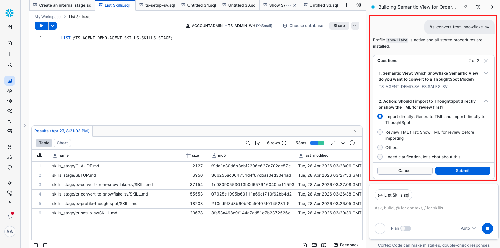

CoCo will display the target Model name when complete; note it down — you'll use it in the next step.

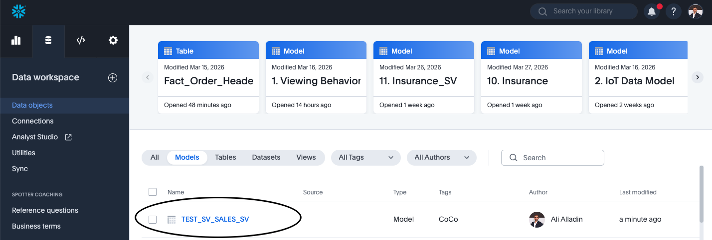

<!-- ------------------------ -->
## Ask Spotter a Few Questions
Duration: 3

Switch to ThoughtSpot, open the new Model, and click **Spotter** (ThoughtSpot's AI analyst). Try a few prompts to confirm the model's metrics and dimensions came across correctly:

- "What was total revenue by region last year?"
- "Top 10 nations by order count"
- "Revenue trend by month for the AUTOMOBILE market segment"

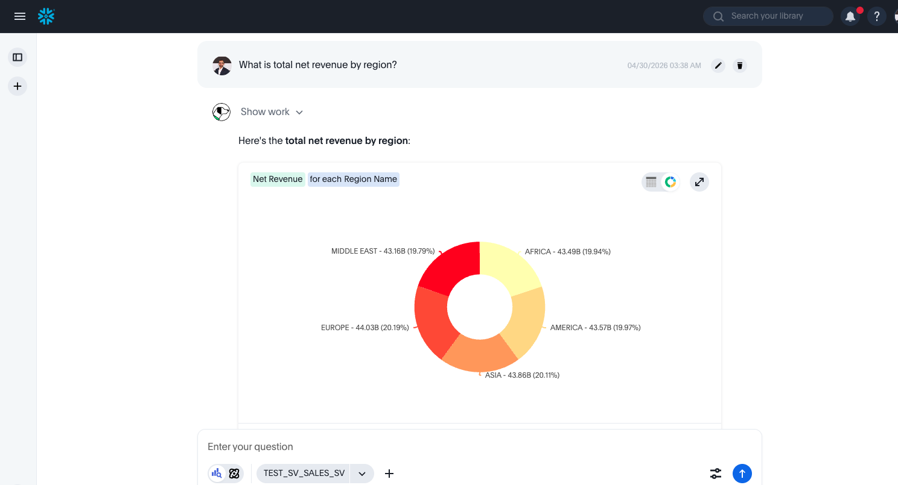

You should get clean answers that respect the metric definitions you set in `SALES_SV` — that's your signal that the semantic contract survived the trip.

<!-- ------------------------ -->
## Build a Liveboard with SpotterViz
Duration: 4

ThoughtSpot's **SpotterViz** turns a single prompt into a multi-visualization Liveboard. From the Model, open SpotterViz and paste:

> Build an executive sales Liveboard with two tabs. Tab 1 "Overview": KPI tiles for total revenue, total orders, total quantity, and average order value; a revenue-by-month line chart for the last 24 months; a revenue-by-market-segment bar chart. Tab 2 "Regional": revenue by nation map, top 10 nations by revenue, and a regional revenue trend line.

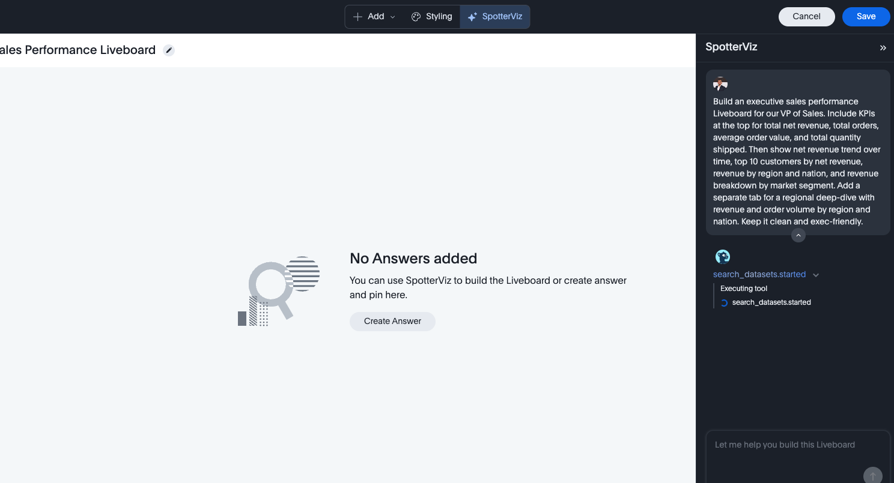

After a few seconds, SpotterViz produces a working two-tab Liveboard.

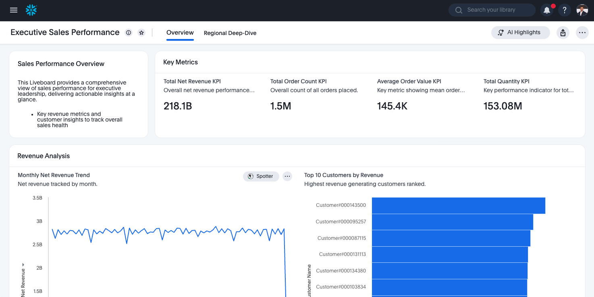

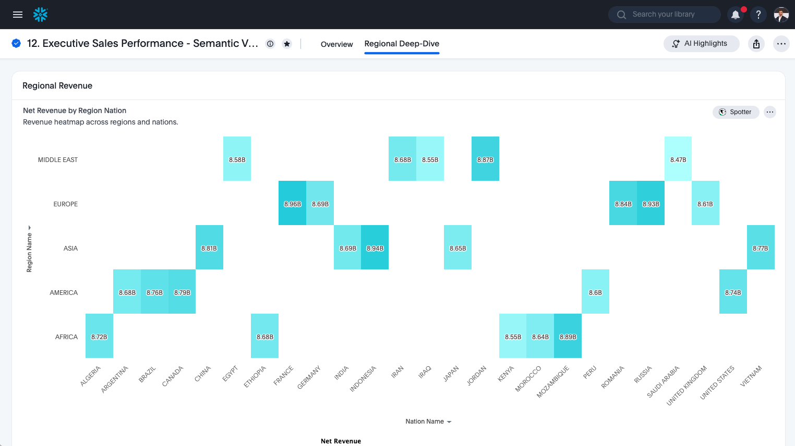

This is the part that usually surprises people: from one Snowflake Semantic View and one English prompt, you have an exec-ready Liveboard.

<!-- ------------------------ -->
## Pull the Model Back into Snowflake
Duration: 4

Now close the loop. Return to CoCo and run:

```
/ts-convert-to-snowflake-sv
```

Point it at the ThoughtSpot Model you created in the earlier step. CoCo will read the Model definition from ThoughtSpot and emit a Snowflake `CREATE SEMANTIC VIEW` statement for the round-tripped view. Review the DDL, then execute.

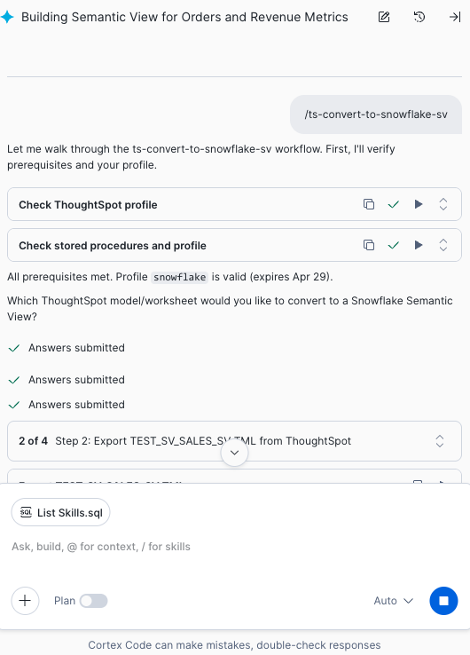

CoCo will prompt you for the target view name; pick something distinct from `SALES_SV` (for example `SALES_SV_ROUNDTRIP`) so you can compare the two side by side.

Verify:

```sql
SHOW SEMANTIC VIEWS IN SCHEMA TS_AGENT_DEMO.SALES;
```

You should now see both your original `SALES_SV` and the round-tripped view.

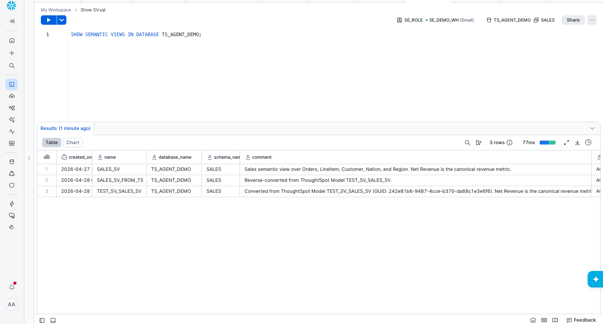

<!-- ------------------------ -->
## Validate the Round-Trip Conversationally
Duration: 4

Here's where CoCo earns its keep. Ask it to compare the two views:

> Compare the dimensions and metrics of `TS_AGENT_DEMO.SALES.SALES_SV` and `TS_AGENT_DEMO.SALES.SALES_SV_ROUNDTRIP`. List anything missing, renamed, or semantically different. For each metric, run a query that computes the metric on both views with the same filter (last full year, all segments) and report any value differences.

CoCo will introspect both views, generate matching aggregation queries, and show you a structural and numerical diff.

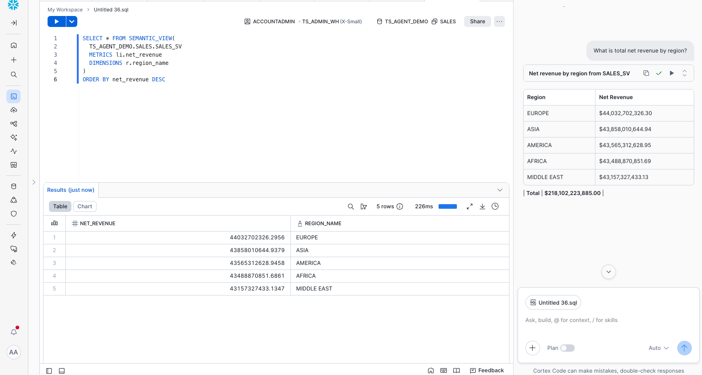

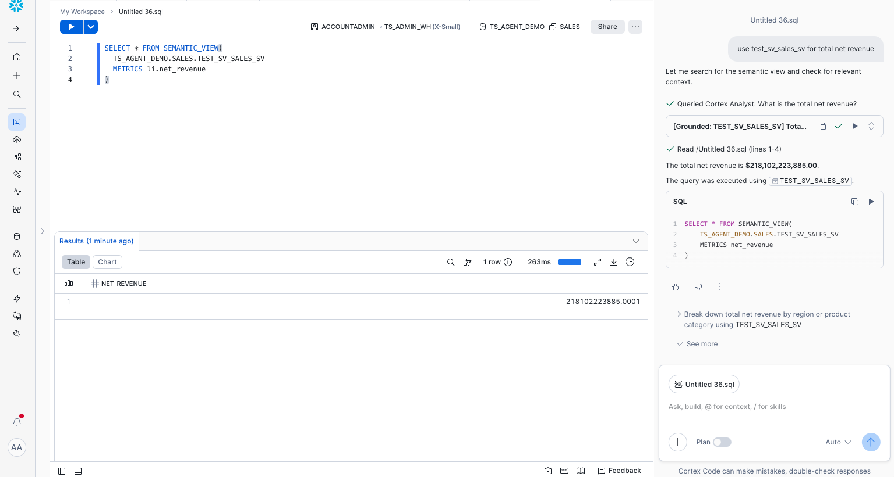

Expect minor cosmetic differences (descriptions, synonyms, casing) but the metric values should match. Anything material is a bug worth filing against the skill pack — the maintainers are responsive on the [`thoughtspot-agent-skills` issue tracker](https://github.com/thoughtspot/thoughtspot-agent-skills/issues).

<!-- ------------------------ -->
## Conclusion And Resources
Duration: 1

You just bridged a semantic model end-to-end across two platforms — and you barely wrote any SQL. The CoCo skills handled the conversions, ThoughtSpot's Spotter and SpotterViz handled the analysis, and CoCo handled the validation in plain English.

### What You Learned
- How to install and operate the `ts-*` CoCo skill pack
- How to author a Snowflake Semantic View from a prompt
- How to convert Semantic Views to ThoughtSpot Models and back
- How to validate semantic equivalence conversationally

### Related Resources
- [`thoughtspot/thoughtspot-agent-skills`](https://github.com/thoughtspot/thoughtspot-agent-skills) — the open-source skill pack
- [`agents/coco/SETUP.md`](https://github.com/thoughtspot/thoughtspot-agent-skills/blob/main/agents/coco/SETUP.md) — CoCo install steps
- [Snowflake Cortex Agents documentation](https://docs.snowflake.com/en/user-guide/snowflake-cortex/cortex-agents)
- [`CREATE SEMANTIC VIEW` reference](https://docs.snowflake.com/en/sql-reference/sql/create-semantic-view)
- [Semantic Views overview](https://docs.snowflake.com/en/user-guide/views-semantic/overview)
- [ThoughtSpot Models](https://docs.thoughtspot.com/cloud/latest/models)
```
