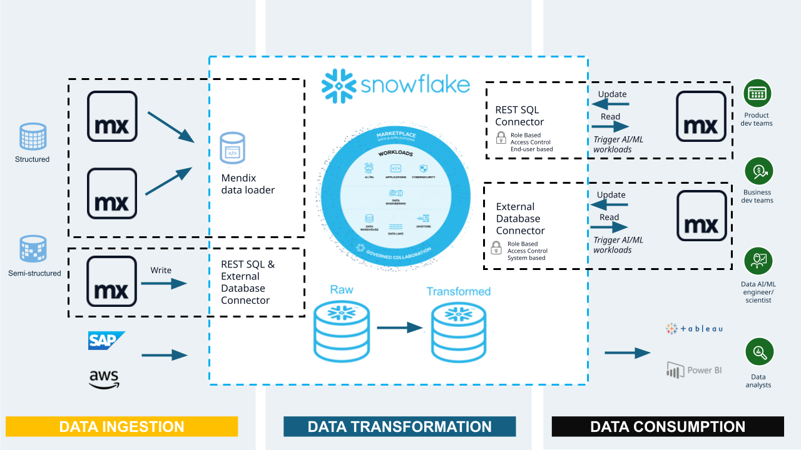

author: Rick Cameron, Robert Van 't Hof
id: build-ai-enabled-enterprise-applications-that-drive-action-from-your-snowflake-data-with-mendix
summary: Mendix is the low-code leader, helping organizations build better software, faster. Seamless integrations for Snowflake provide simple, direct access to your Snowflake data from within the Mendix developer experience.
categories: snowflake-site:taxonomy/solution-center/certification/partner-solution
environments: web
language: en
status: Published
feedback link: https://github.com/Snowflake-Labs/sfguides/issues

# Build AI-Enabled Enterprise Applications That Drive Action From Your Snowflake Data With Mendix
<!-- ------------------------ -->
## Overview

* Mendix is the low-code leader, helping organizations build better software, faster.
* Seamless integrations for Snowflake provide simple, direct access to your Snowflake data from within the Mendix developer experience, while preserving the highest standards for security and robustness provided by Snowflake.
* Quickly build AI-enabled web and native mobile applications to [drive business outcomes from your data](https://www.mendix.com/blog/double-the-power-of-your-data-with-mendix-and-snowflake/)
* Automatically load operational data from your Mendix applications  with the [Mendix Data Loader](https://quickstarts.snowflake.com/guide/mendix_data_loader/index.html#0) to Snowflake and share it across your organization
* [See the Mendix connector for Snowflake in action to quickly build customer experiences on top of your Snowflake data](https://www.youtube.com/watch?v=ejScrFx8HMI)

<!-- ------------------------ -->
## Solution Architecture: Mendix/Snowflake Connectivity for Data & AI

* Mendix Data Loader - A Snowflake Native App from the Snowflake Marketplace to load data from your Mendix application landscape into Snowflake.
* External Database Connector and REST SQL Connector - Connectors that are used within Mendix Applications to bi-directionally work with Snowflake Data & AI/ML capabilities (eg. Cortex AI) with ease.
* Mendix Applications are fully standalone applications with their own front-end and database that run independently to provide direct business value.
* The applications work on desktop, phone and tablet, with offline-data access available. They feature a rich user-experience that make it easy for anyone to access and interact with your data, using a robust Role-based Access Control system to keep your data secure.

<!-- ------------------------ -->
## Get Started

- [view quickstart](https://quickstarts.snowflake.com/guide/mendix_data_loader/#0)
- [View the quickstart guide](https://quickstarts.snowflake.com/guide/mendix_data_loader)
- [Download reference architecture](https://www.snowflake.com/content/dam/snowflake-site/developers/2025/build-ai-enabled-enterprise-applications)
- [Read the blog](https://www.mendix.com/blog/double-the-power-of-your-data-with-mendix-and-snowflake/)
