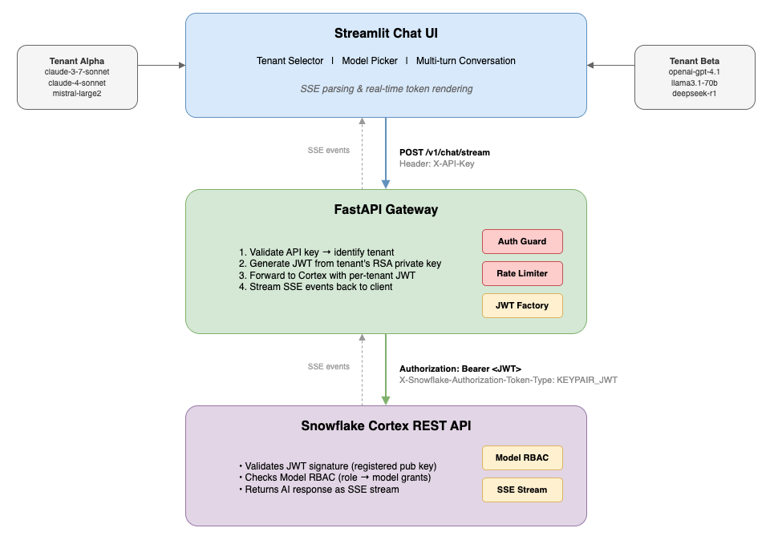

author: Navnit Shukla
id: build-multi-tenant-ai-chat-application-with-cortex-rest-api
language: en
summary: Build a multi-tenant AI chat application with FastAPI, Streamlit, Key Pair JWT auth, and Snowflake Cortex REST API with real-time SSE streaming.
categories: snowflake-site:taxonomy/solution-center/certification/quickstart, snowflake-site:taxonomy/product/ai, snowflake-site:taxonomy/snowflake-feature/cortex-llm-functions, snowflake-site:taxonomy/snowflake-feature/compliance-security-discovery-governance, snowflake-site:taxonomy/snowflake-feature/build
environments: web
status: Published
feedback link: https://github.com/Snowflake-Labs/sfguides/issues
fork repo link: https://github.com/sfc-gh-nashukla/sfquickstarts_multitenat

# Build a Multi-Tenant AI Chat App with Snowflake Cortex REST API

<!-- ------------------------ -->
## Overview

Through this guide, you will build a **multi-tenant AI chat application** that streams responses in real time using Snowflake's Cortex REST API. The system uses **Key Pair JWT authentication** and **Snowflake-native Model RBAC** to control which AI models each tenant can access — all enforced by SQL GRANT statements, not application code.

Each tenant is fully isolated at the Snowflake infrastructure level:

- **Separate Snowflake user** — dedicated service user per tenant (e.g., `COCO_USER_ALPHA`)
- **Separate Snowflake role** — dedicated role with its own grants (e.g., `COCO_TENANT_ALPHA`)
- **Separate RSA key pair** — each tenant authenticates with their own private key
- **Separate model grants** — Snowflake RBAC controls which AI models each tenant can call
- **Separate rate limits** — per-tenant request throttling at the gateway
- **Separate API keys** — gateway-level authentication per tenant

By the end, you'll have a working FastAPI gateway and Streamlit chat interface where two tenants (Alpha and Beta) each see only the models they're authorized to use, with unauthorized attempts blocked by Snowflake itself.



### Demo

<video id="demo-video" autoplay controls muted>
    <source src="assets/multi_tenant_demo.mp4" type="video/mp4">
</video>

### Prerequisites

- Basic familiarity with Python, REST APIs, and terminal commands

### What You'll Learn

- Calling Snowflake Cortex REST API with SSE streaming for real-time AI chat
- Key Pair JWT authentication for multi-tenant access (no static passwords)
- Snowflake Model RBAC to control model access per tenant via SQL GRANT/REVOKE
- Building a streaming chat UI with Streamlit that handles multi-turn conversations

### What You'll Need

- A [Snowflake account](https://signup.snowflake.com/?utm_source=snowflake-devrel&utm_medium=developer-guides&utm_cta=developer-guides) with ACCOUNTADMIN access
- [Python 3.11+](https://www.python.org/downloads/) installed
- OpenSSL installed (for RSA key generation)
- A code editor (e.g., [VS Code](https://code.visualstudio.com/download))

### What You'll Build

- A **FastAPI gateway** with per-tenant auth, rate limiting, and SSE streaming
- A **JWT token factory** that generates short-lived tokens from RSA key pairs
- A **Streamlit chat interface** with tenant switching, model selection, and streaming responses

<!-- ------------------------ -->
## Environment Setup

### Clone and Run Setup

Clone the repository and run the setup script, which creates a virtual environment, installs dependencies, and generates RSA key pairs for both tenants:

```bash
git clone https://github.com/Snowflake-Labs/sfquickstarts.git
cd sfquickstarts/site/sfguides/src/build-multi-tenant-ai-chat-application-with-cortex-rest-api/assets

bash setup.sh
```

### Project Structure

The `assets/` folder contains the complete project:

| Path | Description |
|------|-------------|
| `app/core/jwt_helper.py` | JWT token factory — generates short-lived tokens from RSA key pairs |
| `app/core/config.py` | Settings — reads `.env` via pydantic-settings |
| `app/core/tenants.py` | Tenant registry — maps API keys to Snowflake users/roles |
| `app/api/v1/dependencies.py` | Auth guard + per-tenant rate limiting |
| `app/api/v1/routes.py` | API endpoints — streaming chat route |
| `app/models/schemas.py` | Request/response Pydantic models |
| `app/services/cortex_client.py` | Cortex REST API client — SSE streaming |
| `app/main.py` | FastAPI application entry point |
| `streamlit_app/streamlit_app.py` | Streamlit entry point |
| `streamlit_app/app_pages/chat.py` | AI Chat page with SSE parsing |
| `01_rbac_setup.sql` | Snowflake roles, users, and key registration |
| `02_enable_model_rbac.sql` | Model RBAC grants per tenant |
| `03_bonus_table_agent_rbac.sql` | Optional: table + agent RBAC for Cortex Agents |

### Configure Environment Variables

Edit the `.env` file (created from `.env.example` by `setup.sh`):

```env
SNOWFLAKE_ACCOUNT=YOUR_ACCOUNT_IDENTIFIER

ALPHA_SNOWFLAKE_USER=COCO_USER_ALPHA
ALPHA_PRIVATE_KEY_PATH=keys/alpha_rsa_key.p8

BETA_SNOWFLAKE_USER=COCO_USER_BETA
BETA_PRIVATE_KEY_PATH=keys/beta_rsa_key.p8

COCO_PORT=8000
LOG_LEVEL=INFO
```

> Replace `YOUR_ACCOUNT_IDENTIFIER` with your Snowflake account identifier (e.g., `MYORG-MYACCOUNT`).

> **Accounts with underscores:** If your account identifier contains underscores (e.g., `MYORG-MY_ACCOUNT`), the auto-generated Cortex URL will fail due to SSL hostname validation. Add this line using your **account locator** instead:
>
> ```env
> CORTEX_BASE_URL_OVERRIDE=https://YOUR_ACCOUNT_LOCATOR.snowflakecomputing.com/api/v2/cortex
> ```
>
> Find your account locator by running `SELECT CURRENT_ACCOUNT();` in Snowsight.

<!-- ------------------------ -->
## Snowflake RBAC Setup

Navigate to [Projects → Workspaces](https://app.snowflake.com/_deeplink/#/workspaces?utm_source=snowflake-devrel&utm_medium=developer-guides&utm_content=build-ai-chat-cortex-rest-api&utm_cta=developer-guides-deeplink) in Snowsight and create a new SQL worksheet. Run the following scripts in order.

### Step 1: Create Roles and Users

Run `assets/01_rbac_setup.sql` to create tenant roles, service users, and register RSA public keys:

```sql
USE ROLE ACCOUNTADMIN;

-- Create tenant roles
CREATE ROLE IF NOT EXISTS COCO_TENANT_ALPHA;
CREATE ROLE IF NOT EXISTS COCO_TENANT_BETA;

-- Grant Cortex access to both roles
GRANT DATABASE ROLE SNOWFLAKE.CORTEX_USER TO ROLE COCO_TENANT_ALPHA;
GRANT DATABASE ROLE SNOWFLAKE.CORTEX_USER TO ROLE COCO_TENANT_BETA;

-- Create service users (TYPE=SERVICE means no interactive login)
CREATE USER IF NOT EXISTS COCO_USER_ALPHA
    TYPE = SERVICE
    DEFAULT_ROLE = COCO_TENANT_ALPHA;
CREATE USER IF NOT EXISTS COCO_USER_BETA
    TYPE = SERVICE
    DEFAULT_ROLE = COCO_TENANT_BETA;

-- Assign roles
GRANT ROLE COCO_TENANT_ALPHA TO USER COCO_USER_ALPHA;
GRANT ROLE COCO_TENANT_BETA TO USER COCO_USER_BETA;

-- Register RSA public keys (replace with your actual keys)
ALTER USER COCO_USER_ALPHA SET RSA_PUBLIC_KEY='MIIBIjANBgkqhki...your-alpha-key...';
ALTER USER COCO_USER_BETA  SET RSA_PUBLIC_KEY='MIIBIjANBgkqhki...your-beta-key...';
```

> **Tip:** Extract the key content without the BEGIN/END lines:
> ```bash
> awk 'NR>1 && !/END/' keys/alpha_rsa_key.pub | tr -d '\n'
> ```

### Step 2: Enable Model RBAC

Run `assets/02_enable_model_rbac.sql` to enforce strict model access:

```sql
USE ROLE ACCOUNTADMIN;

CALL SNOWFLAKE.MODELS.CORTEX_BASE_MODELS_REFRESH();
ALTER ACCOUNT SET CORTEX_MODELS_ALLOWLIST = 'None';

-- Alpha models
GRANT APPLICATION ROLE SNOWFLAKE."CORTEX-MODEL-ROLE-CLAUDE-4-SONNET" TO ROLE COCO_TENANT_ALPHA;
GRANT APPLICATION ROLE SNOWFLAKE."CORTEX-MODEL-ROLE-MISTRAL-LARGE2" TO ROLE COCO_TENANT_ALPHA;

-- Beta models
GRANT APPLICATION ROLE SNOWFLAKE."CORTEX-MODEL-ROLE-OPENAI-GPT-4.1" TO ROLE COCO_TENANT_BETA;
GRANT APPLICATION ROLE SNOWFLAKE."CORTEX-MODEL-ROLE-LLAMA3.1-70B" TO ROLE COCO_TENANT_BETA;
GRANT APPLICATION ROLE SNOWFLAKE."CORTEX-MODEL-ROLE-DEEPSEEK-R1" TO ROLE COCO_TENANT_BETA;
```

Model access is now controlled entirely by SQL. To add or remove a model for any tenant, run a single `GRANT` or `REVOKE` — no code changes or redeployment needed.

<!-- ------------------------ -->
## How the Gateway Works

The gateway is a FastAPI application that sits between the Streamlit UI and Snowflake Cortex. Here's how the key components work together.

### JWT Token Factory (`app/core/jwt_helper.py`)

Each tenant authenticates with Snowflake using a short-lived JWT generated from their RSA private key. The factory:

1. Reads the tenant's RSA private key from disk (once, then cached)
2. Computes the public key fingerprint (SHA256 hash)
3. Builds a JWT payload (issuer, subject, issued-at, expiry)
4. Signs it with the private key using RS256
5. Caches the token and auto-refreshes when < 5 minutes remain

```python
payload = {
    "iss": f"{self.qualified_username}.{self._public_key_fp}",
    "sub": self.qualified_username,
    "iat": iat,
    "exp": exp,
}
token = jwt.encode(payload, self._private_key, algorithm="RS256")
```

### Tenant Registry (`app/core/tenants.py`)

Maps API keys to Snowflake users and roles. Each tenant has:

| Field | Alpha | Beta |
|-------|-------|------|
| Snowflake User | `COCO_USER_ALPHA` | `COCO_USER_BETA` |
| Snowflake Role | `COCO_TENANT_ALPHA` | `COCO_TENANT_BETA` |
| Default Model | `claude-4-sonnet` | `openai-gpt-4.1` |
| Rate Limit | 60 req/min | 30 req/min |
| API Key | `sk-alpha-secret-key-001` | `sk-beta-secret-key-001` |

### Cortex REST API Client (`app/services/cortex_client.py`)

Calls the Snowflake Cortex OpenAI-compatible endpoint (`/v1/chat/completions`) and re-emits the response as structured SSE events:

| Event | Purpose | When |
|-------|---------|------|
| `meta` | Request metadata (id, model, tenant) | First event |
| `delta` | Content chunk (one per token) | During streaming |
| `done` | Final stats (latency, token usage) | Last event |
| `error` | Error details (status, message) | On failure |

```python
url = f"{self.base_url}/v1/chat/completions"
body = {
    "model": model,
    "messages": messages,
    "max_completion_tokens": request.max_tokens,
    "temperature": request.temperature,
    "stream": True,
}
```

### Auth Guard (`app/api/v1/dependencies.py`)

A FastAPI dependency that runs before every route:

1. **Authenticate** — validates the `X-API-Key` header against the tenant registry
2. **Rate limit** — enforces a per-tenant sliding window (60-second window)
3. **Inject tenant** — returns the `Tenant` object to the route handler

<!-- ------------------------ -->
## How the Streamlit Chat Works

The Streamlit app (`streamlit_app/app_pages/chat.py`) provides a ChatGPT-like interface that connects to the FastAPI gateway.

### Flow

1. User picks a **tenant** (User Alpha or User Beta) in the sidebar — this selects the API key and available models
2. User types a message in the chat input
3. The full conversation history is sent to the gateway via `POST /v1/chat/stream`
4. The gateway generates a per-tenant JWT and forwards to Cortex
5. Cortex streams tokens back as SSE events
6. Each `delta` event appends text to the chat bubble in real time
7. The `▌` cursor shows the response is still generating

```python
with httpx.stream("POST", f"{GATEWAY_URL}/v1/chat/stream",
                   json=payload, headers=headers, timeout=60.0) as response:
    for line in response.iter_lines():
        if line.startswith("data:"):
            data = json.loads(line[len("data:"):].strip())
            if current_event == "delta":
                full_response += data.get("content", "")
                placeholder.markdown(full_response + "▌")
```

> **Model access is Snowflake-native:** The models list in the UI is a hint. Real enforcement happens via Model RBAC — if a model is listed but not granted to the tenant's role, Snowflake returns 403.

<!-- ------------------------ -->
## Run and Test

### Start the Gateway

```bash
source venv/bin/activate
python3 -m uvicorn app.main:app --host 0.0.0.0 --port 8000 --reload
```

Verify it's running:

```bash
curl http://localhost:8000/healthz
# {"status":"ok"}
```

### Start the Streamlit App

In a separate terminal:

```bash
source venv/bin/activate
cd streamlit_app
streamlit run streamlit_app.py --server.port 8501
```

Open `http://localhost:8501` in your browser.

### Test Streaming Chat via curl

```bash
curl -N -X POST http://localhost:8000/v1/chat/stream \
  -H "Content-Type: application/json" \
  -H "X-API-Key: sk-alpha-secret-key-001" \
  -d '{"message": "What is Snowflake Cortex?", "model": "claude-4-sonnet"}'
```

You'll see SSE events streaming in real time:

```
event: meta
data: {"id": "coco_req_abc123", "model": "claude-4-sonnet", "tenant_id": "tenant-alpha"}

event: delta
data: {"content": "Snowflake"}

event: delta
data: {"content": " Cortex"}
...

event: done
data: {"id": "coco_req_abc123", "latency_ms": 2340, "usage": {"prompt_tokens": 12, "completion_tokens": 89}}
```

### Test RBAC Denial

Beta tries to use Claude (not granted):

```bash
curl -N -X POST http://localhost:8000/v1/chat/stream \
  -H "Content-Type: application/json" \
  -H "X-API-Key: sk-beta-secret-key-001" \
  -d '{"message": "Hello", "model": "claude-4-sonnet"}'
```

Snowflake returns an SSE error event — model not authorized for this role.

<!-- ------------------------ -->
## Bonus: Extending to Cortex Agents

This guide focuses on the Cortex REST API for LLM chat. If you want to extend the same multi-tenant gateway to invoke **Cortex Agents** (which combine text-to-SQL, semantic search, and tool orchestration), the same RBAC pattern applies — grant each tenant role access to the agent and its underlying data.

A reference SQL script is included at `assets/03_bonus_table_agent_rbac.sql` showing the required grants:

| Grant Type | What It Enables |
|-----------|----------------|
| `USAGE ON WAREHOUSE` | Running queries |
| `USAGE ON DATABASE/SCHEMA` | Accessing the data layer |
| `SELECT ON TABLE` | Reading specific tables |
| `USAGE ON CORTEX AGENT` | Invoking Cortex Agents |
| `USAGE ON CORTEX SEARCH SERVICE` | Semantic search |

> **Tip:** To restrict an agent to only certain tenants, simply omit the `GRANT` for that role. Snowflake will return a permission error — no application code changes needed.

To learn more about building Cortex Agents, see:
- [Cortex Agent Documentation](https://docs.snowflake.com/en/user-guide/snowflake-cortex/cortex-agent)
- [Multi-Agent Orchestration with Snowflake Cortex MCP](https://www.snowflake.com/en/developers/guides/multi-agent-orchestration-with-snowflake-cortex-mcp-and-microsoft-ai-foundry/)

<!-- ------------------------ -->
## Conclusion And Resources

Congratulations! You've built a multi-tenant AI chat application with:

- **Real-time SSE streaming** — token-by-token responses from Snowflake Cortex REST API
- **Key Pair JWT auth** — short-lived, auto-rotating tokens per tenant with no static passwords
- **Snowflake Model RBAC** — model access controlled by SQL `GRANT`/`REVOKE`, enforced by Snowflake itself
- **Multi-turn conversation** — full conversation history sent to Cortex for contextual replies
- **Per-tenant rate limiting** — sliding window enforcement per API key

### What You Learned

- Calling Snowflake Cortex REST API with SSE streaming for real-time AI chat
- Implementing Key Pair JWT authentication for multi-tenant security
- Using Snowflake Model RBAC for governance without application-level authorization code
- Building a streaming chat UI with Streamlit that parses SSE events

### Related Resources

- [Snowflake Cortex AI Documentation](https://docs.snowflake.com/en/user-guide/snowflake-cortex)
- [Cortex REST API Reference](https://docs.snowflake.com/en/user-guide/snowflake-cortex/cortex-llm-rest-api)
- [Key Pair Authentication](https://docs.snowflake.com/en/user-guide/key-pair-auth)
- [Cortex Model RBAC](https://docs.snowflake.com/en/user-guide/snowflake-cortex/cortex-llm-rbac)
- [FastAPI Documentation](https://fastapi.tiangolo.com/)
- [Streamlit Documentation](https://docs.streamlit.io/)
