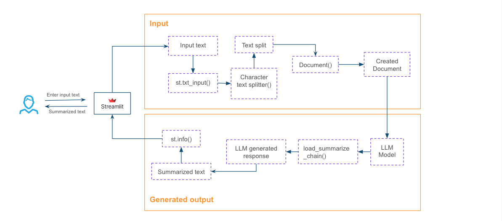

author: Chanin Nantasenamat
id: building-an-llm-large-language-model-application-with-snowflake-and-streamlit
summary: This solution architecture covers how to build an LLM application that uses different tool stack. It covers several use-cases such as: Text summarization with LLMs using Streamlit and Langchain Data exploration with LLM powered chatbot Run sentiment
categories: snowflake-site:taxonomy/solution-center/certification/community-solution
environments: web
language: en
status: Published
feedback link: https://github.com/Snowflake-Labs/sfguides/issues
fork repo link: https://github.com/Snowflake-Labs/sfquickstarts/tree/master/site/sfguides/src/building-an-llm-large-language-model-application-with-snowflake-and-streamlit

# Building an LLM (Large Language Model) Application
<!-- ------------------------ -->
## Overview

This solution architecture covers how to build an LLM application that uses different tool stack. It covers several use-cases such as:

* Text summarization with LLMs using Streamlit and Langchain
* Data exploration with LLM powered chatbot
* Run sentiment analysis and Text-to-SQL conversion using Snowflake and OpenAI

<!-- ------------------------ -->
## Solution Architecture: Text Summarization with LLMs

* The user submits an input text to be summarized into the Streamlit app frontend.
* The app pre-processes the text by splitting it into several chunks, creating documents for each chunk, and applying the summarization chain with the help of the LLM model.
* After a few moments, the summarized text is displayed in the app.
