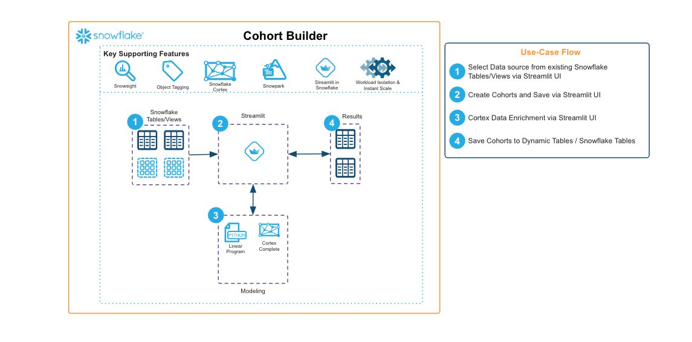

author: Mike Walton
id: cohort-builder-a-customer-segmentation-framework
summary: The Cohort Builder is a versatile solution designed to facilitate the creation, management, and scheduling of customer cohorts using Streamlit and Snowflake.
categories: snowflake-site:taxonomy/solution-center/certification/community-solution
environments: web
language: en
status: Published
feedback link: https://github.com/Snowflake-Labs/sfguides/issues
fork repo link: https://github.com/Snowflake-Labs/sfquickstarts/tree/master/site/sfguides/src/cohort-builder-a-customer-segmentation-framework

# Cohort Builder: A Customer Segmentation Framework
<!-- ------------------------ -->
## Overview

The Cohort Builder is a versatile solution designed to facilitate the creation, management, and scheduling of customer cohorts using Streamlit and Snowflake. This tool leverages a user-friendly Streamlit application to define and manage groups of individuals based on shared characteristics or behaviors.

* **Cohort Building:** Define cohort criteria using an easy-to-use interface that generates SQL queries. This feature enables users to segment data based on attributes like AGE\_CODE, LOCATION, and DATE.
* **Cohort Management:** Offers tools for updating and maintaining cohorts, ensuring they remain relevant and accurate as new data becomes available.
* **Cohort Scheduling:** Automates the refreshing of cohort data at regular intervals, utilizing Snowflake’s dynamic tables, tasks, and procedures.

<!-- ------------------------ -->
## Solution Architecture: Cohort Builder for Customer Segmentation

* User-Friendly Interface: The Cohort Builder offers an intuitive interface for users to create and manage cohorts based on various criteria, making it accessible to both technical and non-technical users.
* Scalable Data Processing: It leverages scalable data pipelines to efficiently process large datasets, ensuring quick and accurate cohort segmentation and analysis.
* Integration and Automation: The solution integrates seamlessly with existing data sources and automates the cohort scheduling process, enabling real-time updates and streamlined workflows.
* Customizable and Secure: Provides customizable cohort definitions and ensures data security and compliance with relevant regulations, maintaining user privacy and data integrity.

<!-- ------------------------ -->
## Get Started

- [view quickstart](https://medium.com/snowflake/cohort-builder-streamlining-data-segmentation-with-streamlit-and-snowflake-f4f0137068a0)
- [fork repo](https://github.com/Snowflake-Labs/emerging-solutions-toolbox/tree/main/sfguide-cohort-builder)
- [Download reference architecture](https://www.snowflake.com/content/dam/snowflake-site/developers/2024/08/Cohort-Builder-Reference-Architecture.pdf)
- [Explore emerging solutions toolbox](https://emerging-solutions-toolbox.streamlit.app/)
