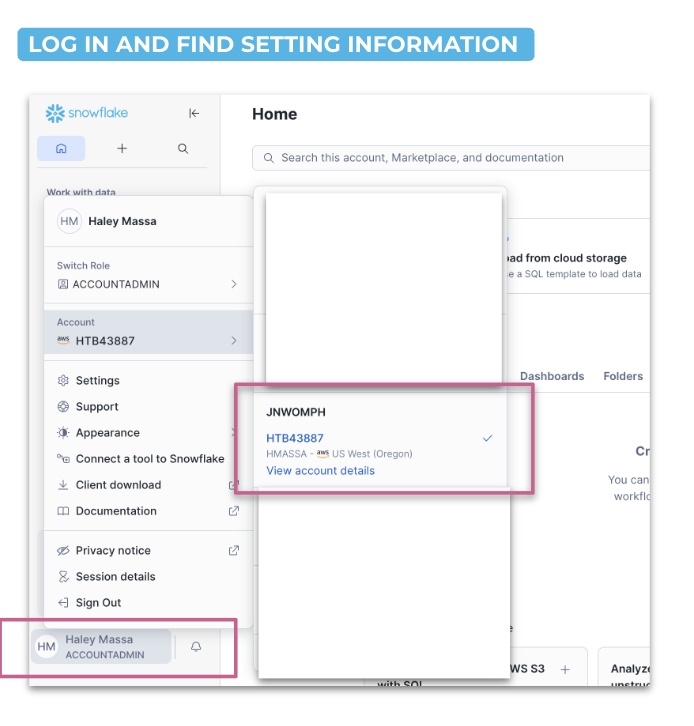
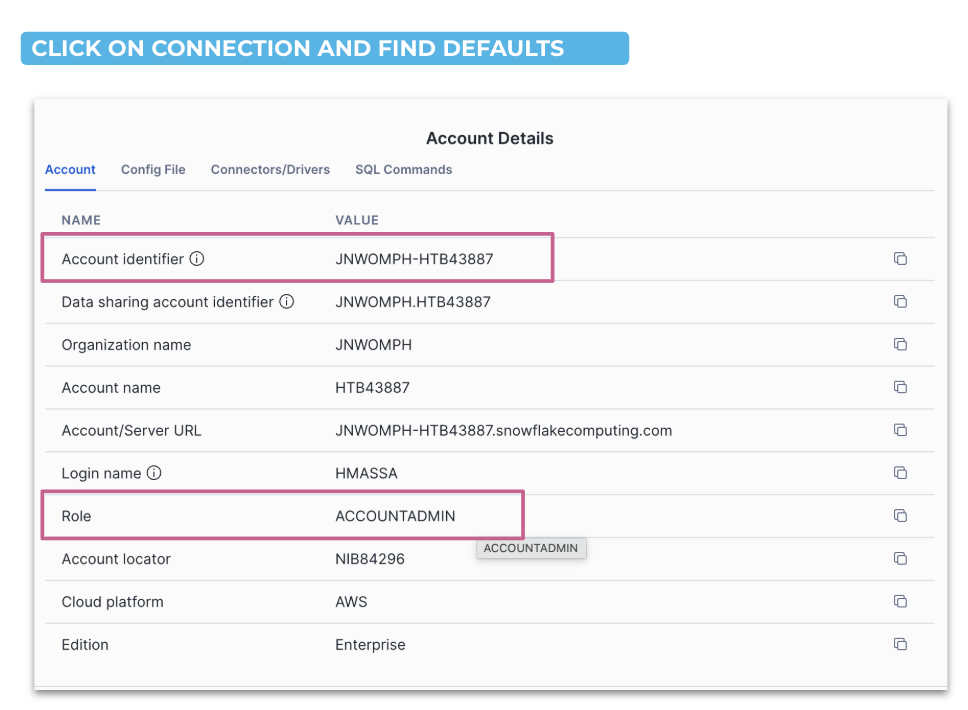
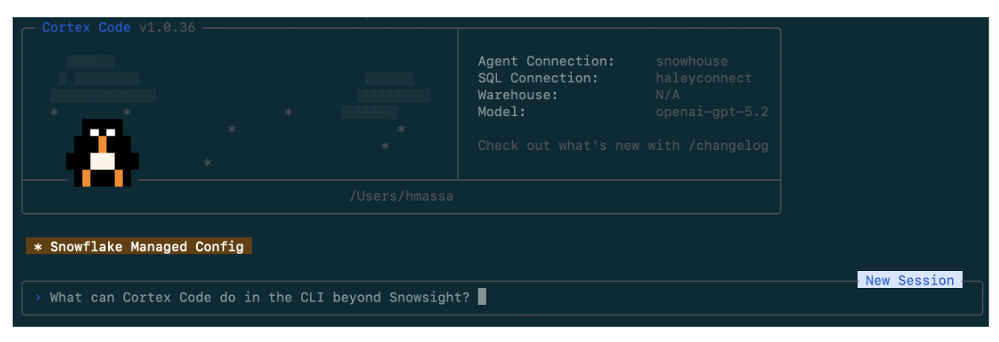

author: Haley Massa, Chase Ginther
id: cortex-code-foundations
language: en
summary: A hands-on guide to installing, configuring, and using Cortex Code: Snowflake's AI coding agent, including CLI setup and workshop demos for building data pipelines, agents, and semantic views.
categories: snowflake-site:taxonomy/solution-center/certification/quickstart
environments: web
status: Published
feedback link: https://github.com/Snowflake-Labs/sfguides/issues

# Cortex Code Foundations
<!-- ------------------------ -->
## Overview

Cortex Code (CoCo) is Snowflake's AI coding agent built to accelerate data and AI workflows directly inside your Snowflake environment. It understands your data catalog, executes SQL as your identity, and integrates natively with dbt, Git, Python, and Streamlit.

This guide walks you through installing the CoCo CLI, configuring your Snowflake connection, and completing a hands-on workshop covering three real-world scenarios: building a Dynamic Table pipeline, maintaining and evolving it, and creating a Cortex Agent with a semantic view.

### Prerequisites
- A Snowflake account with Cortex Code enabled

### What You'll Learn
- How to access Cortex Code via Snowsight (UI) and CLI
- How to install and configure the CoCo CLI 
- How to authenticate your Snowflake connection
- How to build a Dynamic Table pipeline with CoCo
- How to maintain a pipeline 
- How to create a Cortex Agent with a semantic view and evaluate its performance

### What You'll Build
- A configured Cortex Code CLI connected to your Snowflake environment
- A multi-source AP invoice pipeline using Dynamic Tables 
- A Cortex Agent grounded on a semantic view, with an evaluation framework

<!-- ------------------------ -->
## Access Cortex Code in Snowsight

Before setting up the CLI, you can access Cortex Code directly from the Snowflake UI.

In Snowsight, click the **blue star icon** in the bottom right corner to open the Cortex Code panel.


This gives you immediate access to CoCo without any local installation and is useful for quick queries, schema exploration, and testing.

<!-- ------------------------ -->
## Install the CoCo CLI on Mac

### Supported Architectures
- **x64** — Fully supported
- **ARM64** — Fully supported

### Install via Terminal

```bash
curl -LsS https://ai.snowflake.com/static/cc-scripts/install.sh | sh
```

When prompted to add `cortex` to your PATH, respond with **y**.

If the `cortex` command is not recognized after installation, close and reopen your terminal, or restart your machine.

### Verify Installation

```bash
cortex --version
```

### Configure Your Snowflake Connection

Cortex Code uses the same connection files as SnowCLI, located at:

```
~/.snowflake/config.toml
```

(or `connections.toml` if you already use that)

Minimal example, adapt to your accounts and roles:

```toml
default_connection_name = "DEMO"

[connections.DEMO]
account   = "<YOUR_DEMO_ACCOUNT>"    # e.g. SFSENORTHAMERICA-XXXXX
user      = "<YOUR_DEMO_USERNAME>"
password  = "<YOUR_DEMO_PAT>"
role      = "<YOUR_DEMO_ROLE>"
warehouse = "<YOUR_DEMO_WAREHOUSE>"
```





### Create the Config File 

Run the following in your terminal to create and open the config file:

```bash
mkdir -p ~/.snowflake
touch ~/.snowflake/config.toml
chmod 600 ~/.snowflake/config.toml
open -e ~/.snowflake/config.toml
```

<!-- ------------------------ -->
## Install the CoCo CLI on Windows

### Supported Architectures
- **x64** — Fully supported
- **ARM64** — Support is in progress; not yet recommended for production use

### Install via PowerShell

```powershell
irm https://ai.snowflake.com/static/cc-scripts/install.ps1 | iex
```

When prompted to add `cortex` to your PATH, respond with **y**.

If the `cortex` command is not recognized after installation, close and reopen your terminal or restart your machine.

### Verify Installation

```powershell
cortex --version
```

### Configure Your Snowflake Connection

On Windows, the config file is located at:

```
%USERPROFILE%\.snowflake\config.toml
```

Minimal example:

```toml
default_connection_name = "DEMO"    # Name for default Snowflake connection

[connections.DEMO]                  # Name for Snowflake connection (same as above if default)
account   = "<YOUR_DEMO_ACCOUNT>"  # e.g. Account identifier
user      = "<YOUR_DEMO_USERNAME>" # e.g. Authentication variable
password  = "<YOUR_DEMO_PAT>"
role      = "<YOUR_DEMO_ROLE>"     # e.g. Need a role for connection
warehouse = "<YOUR_DEMO_WAREHOUSE>"
```


### Create the Config File

Run the following in PowerShell:

```powershell
mkdir $env:USERPROFILE\.snowflake -Force
New-Item -ItemType File -Path $env:USERPROFILE\.snowflake\config.toml -Force
notepad $env:USERPROFILE\.snowflake\config.toml
```

<!-- ------------------------ -->
## Find Your Connection Details

To fill out your config, you'll need your Snowflake account identifier, role, and warehouse.

1. Log in to Snowsight
2. Click your username in the bottom left → **Account**
3. Note your **Account Identifier** (e.g. `SFSENORTHAMERICA-XXXXX`)
4. Go to **Admin → Warehouses** to find your warehouse name
5. Check **Admin → Users & Roles** for your role

### Authentication Options

There are several ways to authenticate your connection. Common environment variables include:

| Variable | Description |
|---|---|
| `SNOWFLAKE_ACCOUNT` | Your account identifier |
| `SNOWFLAKE_USER` | Your username |
| `SNOWFLAKE_PASSWORD` | Password authentication |
| `SNOWFLAKE_TOKEN` | OAuth token |
| `SNOWFLAKE_TOKEN_FILE_PATH` | Path to token file |
| `SNOWFLAKE_OAUTH_CLIENT_ID` | OAuth client ID |

For a full list, see the [Manage Snowflake connections guide](https://docs.snowflake.com/en/user-guide/snowsql-connect).

<!-- ------------------------ -->
## Launch Cortex Code

Once your connection is configured, launch the CLI:

```bash
cortex -c DEMO    # connect using connection name
```

After connecting, you'll see the Cortex Code CLI interface. Test your connection by asking a simple question — for example:

```
What databases do I have access to?
```



<!-- ------------------------ -->
## Lab Setup

Before starting the demos, run the setup scripts to create the workshop environment and load sample data. These files are in the `assets/` folder of this repo.

### Step 1: Create the Workshop Environment

Run `00_snowday_setup.sql` as `SYSADMIN`. This creates:
- `COCO_WORKSHOP` database
- `PIPELINE_LAB` and `SOURCE_DATA` schemas
- `COCO_WORKSHOP_WH` warehouse (X-Small, auto-suspend 120s)
- Tags for optional governance exercises

### Step 2: Load Sample Data

Run `00_sample_data.sql`. This creates and populates:
- `BRONZE_SAP_AP_INVOICES` — 15 SAP invoices (USD, EUR, GBP)
- `BRONZE_ORACLE_AP_INVOICES` — 15 Oracle invoices (USD, EUR, GBP)
- `BRONZE_BAAN_AP_INVOICES` — 10 Baan invoices (EUR, GBP) — used in Demo 2
- `BRONZE_WORKDAY_AP_INVOICES` — 10 Workday invoices (USD, GBP, EUR) — used in Demo 2
- `AGENT_EVAL_SET` — 15 golden evaluation questions — used in Demo 3

### Resetting Between Runs

If you need to start fresh, run `01_demo_reset.sql` to drop all demo-created objects, then re-run the setup scripts above.

> aside positive
> **Running this in a customer account with Cortex Code enabled?** You will need the `SNOWFLAKE.CORTEX_USER` database role on your user (directly or via a parent role) so Cortex Code CLI can use Snowflake AI features. Use the following files in the `/assets` subfolder in the repo: `00_admin_lab_setup.sql`, `01_admin_lab_reset.sql`, `02_admin_lab_teardown.sql`, `03_participant_connection_template.toml`

<!-- ------------------------ -->
## Workshop Overview

This workshop follows a single AP invoices storyline across three demos — from data discovery through operationalization and optional agent design.

### Lab Environment

Set your context before starting:

```sql
USE ROLE COCO_WORKSHOP_ROLE;
USE WAREHOUSE COCO_WORKSHOP_WH;
USE DATABASE COCO_WORKSHOP;
USE SCHEMA <YOUR_SCHEMA>;
```

<!-- ------------------------ -->
## Demo 1: Pipeline Builder

Finance needs a trusted AP invoices layer. SAP and Oracle invoice data already exist in Snowflake, but there is no standardized Silver object yet. The goal is a single, well-modeled table that can be explained, monitored, and evolved without repeating discovery work each time a requirement changes.

### Step 1.1 – Discover the Source

Begin with data discovery, a natural first move when you enter a new schema.

**Prompt:**
```
What tables are in the `COCO_WORKSHOP.SOURCE_DATA` schema?
For each table, give me a one-line description of what it appears to contain and identify
which ones are most relevant to an AP invoices Silver layer.
```

> **What to look for:** A short list of tables relevant to the AP workflow, with enough description to orient yourself without manually opening each object.

### Step 1.2 – Compare SAP and Oracle Invoice Schemas

Once you know which tables matter, compare them to get the shortest path to a clean normalization plan.

**Prompt:**
```
Compare the columns between
COCO_WORKSHOP.SOURCE_DATA.BRONZE_SAP_AP_INVOICES and
COCO_WORKSHOP.SOURCE_DATA.BRONZE_ORACLE_AP_INVOICES.
Return:
- Equivalent fields with different names
- Fields that require type normalization or default values
- Differences that should remain open questions instead of becoming hidden assumptions
```

> **What to look for:** Equivalent business fields with different names, normalization work you should expect before building Silver, and open questions that should stay explicit for later review.

### Step 1.3 – Generate the Silver Dynamic Table

For this step, turn on **Plan Mode** (`Ctrl+P`) to see how Cortex Code thinks through a multi-step task before executing.

**Plan Mode** stays read-only while it thinks, then returns a structured multi-step plan and waits for your approval before executing. This is useful for higher-risk tasks like creating core tables.

```
Ctrl+P
```

Then run the following prompt: 

```
Use database COCO_WORKSHOP and my current schema for outputs.
Create a Dynamic Table called SILVER_AP_INVOICES in my current schema by combining
COCO_WORKSHOP.SOURCE_DATA.BRONZE_SAP_AP_INVOICES and
COCO_WORKSHOP.SOURCE_DATA.BRONZE_ORACLE_AP_INVOICES.
```

> **What to look for:** A clean first-pass Dynamic Table definition with explainable design choices.

When finished, exit Plan Mode — it should turn off automatically when you approve execution.

### Step 1.4 – Use the Bundled $dynamic-tables Skill

Skills are reusable workflows that tell Cortex Code how to handle a specific Snowflake task. Instead of responding in a completely open-ended way, a skill provides domain context, expected inputs, a defined process, and structured outputs.

**Bundled skills** ship with Cortex Code — prebuilt, Snowflake-native workflows designed to start from proven patterns.

First, see what skills are available:

**Prompt:**
```
/skill list
```

Then inspect the Dynamic Tables skill before applying it:

**Prompt:**
```
What does the $dynamic-tables skill do? Summarize when I should use it,
what inputs it expects, and what kinds of output it returns.
```

Then apply it to `SILVER_AP_INVOICES`:

**Prompt:**
```
$dynamic-tables
Analyze the Dynamic Table SILVER_AP_INVOICES in my current schema.
Return:
1. The recommended TARGET_LAG choice for this workflow and why
2. SQL to inspect current state, lag, and refresh history
3. The main failure or staleness patterns to watch for
4. A short best-practices checklist for operating this table well
```

> **What to look for:** A runbook you would actually keep — a couple of monitoring queries and a concise operating checklist, not generic advice.

### Step 1.5 – Save a Proof Query *(optional)*

End Demo 1 with a lightweight proof query you can rerun after every change.

```
Give me one concise proof query for SILVER_AP_INVOICES that shows record counts
by SOURCE_SYSTEM and is easy to rerun after future changes.
```

> **What to look for:** A concise query that can be reused after every change.
> Save this output: `sql/02_silver_ap_invoices_proof.sql`

By the end of Demo 1 you have a Silver-grade AP invoices Dynamic Table, an operating runbook generated by a bundled skill, and a proof query you can rerun after each change.

<!-- ------------------------ -->
## Demo 2: Add Local Context and Productionize

A month later, the business sends a PRD that expands the AP invoices pipeline. New source systems must be added, field requirements have changed, and some definitions need clarification. Rather than solving this once with a long prompt every time, you can standardize the workflow as a custom skill.

### About the Sample PRD

Three CSV files prepared by the Finance Transformation PMO are included in the `assets/` folder of this repo:

- `sample_business_requirements_source_onboarding.csv` — new source systems (Baan, Workday), owners, priorities, and go-live targets
- `sample_business_requirements_column_mapping.csv` — field-level mappings for both new sources into the Silver schema
- `sample_business_requirements_business_rules.csv` — BR-001 through BR-010 covering status normalization, dedup logic, currency handling, and open questions

Download all three before starting Demo 2.

### Step 2.1 – Read the Local PRD

Start by understanding the business request. Save the CSV files from `assets/` to your working directory, then run:

**Prompt:**
```
Read the local files sample_business_requirements_source_onboarding.csv and
sample_business_requirements_business_rules.csv.
Summarize the changes that affect the AP invoices pipeline.
Return:
- New source systems being introduced
- New fields or business rules that affect the Silver layer
- Ambiguities or open questions that should be resolved before implementation
```

> **What to look for:** A clear distinction between requirements and assumptions, and the shape of information your custom skill should standardize.

### Why Create a Custom Skill?

If you stop here and simply ask Cortex Code to update `SILVER_AP_INVOICES`, you get a reasonable one-off result. But the repeatable pattern is the real value:

- Read the PRD
- Extract requested changes
- Translate those changes into a Dynamic Table plan
- Surface assumptions and open questions
- Propose validation queries

That is exactly the kind of workflow custom skills are meant to standardize.

**Where custom skills live:**

| Skill Type | Location | Scope |
|---|---|---|
| Bundled | Built into Cortex Code | Available by default |
| User-level | `~/.snowflake/cortex/skills/` | Available across projects |
| Project-level | `.cortex/skills/` in your repo | Available only in that project |

For this quickstart, use a **project skill** so anyone who clones the repo gets the same behavior.

### Step 2.2 – Scaffold a Custom Skill

Confirm the `$skill-development` workflow is available with the following prompt:

```
/skill list
```

Then ask it to help you define the new custom skill:

**Prompt:**
```
This seems like a repeatable workflow I will have for many PRDs. Walk me through
[$skill-development] for building a project skill that will help me take PRD-style
files like this and turn them into a plan for putting them into a target Dynamic Table
(for this demo, SILVER_AP_INVOICES).

Define:
- When to use the skill
- What inputs it expects (for example, prd_path and target_dynamic_table)
- The exact outputs it should always return
- Best practices for surfacing assumptions and open questions instead of guessing
- An example usage for an AP invoices pipeline update

Requirements:
- Make it a project skill
- Put it under .cortex/skills/ in this demo repo
- Start by supporting XLSX files
```

> **What to look for:** A skill that returns the same categories of output every time: requested changes, source-to-Silver mapping, open questions and assumptions, DDL delta plan, and validation queries.

### Step 2.3 – Run the PRD Evaluator Skill

With the custom skill in place, invoke the workflow instead of rebuilding the logic from scratch:

**Prompt:**
```
Run the project skill we just made prd-to-silver
Context:
- prd_path: sample_business_requirements_column_mapping.csv
- target_dynamic_table: SILVER_AP_INVOICES
Return:
1. Summary of requested changes
2. Source-to-Silver mapping summary
3. Open questions and assumptions
4. DDL delta plan for SILVER_AP_INVOICES
5. Validation queries to run after implementation
```

> **What to look for:** A consistent shape you could compare across future PRDs, and a delta plan another engineer could review before deployment.
> Save this output: `notes/02_prd_change_plan.md`

### Step 2.4 – Apply the Update

Use the structured output from the skill to update the Dynamic Table with the following prompt:

```
Update SILVER_AP_INVOICES in my current schema using the change plan from
sample_business_requirements_source_onboarding.csv,
sample_business_requirements_column_mapping.csv, and
sample_business_requirements_business_rules.csv.
Assume the PRD introduces Baan and Workday as additional AP invoice sources.
Return:
- The updated Dynamic Table SQL
- A short explanation of how the new sources map into the common schema
- Any assumptions that require engineering review
- Validation queries that prove the update worked
```

> **What to look for:** Updated SQL, explainable source mapping, explicit assumptions, and validation queries.
> Save this output: `sql/03_silver_ap_invoices_prd_update.sql`

### Step 2.5 – Save Handoff Artifacts *(optional)*

**Prompt:**
```
List the artifacts in a local markdown file I should save from this PRD-driven update
so another engineer can review the change, rerun the checks, and reuse the
PRD Evaluator skill.
```

> **What to look for:** A concise handoff package another engineer can review and rerun.
> Save this output: `notes/03_prd_workflow_handoff.md`

At this point the quickstart is complete for most teams: you have a curated AP invoices object and a repeatable workflow for evolving it with new PRDs.

<!-- ------------------------ -->
## Demo 3: Build an Agent on the Data Product *(Optional)*

By this point you have a curated AP invoices Silver object and a repeatable way to evolve it based on business requirements. That is the right moment to introduce agents — because you can keep the AI experience grounded in trusted, well-modeled data.

### Step 3.1 – Define the Agent Use Case

Keep the first pass narrow and grounded in the data product you built with this prompt:

```
Help me define a Cortex data agent on top of SILVER_AP_INVOICES in my current schema.
Suggest:
- The primary audience
- The top five business questions the agent should answer
- Guardrails that keep the agent grounded in the curated data
- Any semantic descriptions that would improve answer quality
```

### Step 3.2 – Create a Semantic View over the Silver Data

Create a semantic view that exposes business-friendly dimensions and measures. This is the object the agent will rely on for most of its answers.

**Prompt:**
```
Let's start by building the semantic model using the $semantic-view.
Create a semantic view called SV_AP_ANALYTICS over <YOUR_SCHEMA>.SILVER_AP_INVOICES.
It should support natural language questions like:
- "Total AP spend by vendor over the last 12 months"
- "Invoice count by month and business unit"
- "Top 10 vendors by unpaid invoice amount"
Return:
- A complete semantic view definition that clearly names business measures and dimensions.
- Any assumptions you are making about grain, time dimensions, and vendor identifiers.
```

> **What to look for:** A semantic view definition with clear business measures, dimensions, and assumptions.

### Step 3.3 – Create a Cortex Agent

Now create a Cortex data agent that uses the semantic view to answer natural-language questions with the following prompt:

```
$cortex-agent
Create an agent named AP_ANALYTICS_ASSISTANT.
The agent should:
- Prefer SV_AP_ANALYTICS as its primary data source.
- Always respond with three parts: (1) the final answer, (2) the SQL used,
  and (3) any assumptions about grain or filters.
- Ask a clarifying question if the requested metric or time grain is ambiguous.
Return a configuration I can save alongside my project files.
```

### Step 3.4 – Audit the Semantic View

With the agent created, validate the semantic view and get improvement suggestions:

**Prompt:**
```
Help me audit my Semantic View for best practices and provide suggestions.
```

> **What to look for:** An evaluation of the semantic view against best practices, with concrete suggestions for improving answer quality.

### Step 3.5 – Skills and Workflows from Here

The `$agent-optimize` and `$semantic-view` skills provide structured workflows for iterating on your agent:

| Skill | Capabilities |
|---|---|
| `$semantic-view` | Create, Audit (VQR testing, best practices), Debug (root cause analysis for failing queries) |
| `$agent-optimize` | Create, Ad-Hoc Test, Debug Query, Optimize (improve accuracy from evaluation results) |

Common next steps teams take from here: running curated evaluation datasets, testing verified queries after schema changes, auditing semantic models for best practices, and iterating on agent accuracy based on user feedback.

<!-- ------------------------ -->
## Conclusion And Resources

The core pattern is simple: pick one concrete object, ask Cortex Code for one concrete artifact, and keep the result in the project.

In Demo 1, that means a Dynamic Table, a small runbook from a bundled skill, and a single proof query you can rerun after every change. In Demo 2, it means treating the PRD and its evaluator as part of the same data product — with a custom skill that turns a loosely written requirements file into a structured, reviewable change plan. By the time you reach the optional agent design in Demo 3, you can see how bundled skills and custom skills together create a path from disciplined data engineering to a credible AI experience.

### What You Learned
- CLI installation on Mac and Windows and Snowflake connection configuration
- Data discovery, schema comparison, and Silver Dynamic Table creation with CoCo
- Using Plan Mode (`Ctrl+P`) for multi-step, higher-risk operations
- Applying bundled skills (`$dynamic-tables`) for operating runbooks
- Building and using custom skills to standardize repeatable PRD workflows
- Creating a Cortex Agent grounded on a semantic view with verifiable responses

### Related Resources
- [Cortex Code Documentation](https://docs.snowflake.com/en/user-guide/cortex-code)
- [Manage Snowflake Connections](https://docs.snowflake.com/en/user-guide/snowsql-connect)
- [Dynamic Tables Overview](https://docs.snowflake.com/en/user-guide/dynamic-tables-intro)
- [Cortex Agents Overview](https://docs.snowflake.com/en/user-guide/snowflake-cortex/cortex-agent)
- [Get Started with Snowflake Guides](https://www.snowflake.com/en/developers/guides/get-started-with-guides)
- [sfguides GitHub Issues](https://github.com/Snowflake-Labs/sfguides/issues)
