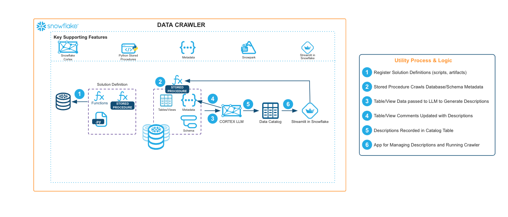

author: Jason Summer
id: create-an-llm-generated-data-catalog-using-data-crawler
summary: The Data Crawler is an LLM-powered utility that prompts a Cortex Large Language Model (LLM) to generate a natural language description of each table and view contained in a Snowflake database and/or schema.
categories: snowflake-site:taxonomy/solution-center/certification/community-solution
environments: web
language: en
status: Published
feedback link: https://github.com/Snowflake-Labs/sfguides/issues
fork repo link: https://github.com/Snowflake-Labs/sfquickstarts/tree/master/site/sfguides/src/create-an-llm-generated-data-catalog-using-data-crawler

# Create an LLM-generated Data Catalog using Data Crawler
<!-- ------------------------ -->
## Overview

The Data Crawler is an LLM-powered utility that prompts a Cortex Large Language Model (LLM) to generate a natural language description of each table and view contained in a Snowflake database and/or schema. The output of the utility is a catalog table containing natural language summaries of tables’ contents which can be easily reviewed, searched, and revised by team members. The utility can also update table/view comments directly.

Examples of where one might want to use the Data Crawler include:

* Understand the enterprise data landscape
* Survey enterprise data availability based on semantics
* Update table/view comments at scale

<!-- ------------------------ -->
## Solution Architecture: LLM-Generated Data Catalog using Data Crawler

* For this utility, we create a Snowpark for Python stored procedure to crawl any database or schema to catalog tables and views using Cortex Large Language Model (LLMs).
* The Data Crawler will execute an asynchronous stored procedure for each table/view to infer data contents and relationships based on metadata, sample data, and neighbor table/views in the same schema.
* A Streamlit in Snowflake app enables users to execute the Data Crawler, search the generated data catalog, and make modifications to descriptions.

<!-- ------------------------ -->
## Get Started

- [read the blog](https://medium.com/snowflake/llm-powered-snowflake-data-crawler-0dabbaa0e2a5)
- [fork notebook](https://github.com/Snowflake-Labs/emerging-solutions-toolbox/tree/main/sfguide-data-crawler)
- [Download reference architecture](https://www.snowflake.com/content/dam/snowflake-site/developers/2024/06/Data-Crawler-Reference-Architecture.pdf)
- [Explore emerging solutions toolbox](https://emerging-solutions-toolbox.streamlit.app/)
