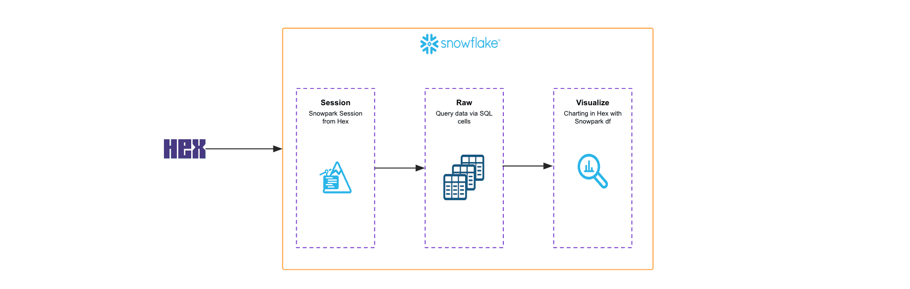

author: Hex Staff
id: data-exploration-with-hex-and-snowpark
summary: This solution architecture shows how to use Snowpark dataframes to analyze 20 million rows of Citibike dataset using Hex notebooks.
categories: snowflake-site:taxonomy/solution-center/certification/partner-solution
environments: web
language: en
status: Published
feedback link: https://github.com/Snowflake-Labs/sfguides/issues
fork repo link: https://github.com/Snowflake-Labs/sfquickstarts/tree/master/site/sfguides/src/data-exploration-with-hex-and-snowpark

# Data Exploration & Analysis using Hex and Snowpark
<!-- ------------------------ -->
## Overview

This solution architecture shows how to use Snowpark dataframes to analyze 20 million rows of Citibike dataset using Hex notebooks. 

* Create Snowpark session to read data from Snowflake account in Hex notebook
* Use Snowpark dataframe API to run aggregations on the dataset
* Visualize the dataframe in Hex notebooks

<!-- ------------------------ -->
## Solution Architecture: Snowpark for Data Exploration with Hex

* In this use-case, you learn how to run data exploration and analysis using Snowpark dataframes in Hex notebooks.
* You will also learn how to visualize the dataframes in Hex.
