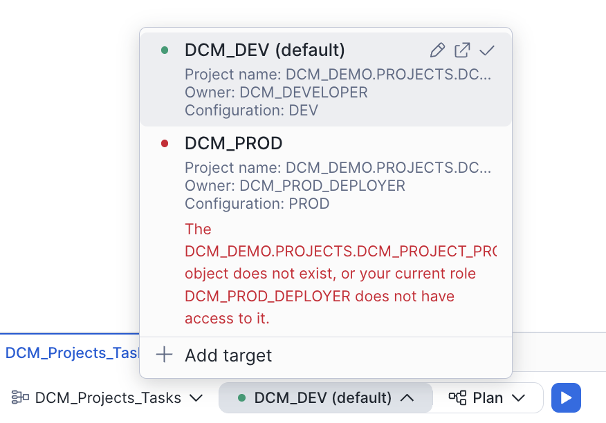
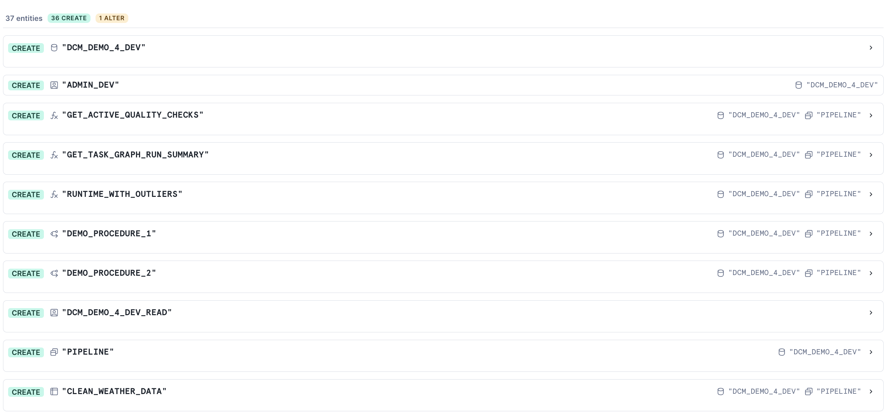
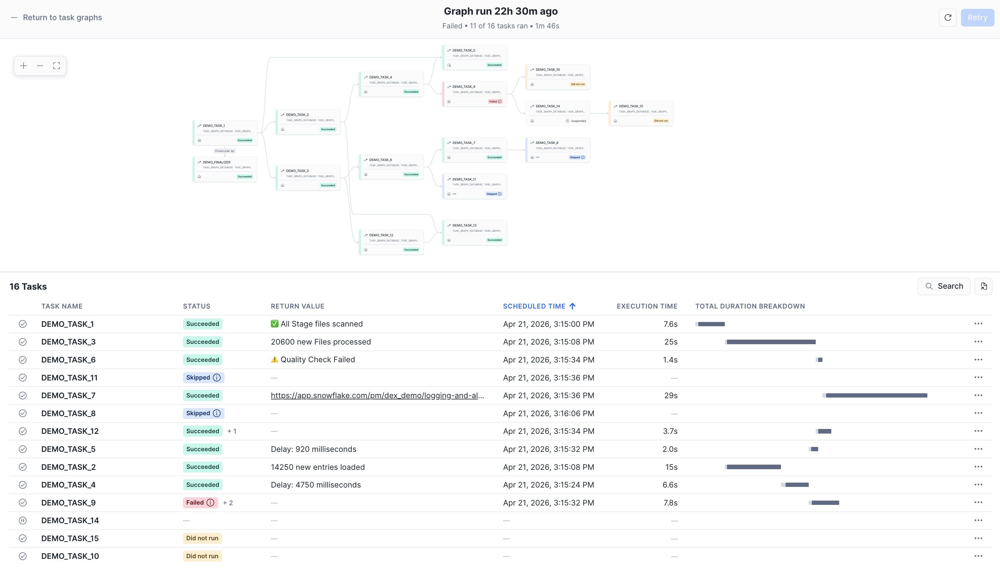

author: Charlie Hammond, Jan Sommerfeld, Gilberto Hernandez, Yoav Ostrinsky
id: dcm-projects-for-tasks
summary: Learn how to use DCM Projects to define, deploy, and manage a complex task graph — including a finalizer task that emails a run summary and a DMF-backed quality gate that routes rows into target or quarantine tables.
categories: snowflake-site:taxonomy/solution-center/certification/quickstart, snowflake-site:taxonomy/product/platform, snowflake-site:taxonomy/product/data-engineering, snowflake-site:taxonomy/snowflake-feature/tasks
environments: web
status: Published
language: en
feedback link: https://github.com/Snowflake-Labs/sfguides/issues
fork repo link: https://github.com/Snowflake-Labs/snowflake-dcm-projects

# DCM Projects for Tasks
<!-- ------------------------ -->
## Overview

In the [Get Started with Snowflake DCM Projects](https://www.snowflake.com/en/developers/guides/get-started-snowflake-dcm-projects/), [Build Data Pipelines with Snowflake DCM Projects](https://www.snowflake.com/en/developers/guides/build-data-pipelines-with-snowflake-dcm-projects/), and [DCM Projects for Dynamic Tables](https://www.snowflake.com/en/developers/guides/dcm-projects-for-dynamic-tables/) guides, you learned how DCM Projects manage Snowflake infrastructure declaratively — from a single project up to dynamic-table pipelines that evolve without full recomputation.

In this guide, you'll focus on **Tasks and task graphs** — the orchestration layer that drives scheduled and event-driven work across your pipeline.

Task graphs (DAGs, or directed acyclic graphs, of Tasks — meaning dependencies flow in one direction and no task can loop back to itself) are how most production Snowflake pipelines coordinate sequences of work: a root task kicks off every run, child tasks depend on their predecessors, streams and return values can gate downstream execution, and a finalizer closes out the run. Managing that whole graph as code — with retries, schedules, warehouse bindings, and config values promoted across environments — becomes much easier to maintain as a DCM Project.

You'll define a fifteen-task demo graph that shows off every interesting Task feature in one place:

- **Root task with retries, overlap policy, and graph-level config** pushed into children via `SYSTEM$GET_TASK_GRAPH_CONFIG`
- **Finalizer task** that emails a plain-text JSON summary of every graph run
- **Serverless task** and **multi-predecessor task** patterns
- **Stream-conditional** and **return-value-conditional** child tasks
- **Failing task with retries** + dependent that gets skipped
- **DCM-managed target state** — a task deployed as `SUSPENDED` that never runs
- **DMF quality gate** that routes rows to a target or quarantine table based on data metric function results
- **Overlap policy** on the root task — the new `OVERLAP_POLICY` parameter gives you granular control over concurrent graph execution

Along the way, you'll see two DCM features that make Tasks a first-class citizen of the DCM Project model:

- **`DEFINE TASK ... STARTED | SUSPENDED`** — declare the target state of every task so you never need an `ALTER TASK ... RESUME` post-script
- **`DEFINE PROCEDURE`** — manage SQL stored procedures through DCM Plan & Deploy alongside the tasks that call them

### Prerequisites
- Basic knowledge of Snowflake concepts (databases, schemas, tables, roles)
- Familiarity with SQL and [Snowflake Tasks](https://docs.snowflake.com/en/user-guide/tasks-intro)
- Completion of [Get Started with Snowflake DCM Projects](https://www.snowflake.com/en/developers/guides/get-started-snowflake-dcm-projects/) is recommended

### What You'll Learn
- How to define a range of Task features declaratively with `DEFINE TASK`
- How to use the new `STARTED | SUSPENDED` target-state property to control task state through DCM deployments
- How to manage SQL procedures used by tasks with `DEFINE PROCEDURE`
- How to build a finalizer task that sends a plain-text JSON email summary for every graph run
- How to add a DMF-based quality gate that routes rows to target or quarantine tables
- How to monitor ongoing health with a serverless failed-task alert

### What You'll Need
- A [Snowflake account](https://signup.snowflake.com/?utm_source=snowflake-devrel&utm_medium=developer-guides&utm_cta=developer-guides) with ACCOUNTADMIN access (or a role with sufficient privileges)
- A [verified email address](https://docs.snowflake.com/en/user-guide/ui-snowsight-profile#label-snowsight-verify-email-address) on your Snowflake user so the finalizer and alerts can reach you
- (Optional) [Snowflake CLI](https://docs.snowflake.com/en/developer-guide/snowflake-cli/installation/installation) v3.16.0+ if you prefer CLI over the Snowsight UI

### What You'll Build
- A fully deployed task graph — root, finalizer, fifteen demo tasks, and a DMF quality-gate branch — all defined as code in a single DCM Project
- A serverless alert that emails you when any task in the database fails
- A reusable pattern for getting your whole orchestration layer into DCM

<!-- ------------------------ -->
## Create a Workspace from Git

In this step, you'll create a Snowsight Workspace linked to the sample DCM Project repository on GitHub.

1. Navigate to **Projects > Workspaces** in Snowsight.
2. Click **Create** (+) and select **Git repository**.
3. Enter the repository URL: `https://github.com/snowflake-labs/snowflake-dcm-projects`
4. Select an API Integration for GitHub ([create one if needed](https://docs.snowflake.com/en/user-guide/ui-snowsight/workspaces-git#label-create-a-git-workspace)).
5. Select **Public repository**.

Once the workspace is created, you'll see the repository files in the file explorer. Navigate to **Quickstarts/dcm-projects-for-tasks** to find two directories:

- **`DCM_Projects_Tasks/`** — The DCM Project itself (manifest, definitions). This is what DCM reads during Plan & Deploy.
- **`scripts/`** — Numbered SQL files that you'll run in Snowsight worksheets at different stages of this guide. These live outside the DCM project directory so they don't interfere with it.

| File | When to Run |
|:-----|:------------|
| `scripts/01_pre_deploy.sql` | Before the first DCM Plan & Deploy |
| `scripts/02_post_deploy.sql` | After the first successful deployment |
| `scripts/03_cleanup.sql` | When you're done and want to tear everything down |

Open `scripts/01_pre_deploy.sql` in a Snowsight worksheet — you'll use it in the next step.

<!-- ------------------------ -->
## Set Up Roles, Grants, and the Notification Integration

Before deploying the task graph, you need a dedicated DCM developer role, a DCM Project object, and an email notification integration that the finalizer and alerts will use.

Open `scripts/01_pre_deploy.sql` in a Snowsight worksheet and run each section in order. This script lives outside the DCM project directory, so it won't be picked up by Plan or Deploy.

### 1. Create a DCM Developer Role

```sql
USE ROLE ACCOUNTADMIN;

CREATE ROLE IF NOT EXISTS dcm_developer;
SET user_name = (SELECT CURRENT_USER());
GRANT ROLE dcm_developer TO USER IDENTIFIER($user_name);
```

### 2. Grant Infrastructure, Task, and Alert Privileges

```sql
GRANT CREATE WAREHOUSE ON ACCOUNT TO ROLE dcm_developer;
GRANT CREATE ROLE ON ACCOUNT TO ROLE dcm_developer;
GRANT CREATE DATABASE ON ACCOUNT TO ROLE dcm_developer;
GRANT CREATE INTEGRATION ON ACCOUNT TO ROLE dcm_developer;
GRANT EXECUTE MANAGED TASK ON ACCOUNT TO ROLE dcm_developer;
GRANT EXECUTE TASK ON ACCOUNT TO ROLE dcm_developer;
GRANT EXECUTE ALERT ON ACCOUNT TO ROLE dcm_developer;
GRANT EXECUTE MANAGED ALERT ON ACCOUNT TO ROLE dcm_developer;
GRANT MANAGE GRANTS ON ACCOUNT TO ROLE dcm_developer;
GRANT IMPORTED PRIVILEGES ON DATABASE SNOWFLAKE TO ROLE dcm_developer;
```

### 3. Grant Data Quality Privileges

The quality-gate branch uses system and custom DMFs, which require these grants:

```sql
GRANT APPLICATION ROLE SNOWFLAKE.DATA_QUALITY_MONITORING_VIEWER TO ROLE dcm_developer;
GRANT APPLICATION ROLE SNOWFLAKE.DATA_QUALITY_MONITORING_ADMIN  TO ROLE dcm_developer;
GRANT DATABASE ROLE SNOWFLAKE.DATA_METRIC_USER TO ROLE dcm_developer;
GRANT EXECUTE DATA METRIC FUNCTION ON ACCOUNT TO ROLE dcm_developer;
```

### 4. Create the DCM Project Object

```sql
USE ROLE dcm_developer;

CREATE DATABASE IF NOT EXISTS dcm_demo;
CREATE SCHEMA IF NOT EXISTS dcm_demo.projects;

CREATE OR REPLACE DCM PROJECT dcm_demo.projects.dcm_tasks_project_dev
    COMMENT = 'for testing DCM Projects with Tasks and task graphs';
```

### 5. Create the Email Notification Integration

Notification integrations are account-level objects — they live outside any DCM Project. The finalizer task and the failed-task alert both send through this integration:

```sql
USE ROLE ACCOUNTADMIN;

CREATE NOTIFICATION INTEGRATION IF NOT EXISTS dcm_demo_email_notifications
    TYPE = EMAIL
    ENABLED = TRUE
    COMMENT = 'Used by DCM Tasks quickstart finalizer and alerts';

GRANT USAGE ON INTEGRATION dcm_demo_email_notifications TO ROLE dcm_developer;
```

### 6. Get Your Account Identifier and Username

```sql
SELECT
    CURRENT_ORGANIZATION_NAME() || '-' || CURRENT_ACCOUNT_NAME() AS account_identifier,
    CURRENT_USER() AS user_name;
```

Keep these values — you'll paste them into `manifest.yml` and the `notification_recipient` field in the next section.

### 7. Verify Your Email Address

The finalizer task, quality-issue notification, and failed-task alert all send email through `SYSTEM$SEND_SNOWFLAKE_NOTIFICATION`. This only works if the recipient email is **verified** on the Snowflake account.

1. Click your **username** (bottom-left circle) in Snowsight, then select **Settings** → **Profile**.
2. Under **Email**, confirm your address shows a ✅ verified badge.
3. If not, click **Verify** and follow the link sent to your inbox.

> **If you skip this step**, any task or alert that sends a notification will fail with: *"Email recipients at indexes [1] are not allowed."*

> **Important:** Before running Plan & Deploy, update three values in `DCM_Projects_Tasks/manifest.yml`: set `account_identifier` on the `DCM_DEV` target to the identifier you just got, set `user` under `templating.configurations.DEV` to your username, and set `notification_recipient` to your verified Snowflake user email. The values with a `# <-- Replace with ...` comment flag where to change things.

> **Note:** After running this script, refresh your browser so Snowsight picks up the newly created DCM Project object.

<!-- ------------------------ -->
## Explore the Project Files

Navigate into the `DCM_Projects_Tasks/` directory. Unlike earlier guides which were centered on tables and dynamic tables, this project's definitions are almost all about *orchestration*: helper functions, procedures, and the task graph itself.

### Manifest

Open `DCM_Projects_Tasks/manifest.yml`:

```yaml
manifest_version: 2
type: DCM_PROJECT

default_target: DCM_DEV

targets:
  DCM_DEV:
    account_identifier: MYORG-MY_DEV_ACCOUNT        # <-- Replace with your account identifier
    project_name: DCM_DEMO.PROJECTS.DCM_TASKS_PROJECT_DEV
    project_owner: DCM_DEVELOPER
    templating_config: DEV

  DCM_PROD:
    account_identifier: MYORG-MY_PROD_ACCOUNT       # <-- Replace with your account identifier
    project_name: DCM_DEMO.PROJECTS.DCM_TASKS_PROJECT_PROD
    project_owner: DCM_PROD_DEPLOYER
    templating_config: PROD

templating:
  defaults:
    wh_size: "X-SMALL"
    runtime_multiplier: 5

  configurations:
    DEV:
      env_suffix: "_DEV"
      user: "INSERT_YOUR_USER"                      # <-- Replace with your Snowflake username
      project_owner_role: "DCM_DEVELOPER"
      notification_recipient: "INSERT_YOUR_EMAIL"   # <-- Replace with your verified email

    PROD:
      env_suffix: ""
      wh_size: "SMALL"
      project_owner_role: "DCM_PROD_DEPLOYER"
      user: "GITHUB_ACTIONS_SERVICE_USER"
      notification_recipient: "prod_alerts@example.com"
      runtime_multiplier: 10
```

Note how the root task sets [`OVERLAP_POLICY = 'NO_OVERLAP'`](https://docs.snowflake.com/en/release-notes/2026/other/2026-03-13-tasks-overlap-policy) (the default), which ensures each graph run completes before the next one starts. You can change this to `ALLOW_CHILD_OVERLAP` or `ALLOW_ALL_OVERLAP` if your pipeline benefits from concurrent runs.

Note how templating lets the same definitions produce a DEV graph with an X-SMALL warehouse and a short `runtime_multiplier` of 5, and a PROD graph with a SMALL warehouse and a multiplier of 10. Notification recipients differ per environment too.

### Infrastructure — `sources/definitions/infrastructure.sql`

Warehouse, database, schema, and a read-only role — nothing task-specific yet, but this is the baseline that the rest of the project depends on:

```sql
DEFINE WAREHOUSE DCM_DEMO_4_WH{{env_suffix}}
WITH
    WAREHOUSE_SIZE = '{{wh_size}}'
    AUTO_SUSPEND = 60
    COMMENT = 'For Quickstart Demo of DCM Projects with Tasks';

DEFINE DATABASE DCM_DEMO_4{{env_suffix}}
    COMMENT = 'Quickstart Demo for DCM Projects with Tasks and task graphs';

DEFINE SCHEMA DCM_DEMO_4{{env_suffix}}.PIPELINE
    COMMENT = 'Task graph, helper functions, procedures, and DMFs';
```

### Tables — `sources/definitions/tables.sql`

Five tables support the graph:

- **`WEATHER_DATA_SOURCE`** — the source that `LOAD_RAW_DATA` reads from
- **`RAW_WEATHER_DATA`** — the landing table where DMF checks run (`DATA_METRIC_SCHEDULE = 'TRIGGER_ON_CHANGES'`)
- **`CLEAN_WEATHER_DATA`** — target for rows that passed
- **`QUARANTINED_WEATHER_DATA`** — target for rows that failed
- **`TASK_DEMO_TABLE`** — used by the stream-conditional task

### Procedures — `sources/definitions/procedures.sql`

This file uses **`DEFINE PROCEDURE`**, so procedure lifecycle is fully DCM-managed — you don't need separate `CREATE OR ALTER PROCEDURE` migrations for the demo procs.

```sql
DEFINE PROCEDURE DCM_DEMO_4{{env_suffix}}.PIPELINE.DEMO_PROCEDURE_1()
RETURNS VARCHAR(16777216)
LANGUAGE SQL
EXECUTE AS OWNER
AS
$$
    SELECT SYSTEM$WAIT(3);
$$;
```

`DEMO_PROCEDURE_2` is similar but fails ~50% of the time, which drives the "failing task" demo later.

### Functions — `sources/definitions/functions.sql`

Three helper functions, all managed by DCM:

- **`RUNTIME_WITH_OUTLIERS`** — randomizes each task's duration so the graph feels realistic, with 1-in-10 outlier runs
- **`GET_TASK_GRAPH_RUN_SUMMARY`** — returns the current graph run as a JSON array (used by the finalizer)
- **`GET_ACTIVE_QUALITY_CHECKS`** — a UDTF listing every DMF currently attached to a given table

### Expectations — `sources/definitions/expectations.sql`

DCM manages DMF attachments natively through `ATTACH DATA METRIC FUNCTION`, so the quality gate lives in the DCM Project using Snowflake's built-in system DMFs:

```sql
ATTACH DATA METRIC FUNCTION SNOWFLAKE.CORE.DUPLICATE_COUNT
    TO TABLE DCM_DEMO_4{{env_suffix}}.PIPELINE.RAW_WEATHER_DATA
    ON (ROW_ID)
    EXPECTATION NO_DUPLICATE_ROW_IDS (value = 0);

ATTACH DATA METRIC FUNCTION SNOWFLAKE.CORE.NULL_COUNT
    TO TABLE DCM_DEMO_4{{env_suffix}}.PIPELINE.RAW_WEATHER_DATA
    ON (DS)
    EXPECTATION NO_NULL_DATES (value = 0);

ATTACH DATA METRIC FUNCTION SNOWFLAKE.CORE.NULL_COUNT
    TO TABLE DCM_DEMO_4{{env_suffix}}.PIPELINE.RAW_WEATHER_DATA
    ON (ZIPCODE)
    EXPECTATION NO_NULL_ZIPCODES (value = 0);
```

Adding or removing an attachment here changes the `CHECK_DATA_QUALITY` task's behavior on the next deploy (it discovers attached DMFs at runtime via `GET_ACTIVE_QUALITY_CHECKS`) — no manual `ALTER TABLE` required.

### Alerts — `sources/definitions/alerts.sql`

The failed-task alert is defined declaratively with `DEFINE ALERT`, so the alert lives alongside the tasks it monitors and evolves through the same Plan/Deploy cycle. The alert is created suspended — you'll resume it once in `scripts/02_post_deploy.sql` with `ALTER ALERT ... RESUME`. The recipient email comes from the same `{{notification_recipient}}` manifest value the finalizer uses, so you only configure it in one place.

```sql
DEFINE ALERT DCM_DEMO_4{{env_suffix}}.PIPELINE.FAILED_TASK_ALERT
    SCHEDULE = '60 MINUTE'
    IF (EXISTS (
        SELECT NAME, SCHEMA_NAME
        FROM TABLE(DCM_DEMO_4{{env_suffix}}.INFORMATION_SCHEMA.TASK_HISTORY(
            SCHEDULED_TIME_RANGE_START => (GREATEST(
                TIMEADD('DAY', -7, CURRENT_TIMESTAMP),
                SNOWFLAKE.ALERT.LAST_SUCCESSFUL_SCHEDULED_TIME())),
            SCHEDULED_TIME_RANGE_END   => SNOWFLAKE.ALERT.SCHEDULED_TIME(),
            ERROR_ONLY                 => TRUE))))
    THEN
        BEGIN
            LET task_names STRING := (
                SELECT LISTAGG(DISTINCT(SCHEMA_NAME || '.' || NAME), ', ')
                FROM TABLE(RESULT_SCAN(SNOWFLAKE.ALERT.GET_CONDITION_QUERY_UUID())));
            CALL SYSTEM$SEND_SNOWFLAKE_NOTIFICATION(
                SNOWFLAKE.NOTIFICATION.TEXT_HTML(
                    'Failed tasks detected: <b>' || :task_names || '</b>'),
                SNOWFLAKE.NOTIFICATION.EMAIL_INTEGRATION_CONFIG(
                    'dcm_demo_email_notifications',
                    'DCM Pipeline — Failed Task Alert',
                    ARRAY_CONSTRUCT('{{notification_recipient}}'),
                    NULL, NULL));
        END;
```

The alert runs **serverless** (no warehouse specified) and monitors **every task** in the database for failures in the last interval — a broader scope than the finalizer. Think of them as complementary rather than overlapping: the finalizer gives you a detailed per-run summary (even when the graph failed mid-way), while the alert is a lighter-weight, database-wide safety net that only fires when something fails. `SNOWFLAKE.ALERT.GET_CONDITION_QUERY_UUID()` lets you re-use the result of the condition query so you don't have to re-run it to build the message.

### Tasks — `sources/definitions/tasks.sql`

This is the heart of the project. Every task uses the `STARTED | SUSPENDED` target-state property — a DCM-only extension to `DEFINE TASK` that has no equivalent in `CREATE TASK`. With plain DDL, a new task is always created in a suspended state and you have to follow up with `ALTER TASK ... RESUME` (or `SYSTEM$TASK_DEPENDENTS_ENABLE` for a whole graph) to bring it online. By declaring the desired state inline, DCM deploys the graph fully wired up — no post-scripts needed — and resolves the root-vs-child state ordering for you. It also means that suspending a task is a declarative change: flip `STARTED` to `SUSPENDED` in Git, deploy, and DCM handles the transition.

Here's the root:

```sql
DEFINE TASK DCM_DEMO_4{{env_suffix}}.PIPELINE.DEMO_TASK_1
    WAREHOUSE = 'DCM_DEMO_4_WH{{env_suffix}}'
    SCHEDULE = 'USING CRON 15 8-18 * * MON-FRI CET'
    SUSPEND_TASK_AFTER_NUM_FAILURES = 0
    TASK_AUTO_RETRY_ATTEMPTS = 2
    OVERLAP_POLICY = 'NO_OVERLAP'
    CONFIG = $${"RUNTIME_MULTIPLIER": {{runtime_multiplier}}}$$
    COMMENT = 'Root task with retries, overlap policy, and a runtime-multiplier config'
    STARTED
AS
    DECLARE
        RUNTIME_MULTIPLIER INTEGER := SYSTEM$GET_TASK_GRAPH_CONFIG('RUNTIME_MULTIPLIER');
        RANDOM_RUNTIME     VARCHAR := DCM_DEMO_4{{env_suffix}}.PIPELINE.RUNTIME_WITH_OUTLIERS(:RUNTIME_MULTIPLIER * 1000);
    BEGIN
        SELECT SYSTEM$WAIT(:RANDOM_RUNTIME, 'MILLISECONDS');
        CALL SYSTEM$SET_RETURN_VALUE('✅ All stage files scanned');
    END;
```

And the finalizer that closes out every run with a plain-text JSON email:

```sql
DEFINE TASK DCM_DEMO_4{{env_suffix}}.PIPELINE.DEMO_FINALIZER
    WAREHOUSE = 'DCM_DEMO_4_WH{{env_suffix}}'
    FINALIZE = DCM_DEMO_4{{env_suffix}}.PIPELINE.DEMO_TASK_1
    COMMENT = 'Sends a plain-text JSON email summary after every graph run'
    STARTED
AS
    DECLARE
        MY_ROOT_TASK_ID STRING;
        MY_START_TIME   TIMESTAMP_LTZ;
        SUMMARY_JSON    STRING;
    BEGIN
        MY_ROOT_TASK_ID := (CALL SYSTEM$TASK_RUNTIME_INFO('CURRENT_ROOT_TASK_UUID'));
        MY_START_TIME   := (CALL SYSTEM$TASK_RUNTIME_INFO('CURRENT_TASK_GRAPH_ORIGINAL_SCHEDULED_TIMESTAMP'));

        SUMMARY_JSON := (SELECT DCM_DEMO_4{{env_suffix}}.PIPELINE.GET_TASK_GRAPH_RUN_SUMMARY(:MY_ROOT_TASK_ID, :MY_START_TIME));

        CALL SYSTEM$SEND_SNOWFLAKE_NOTIFICATION(
            SNOWFLAKE.NOTIFICATION.TEXT_PLAIN(:SUMMARY_JSON),
            SNOWFLAKE.NOTIFICATION.EMAIL_INTEGRATION_CONFIG(
                'dcm_demo_email_notifications',
                'DCM Task Graph Run Summary ({{env_suffix}})',
                ARRAY_CONSTRUCT('{{notification_recipient}}'),
                NULL, NULL));

        CALL SYSTEM$SET_RETURN_VALUE('✅ Graph run summary email sent');
    END;
```

Feature tour of the remaining tasks:

| Task | What it demonstrates |
|:-----|:---------------------|
| `DEMO_TASK_2`, `DEMO_TASK_4` | Plain child tasks with a return value |
| `DEMO_TASK_3` | Calling a stored procedure (`DEMO_PROCEDURE_1`) |
| `DEMO_TASK_5` | Serverless task (no `WAREHOUSE =`) with two predecessors |
| `DEMO_TASK_6` | Returns a value chosen at random — used downstream as a condition |
| `DEMO_TASK_7` | Return value is a URL (clickable in Snowsight) |
| `DEMO_TASK_8` | `WHEN SYSTEM$STREAM_HAS_DATA(...)` — skipped when the stream is empty |
| `DEMO_TASK_9` | Calls a procedure that fails ~50% of the time; retries are inherited from the root task's `TASK_AUTO_RETRY_ATTEMPTS`. Watch this in Snowsight to see how retries and failures affect downstream tasks |
| `DEMO_TASK_10` | Does not run when its predecessor (`DEMO_TASK_9`) fails after exhausting retries |
| `DEMO_TASK_11` | `WHEN SYSTEM$GET_PREDECESSOR_RETURN_VALUE(...)` — runs conditionally on upstream return |
| `DEMO_TASK_12` | Self-cancels 1 in 10 runs via `SYSTEM$USER_TASK_CANCEL_ONGOING_EXECUTIONS` |
| `DEMO_TASK_13` | Two predecessors |
| `DEMO_TASK_14` | Deployed as `SUSPENDED` — target-state property in action |
| `DEMO_TASK_15` | Never runs because its predecessor is suspended |

Plus the quality-gate branch:

| Task | What it demonstrates |
|:-----|:---------------------|
| `LOAD_RAW_DATA` | Pulls rows from source into the landing table, occasionally injecting duplicate ROW_IDs |
| `CHECK_DATA_QUALITY` | Iterates through every DMF attached to the landing table and returns pass/fail as its return value |
| `TRANSFORM_DATA` | Conditional on `CHECK_DATA_QUALITY` return = "passed" — copies rows into the target table |
| `ISOLATE_DATA_ISSUES` | Conditional on the inverse — moves rows into quarantine |
| `NOTIFY_ABOUT_QUALITY_ISSUE` | Sends a quality-issue email through the same notification integration |

Because every task is declared with its dependencies (`AFTER ...`), DCM knows the full DAG. You never have to call `SYSTEM$TASK_DEPENDENTS_ENABLE` after deployment — DCM handles state resolution, including the `SUSPENDED` branch rooted at `DEMO_TASK_14`.

<!-- ------------------------ -->
## Plan and Deploy

With the manifest updated (account identifier, user, notification recipient) and the pre-deploy script run, you're ready to deploy the task graph.

### Option A: Snowsight Workspaces

1. Open `DCM_Projects_Tasks/manifest.yml` in the Workspaces file explorer.
2. At the bottom of the editor, confirm the project selector shows `DCM_DEMO.PROJECTS.DCM_TASKS_PROJECT_DEV` and the target shows `DCM_DEV`.



3. Click **Plan**. Review the changeset — you should see the warehouse, database, schema, tables, procedures, functions, and every task listed as `CREATE`.



4. Click **Deploy**.

### Option B: Snowflake CLI

```bash
cd Quickstarts/dcm-projects-for-tasks/DCM_Projects_Tasks
snow dcm plan --target DCM_DEV
snow dcm deploy --target DCM_DEV
```

Deployment takes about 30–60 seconds. When it succeeds, every `STARTED` task is already running state — the schedule on `DEMO_TASK_1` will fire the root task at the next CRON slot, and `DEMO_TASK_14` and `DEMO_TASK_15` are correctly in `SUSPENDED` state.

<!-- ------------------------ -->
## Post-Deploy: Stream and a Manual Run

Streams are not yet supported as DCM `DEFINE` statements, so the stream setup still lives in `scripts/02_post_deploy.sql`. The script also resumes the DCM-managed failed-task alert (which deploys suspended) and triggers the first graph run. (The DMF attachments and the failed-task alert definition are already DCM-managed — see `expectations.sql` and `alerts.sql` above.)

Open that script in a Snowsight worksheet and walk through it section by section.

### 1. Create the Stream

```sql
CREATE OR REPLACE STREAM dcm_demo_4_dev.pipeline.demo_stream
    ON TABLE dcm_demo_4_dev.pipeline.task_demo_table
    COMMENT = 'Empty stream — DEMO_TASK_8 will be skipped unless this has data';
```

`DEMO_TASK_8` has `WHEN SYSTEM$STREAM_HAS_DATA('...DEMO_STREAM')`, so without data it is skipped on every graph run — exactly the "conditional execution on a stream" scenario.

### 2. Resume the Failed-Task Alert

```sql
ALTER ALERT dcm_demo_4_dev.pipeline.failed_task_alert RESUME;
```

The alert was deployed by DCM but starts suspended — this one-time `RESUME` flips it to running. From here on it evaluates on its 60-minute schedule.

### 3. Seed the Source Table and Run the Graph

```sql
INSERT INTO dcm_demo_4_dev.pipeline.weather_data_source (...) VALUES (...);

EXECUTE TASK dcm_demo_4_dev.pipeline.demo_task_1;
```

The graph kicks off immediately — you don't have to wait for the CRON schedule.

> **Tip:** You can dynamically override the graph config for a single run with the [`USING CONFIG` clause](https://docs.snowflake.com/en/sql-reference/sql/execute-task). For example, to speed up the demo tasks:
>
> ```sql
> EXECUTE TASK dcm_demo_4_dev.pipeline.demo_task_1
>     USING CONFIG = '{"RUNTIME_MULTIPLIER": 1}';
> ```
>
> This overrides `RUNTIME_MULTIPLIER` for that one execution without changing the task definition.

<!-- ------------------------ -->
## View the Task Graph

Navigate to **Monitoring → Task History** in Snowsight. Filter by database `DCM_DEMO_4_DEV` and you'll see the run you just triggered.

Click into the run to see the full graph:



You should see:

- **`DEMO_TASK_1`** (root) and **`DEMO_FINALIZER`** both succeeded
- Most child tasks green; `DEMO_TASK_8` skipped (empty stream) and `DEMO_TASK_11` either ran or skipped depending on `DEMO_TASK_6`'s random return
- Occasionally `DEMO_TASK_9` fails (its procedure errors ~50% of the time); because the root task has `TASK_AUTO_RETRY_ATTEMPTS = 2`, Snowflake retries before marking it failed — if all attempts fail, `DEMO_TASK_10` is skipped
- `DEMO_TASK_14` and `DEMO_TASK_15` stay suspended — DCM deployed them that way on purpose
- The quality-gate branch takes one of two paths:
    - `CHECK_DATA_QUALITY` → `TRANSFORM_DATA` (clean rows make it to the target)
    - `CHECK_DATA_QUALITY` → `ISOLATE_DATA_ISSUES` → `NOTIFY_ABOUT_QUALITY_ISSUE` (bad rows quarantined + email sent)

Check your inbox — you should see **two kinds of notification email** from this quickstart:

| Email subject | Sent by | When it fires |
|---|---|---|
| **DCM Task Graph Run Summary (_DEV)** | `DEMO_FINALIZER` — a DCM-managed finalizer task | After **every** graph run, with a JSON summary of task statuses, return values, and durations |
| **DCM Pipeline — Failed Task Alert** | `FAILED_TASK_ALERT` — the DCM-managed serverless alert (defined in `alerts.sql`, resumed in `02_post_deploy.sql`) | Every 60 minutes, **only** when at least one task failed since the last check |

The finalizer gives you per-run detail; the alert is a background safety net that catches failures even if the finalizer itself errors out.

Run the graph a few more times (`EXECUTE TASK dcm_demo_4_dev.pipeline.demo_task_1;`) to see the random branches exercise themselves. Each run produces a fresh summary email thanks to the finalizer. To test the alert on demand, run `EXECUTE ALERT dcm_demo_4_dev.pipeline.failed_task_alert;`.

<!-- ------------------------ -->
## Iterate on the Graph Through DCM

The real power of putting Tasks in DCM shows up when you want to change something. Suppose you want `DEMO_TASK_14` to actually run in DEV. Open `tasks.sql`, change its target state:

```sql
DEFINE TASK DCM_DEMO_4{{env_suffix}}.PIPELINE.DEMO_TASK_14
    ...
    STARTED
AS
    SELECT SYSTEM$WAIT(3);
```

Click **Plan**. The changeset shows a single `ALTER TASK` to flip the state. Click **Deploy**. Next graph run, `DEMO_TASK_14` and `DEMO_TASK_15` both execute.

This is the pattern: schema change, Plan, Deploy. No drift between environments — and because target state is part of the definition, if someone manually suspends a task outside DCM, the next deploy will re-enable it.

<!-- ------------------------ -->
## Cleanup

When you're done, open `scripts/03_cleanup.sql` in a Snowsight worksheet and run it:

```sql
USE ROLE dcm_developer;
EXECUTE DCM PROJECT dcm_demo.projects.dcm_tasks_project_dev PURGE;

-- Notification integration is outside project scope, drop separately
USE ROLE ACCOUNTADMIN;
DROP INTEGRATION IF EXISTS dcm_demo_email_notifications;

DROP DCM PROJECT IF EXISTS dcm_demo.projects.dcm_tasks_project_dev;
DROP SCHEMA IF EXISTS dcm_demo.projects;
DROP DATABASE IF EXISTS dcm_demo;

DROP ROLE IF EXISTS dcm_developer;
```

<!-- ------------------------ -->
## Conclusion and Resources

In this guide, you learned how to:

- **Define a complete task graph as code** using DCM Projects — root, finalizer, conditional branches, retries, and quality gates, all in SQL definition files
- **Use the `STARTED | SUSPENDED` target-state property** on `DEFINE TASK` so every deployment lands the graph in exactly the state you wanted, no post-scripts required
- **Manage stored procedures through DCM** with `DEFINE PROCEDURE`, so the procs your tasks call version alongside the tasks themselves
- **Send plain-text email summaries from a finalizer task** using a reusable JSON summary helper function
- **Build a DMF-backed quality gate** that uses return-value routing to push clean rows to a target table and bad rows to quarantine — and make the set of checks completely data-driven
- **Monitor graph health with a DCM-managed serverless alert** (`DEFINE ALERT`) that emails you whenever any task in the database fails

The combination of DCM Projects and Tasks gives you the same production-grade workflow for orchestration that you already have for tables: version-controlled definitions, environment-aware deployments, and Plan/Deploy reviewability for every change.

### What's Next

You've completed the 4-part DCM series. Ready to go deeper?

- **[DCM Projects Documentation](https://docs.snowflake.com/en/user-guide/dcm-projects/dcm-projects-overview)** — full reference for advanced DCM features: release channels, target-state management for more object types, and CI/CD integration patterns.

### Related Resources
- [DCM Projects Documentation](https://docs.snowflake.com/en/user-guide/dcm-projects/dcm-projects-overview)
- [Snowflake Tasks and Task Graphs](https://docs.snowflake.com/en/user-guide/tasks-graphs)
- [Finalizer Tasks](https://docs.snowflake.com/en/user-guide/tasks-intro#finalizer-task)
- [Data Metric Functions](https://docs.snowflake.com/en/user-guide/data-quality-intro)
- [OVERLAP_POLICY for Task Graphs](https://docs.snowflake.com/en/release-notes/2026/other/2026-03-13-tasks-overlap-policy)
- [EXECUTE TASK with Dynamic Config](https://docs.snowflake.com/en/release-notes/2026/other/2026-01-26-dynamic-task-config)
- [Alerts and Notifications](https://docs.snowflake.com/en/user-guide/alerts)
- [Get Started with Snowflake DCM Projects](https://www.snowflake.com/en/developers/guides/get-started-snowflake-dcm-projects/)
- [Build Data Pipelines with Snowflake DCM Projects](https://www.snowflake.com/en/developers/guides/build-data-pipelines-with-snowflake-dcm-projects/)
- [DCM Projects for Dynamic Tables](https://www.snowflake.com/en/developers/guides/dcm-projects-for-dynamic-tables/)
- [Sample DCM Projects Repository](https://github.com/Snowflake-Labs/snowflake-dcm-projects)
