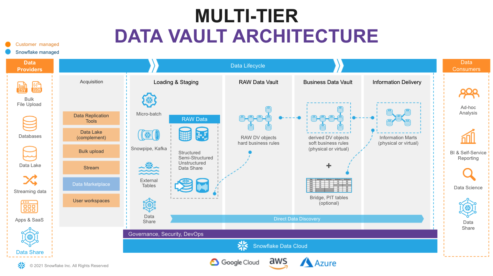
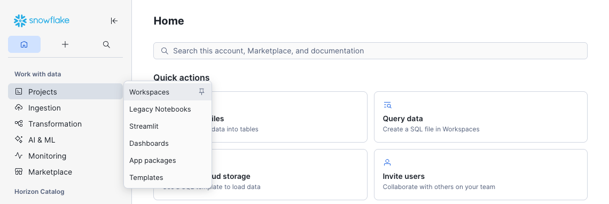
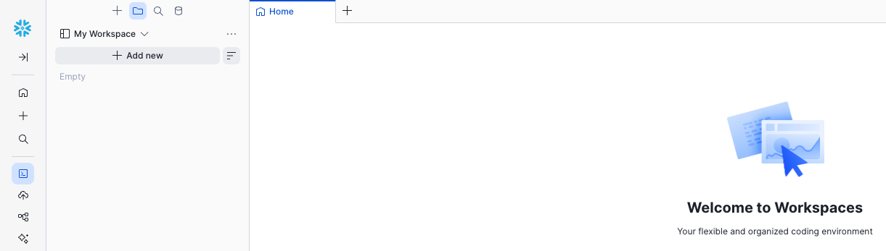
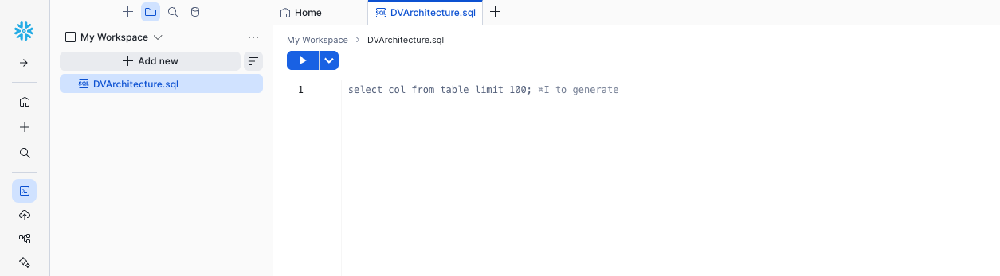

author: Paul Hooper
id: defensible-analytics-using-data-vault-and-snowflake
language: en
summary: Defensible Analytics using Data Vault and Snowflake
categories: snowflake-site:taxonomy/solution-center/certification/quickstart, snowflake-site:taxonomy/product/platform, snowflake-site:taxonomy/snowflake-feature/business-intelligence, snowflake-site:taxonomy/snowflake-feature/lakehouse-analytics
environments: web
status: Published
feedback link: https://github.com/Snowflake-Labs/sfguides/issues
fork repo link: https://github.com/sfc-gh-phooper/sfquickstarts


# Defensible Analytics using Data Vault and Snowflake
<!-- ------------------------ -->
## Defensible Analytics

Today, AI tools interact with data on a daily basis, and enterprises are increasingly recognizing the need for a mature [system of information management](https://datavaultalliance.com/strategy-operating/system-information-management/) that provides **defensible analytics** -- analytics based upon auditable, trustworthy enterprise memory, with unambiguous business context.

Instead, enterprises require a reliable **system of information management**, a system that not only transforms data, but continuous trustworthy information that is aligned to business needs, accompanied by business context, using business vocabulary, with auditable lineage to the originating source. The system must generate the evidence needed to make confident decisions, defend those decisions, and enable consistent answers to questions given to AI agents. The system must be responsive to change, which comes at the speed of business, compatible with an agile approach to implementation, maximizing reuse and avoiding duplication of effort, yet never destroying the auditability and reliability of what has already been delivered.

Data are assets, relevant to our decision-making processes, reducing the effort of, and increasing the quality, speed, and execution of our decisions. Better decision-making improves the performance of our enterprise for all stakeholders. Knowing that, how do we manage information appropriately?

### What is Data Vault

In 2018, at the World-Wide Data Vault Consortium (WWDVC), [Bill Inmon](https://en.wikipedia.org/wiki/Bill_Inmon) slightly updated his classic definition of the Data Warehouse.


 He followed that statement with his recommendation of the Data Vault system to build it. His definition does not contain the words schema-on-write or structured. His phrase "collection of data" includes [unstructured](https://docs.snowflake.com/en/user-guide/unstructured-intro) and [semi-structured](https://docs.snowflake.com/en/user-guide/semistructured-intro) data. Whether we call it a data warehouse, data lake, or data lakehouse, nothing beats the Snowflake AI Data Cloud when it comes to handling those diverse types of data.

Data Vault, as invented by [Dan Linstedt](https://datavaultalliance.com/#about), is not just a collection of data modeling standards, but a complete system of information management. That system has key pillars of methodology, architecture, and model, always supporting informed decision-making and delivering business outcomes. This guide cannot possibly detail the entire Data Vault system. To gain a full understanding of Data Vault, we recommend working with experts & partners from [Data Vault Alliance](https://datavaultalliance.com/).

In Data Vault 2.1, Linstedt has clearly articulated a logical architecture consisting of gated [zones](https://www.youtube.com/watch?v=OkI1LWsz9Nc). At the core are the Landing Zone, the Enterprise Memory Zone, and the Information Delivery Zone. However, before a functional implementation, the logical architecture must progress to physical. This guide is an introduction to how that may be accomplished in the Snowflake AI Data Cloud.

### Prerequisites
- Familiarity with [Snowflake key concepts and architecture](https://docs.snowflake.com/en/user-guide/intro-key-concepts)
- Familiarity with [Data Vault methodology and architecture](https://datavaultalliance.com/#resources)

### What You’ll Learn
- How to structure a Snowflake account for Data Vault
- How to enable domain-oriented development and governance in your Data Vault

### What You’ll Need 
- A Snowflake account -- we recommend starting with a fresh Enterprise Edition [trial](https://trial.snowflake.com/) account for this guide

### What You’ll Build 
- A Data Vault environment using Snowflake


<!-- ------------------------ -->
## Reference Architecture

Let’s start with the target architecture. 



On the very left of figure above we have a list of **data sources** that typically include a mix of operational databases, files, streaming event sources, SaaS apps, and more. The [Snowflake Marketplace](https://www.snowflake.com/en/product/features/marketplace/) allows us to tap into 3rd party data to augment our own.

On the very right we have our ultimate **data consumers**: business users, AI agents, data scientists, IT systems or even other companies you decide to share your data with.

Architecturally, we will consider the following Data Vault 2.1 zones:
- **Transient Zone**: used to transport ephemeral data from source systems and make it accessible for ingestion into Snowflake. We won't dive deep into this zone in this guide, but be sure to check out [Snowflake Openflow](https://docs.snowflake.com/en/user-guide/data-integration/openflow/about) and the [Snowflake Ecosystem](https://docs.snowflake.com/en/user-guide/ecosystem) as key enablers for this zone.
- **Landing Zone**: a managed persistent staging area (PSA) where data is ingested and kept as close as possible to its original state, as established by the source systems it came from. For this Snowflake has [multiple options](https://docs.snowflake.com/en/guides-overview-loading-data), including [bulk loading of files](https://docs.snowflake.com/en/user-guide/data-load-local-file-system), continuous loading of micro-batches of files through [Snowpipe](https://docs.snowflake.com/en/user-guide/data-load-snowpipe-intro), or continuous rows of data through [Snowpipe Streaming](https://docs.snowflake.com/en/user-guide/snowpipe-streaming/data-load-snowpipe-streaming-overview). Snowflake allows you to load and store structured, unstructured, and semi-structured in the original format whilst automatically optimizing the physical structure for efficient query access. But this zone isn't just a data dump. Per Data Vault 2.1, in this zone the data is immutable, stored as it was received from source, with no changes to the content. Here, data are [governed as assets](https://docs.snowflake.com/en/guides-overview-govern). Metadata may be documented, data may be tagged, profiled, and encrypted. Snowflake's [storage lifecycle policies](https://docs.snowflake.com/en/user-guide/storage-management/storage-lifecycle-policies) may be used to automatically move older data to more cost-effective cool and cold archival tiers, keeping expenses down.
- **Enterprise Memory Zone**: where data become subject-oriented, integrated by business key, time-variant and non-volatile. This is where the data vault modeling patterns -- such as hubs, links, and satellites -- begin to be applied. Data enters the raw vault, sparsely built, where only hard business rules are applied, loading all records received from source.
- **Information Delivery Zone**: a collection of consumer-oriented models, designed to inform decision-making processes. This can be implemented as a set (or multiple sets) of views. It is common to see the use of dimensional models (facts and dimensions, star or snowflake) or denormalized flat tables (for data science or sharing) but it could be any other modeling style (e.g., unified star schema, supernova, key-value, document object model, etc.) that fits best for your data consumer. The Business Vault contains data vault objects with soft business rules applied, augmenting the intelligence of the system, and potentially enhancing the performance of the consumer-facing views. Soft business rules may include the calculation of metrics, commonly used aggregations, master data records, PIT and Bridge tables helping to simplify access to bi-temporal view of the data with highly performant views of facts and dimensions. Snowflake’s scalability will support the required speed of access at any point of this data lifecycle. You should consider materialization of Business Vault and other Information Delivery objects as optional.

With a brand new Snowflake account, objects are not automatically created to represent these logical concepts. We must create them, while building within the constraints of Snowflake's object hierarchy below.


<!-- ------------------------ -->
## From Logical Architecture Zones to Implemented Snowflake Objects

If you're familiar with Snowflake's [Data Cloud Deployment Framework (DCDF)](https://www.snowflake.com/en/developers/guides/dcdf-incremental-processing/), you might recognize parallels between the Data Vault zones and the DCDF databases: Raw, Integration, and Presentation. This is because databases are a great place to start for the physical implementation of the logical zones. Snowflake Databases are not simply containers, but a key aspect of the physical architecture with significant governance implications.

In addition to the databases related to our Data Vault zones, a common platform database can serve to hold objects not specific to any single zone. We'll create this, as well.

> For the sake of simplicity, this guide will not delve into utilizing multiple Snowflake accounts. However, adopting a multi-account strategy, taking advantage of Snowflake's remarkable [Secure Data Sharing](https://docs.snowflake.com/en/user-guide/data-sharing-intro), could unlock significant value for your organization. A multi-account strategy is one where a single [Organization](https://docs.snowflake.com/en/user-guide/organizations) has multiple Accounts, each serving a specific purpose. This provides you with the flexibility to distribute databases across multiple accounts, where [shared read-only access to data](https://docs.snowflake.com/en/user-guide/data-sharing-intro) with zero copying, and thus enabling the use of different [Editions](https://docs.snowflake.com/en/user-guide/intro-editions) for different Accounts, which enable different feature sets and have different compute pricing. Databases may also be [replicated for business continuity and disaster recovery purposes](https://docs.snowflake.com/en/user-guide/account-replication-config) to other accounts.

### Step 0: Login to your Snowflake Account, Create a Workspace File

Login to your Snowflake trial account. You will need to use the same user and password that you used to login to your Snowflake account the first time.

To get started on the implementation, click on Projects -> Workspaces to open the Workspaces interface.



Make a mental note of the content on the Home tab. Click the + Add new button, then SQL File, and name this new file DVArchitecture.sql.



This is an intuitive SQL workbench. It has a section for the code we'll copy from the guide and paste into the SQL file. It also has a 'run' button to execute the code, the result panel at the bottom, and Cortex Code to the right to provide natural language assistance.



At the end of this guide, you will explore what you've created through the eyes of different roles. However, with a new trial account, your user will default to using all secondary roles. So, we'll start by changing that to using none. This ensures secondary roles are not automatically activated at login, so you can activate them explicitly when needed:

```sql
-- Defaulting Secondary Roles to None ------------------------------------------
ALTER USER SET DEFAULT_SECONDARY_ROLES = ();
```

This setting is checked at sign in, so click your user icon at the bottom left corner, Sign Out, and then sign back in. Once signed back in, open your DVArchitecture.sql SQL File.

### Step 1: Platform Role, Warehouse, and Database

Assuming you are using a new trial account, we'll start with some basics. We'll create a Platform Administrator role, as well as a virtual warehouse to use for basic administrative tasks, and a common platform database for common objects. This is meant to serve only as an example. Your role-based access control (RBAC) strategy and design may differ, but we'll use this example later in the guide. We'll grant the ability for any user to see the Platform database using the PUBLIC role.

```sql
-- Platform Administration Role ------------------------------------------------
USE ROLE SECURITYADMIN;

CREATE ROLE IF NOT EXISTS PLT_ADMIN
  COMMENT = 'Platform administrator role for managing shared platform objects';

GRANT ROLE PLT_ADMIN TO ROLE SYSADMIN;

-- Administration Warehouse ----------------------------------------------------
USE ROLE SYSADMIN;

CREATE WAREHOUSE IF NOT EXISTS ADMIN_WH
  WAREHOUSE_SIZE = 'XSMALL'
  AUTO_SUSPEND = 60
  AUTO_RESUME = TRUE
  INITIALLY_SUSPENDED = TRUE
  COMMENT = 'Administration warehouse for platform admin tasks';

GRANT ALL PRIVILEGES ON WAREHOUSE ADMIN_WH TO ROLE PLT_ADMIN WITH GRANT OPTION;

-- Platform Database -----------------------------------------------------------
CREATE DATABASE IF NOT EXISTS PLT
  COMMENT = 'Common centralized platform database for shared objects and utilities';

DROP SCHEMA IF EXISTS PLT.PUBLIC;

GRANT ALL PRIVILEGES ON DATABASE PLT TO ROLE PLT_ADMIN WITH GRANT OPTION;
```

### Step 2: Platform Governance Schema

Let's create a schema in the platform database for governance, containing common objects that we'll provide as the platform administrator, or as a central enablement team.

```sql
-- Platform Database: Governance -----------------------------------------------
USE ROLE PLT_ADMIN;

CREATE SCHEMA IF NOT EXISTS PLT.GOVERNANCE
  WITH MANAGED ACCESS
  COMMENT = 'Platform governance objects, such as classification tags for annotating data assets';

CREATE DATABASE ROLE IF NOT EXISTS PLT.GOVERNANCE_R
  COMMENT = 'Read access to platform governance objects and tag definitions';
CREATE DATABASE ROLE IF NOT EXISTS PLT.GOVERNANCE_A
  COMMENT = 'Apply and invoke access to platform governance objects';
CREATE DATABASE ROLE IF NOT EXISTS PLT.GOVERNANCE_W
  COMMENT = 'Create and manage platform governance objects';

GRANT DATABASE ROLE PLT.GOVERNANCE_R TO DATABASE ROLE PLT.GOVERNANCE_A;
GRANT DATABASE ROLE PLT.GOVERNANCE_A TO DATABASE ROLE PLT.GOVERNANCE_W;

GRANT DATABASE ROLE PLT.GOVERNANCE_R TO ROLE PUBLIC;

-- GOVERNANCE_R: read access to governance schema and tag values
GRANT USAGE ON DATABASE PLT TO DATABASE ROLE PLT.GOVERNANCE_R;
GRANT USAGE ON SCHEMA PLT.GOVERNANCE TO DATABASE ROLE PLT.GOVERNANCE_R;

-- GOVERNANCE_A: apply platform governance objects
GRANT MONITOR ON SCHEMA PLT.GOVERNANCE TO DATABASE ROLE PLT.GOVERNANCE_A;
GRANT USAGE ON FUTURE DATA METRIC FUNCTIONS IN SCHEMA PLT.GOVERNANCE TO DATABASE ROLE PLT.GOVERNANCE_A;
-- Note that the APPLY privilege may not be granted to future tags, but granted after tags are created

-- GOVERNANCE_W: create and manage platform governance objects
GRANT CREATE DATA METRIC FUNCTION ON SCHEMA PLT.GOVERNANCE TO DATABASE ROLE PLT.GOVERNANCE_W;
GRANT CREATE TAG ON SCHEMA PLT.GOVERNANCE TO DATABASE ROLE PLT.GOVERNANCE_W;

CREATE TAG IF NOT EXISTS PLT.GOVERNANCE.INFO_CLASSIFICATION
  ALLOWED_VALUES 'Public', 'Internal', 'Restricted'
  COMMENT = 'Information classification level of the tagged data object or column';
GRANT READ ON TAG PLT.GOVERNANCE.INFO_CLASSIFICATION TO DATABASE ROLE PLT.GOVERNANCE_R;
GRANT APPLY ON TAG PLT.GOVERNANCE.INFO_CLASSIFICATION TO DATABASE ROLE PLT.GOVERNANCE_A;

CREATE TAG IF NOT EXISTS PLT.GOVERNANCE.DOMAIN
  COMMENT = 'Domain association of the tagged data object or column';
GRANT READ ON TAG PLT.GOVERNANCE.DOMAIN TO DATABASE ROLE PLT.GOVERNANCE_R;
GRANT APPLY ON TAG PLT.GOVERNANCE.DOMAIN TO DATABASE ROLE PLT.GOVERNANCE_A;
```

> This guide could not possibly cover the vast array of what is possible using the powerful governance features available. [Cortex Code includes built-in data governance skills](https://docs.snowflake.com/en/user-guide/governance-skills) designed to help you understand, protect, and monitor the data in your Snowflake account.
>
> Snowflake provides a set of built-in DMFs — such as `SNOWFLAKE.CORE.NULL_COUNT`, `SNOWFLAKE.CORE.DUPLICATE_COUNT`, and `SNOWFLAKE.CORE.FRESHNESS` — that cover generic quality checks out of the box. Custom DMFs in `PLT.GOVERNANCE` should encode Data Vault-specific quality standards that have no system equivalent, such as LDTS staleness, future LDTS values, hash key and business key duplicates, and ghost records.
>
> Snowflake provides a set of built-in Tags — such as `SNOWFLAKE.CORE.SEMANTIC_CATEGORY` and `SNOWFLAKE.CORE.PRIVACY_CATEGORY` — that cover generic sensitive data classification out of the box. Custom Tags stored in `PLT.GOVERNANCE` should encode your organization's specific or Data Vault-specific tags that have no system equivalent. The `INFO_CLASSIFICATION` tag is an example. You can map user-defined tags to system-defined classification tags. For example, you can set up a tag map so that every time the system tag SNOWFLAKE.CORE.SEMANTIC_CATEGORY = 'NAME' is applied to a column, the custom tag INFO_CLASSIFICATION = 'Restricted' is also applied. See [Sensitive Data Classification](https://docs.snowflake.com/en/user-guide/classify-intro).
>
> Snowflake's [Data Protection Policies](https://docs.snowflake.com/en/user-guide/tag-based-masking-policies) — masking, row access, aggregation, projection — enforce the information classification at the column or row level. Restricted data is typically restricted to a list of named persons, where that list is typically given a domain-specific role and governed in domain-specific manner. Thus, these policies will be created later in the domain-oriented schemas, not in `PLT.GOVERNANCE`.
>
> Snowflake does not support future grants for tags — `GRANT APPLY ON TAG` is issued per object immediately after each `CREATE TAG`.


### Step 3: Platform Admin Tools Schema

Let's create a schema in the platform database for administration tools, containing helper procedures that we'll later use as the platform administrator, reducing repetition and helping achieve consistency later in our deployment. This is a long block of code, with content that might make more sense later, so don't feel the need to understand every detail.

```sql
-- Platform Database: Admin Tools ----------------------------------------------
USE ROLE PLT_ADMIN;

CREATE SCHEMA IF NOT EXISTS PLT.ADMIN_TOOLS
  WITH MANAGED ACCESS
  COMMENT = 'Common platform administration tools and utilities';

CREATE OR REPLACE PROCEDURE PLT.ADMIN_TOOLS.CREATE_SCHEMA_AND_ROLES(
    DATABASE_NAME   VARCHAR,
    SCHEMA_NAME     VARCHAR,
    SCHEMA_SUBJECT  VARCHAR
)
RETURNS VARCHAR
LANGUAGE SQL
COMMENT = 'Base helper: creates a managed-access schema, paired _R/_W database roles, and standard privilege grants. Called by zone-specific wrappers.'
EXECUTE AS CALLER
AS
$$
DECLARE
    v_db        VARCHAR DEFAULT UPPER(DATABASE_NAME);
    v_schema    VARCHAR DEFAULT UPPER(SCHEMA_NAME);
    v_subject   VARCHAR DEFAULT SCHEMA_SUBJECT;
BEGIN

    -- Ensure database-wide roles exist
    EXECUTE IMMEDIATE 'CREATE DATABASE ROLE IF NOT EXISTS ' || v_db || '.DB_R'
        || ' COMMENT = ''Database-wide read access''';
    EXECUTE IMMEDIATE 'CREATE DATABASE ROLE IF NOT EXISTS ' || v_db || '.DB_W'
        || ' COMMENT = ''Database-wide write and create access''';

    -- Create the managed access schema
    EXECUTE IMMEDIATE
        'CREATE SCHEMA IF NOT EXISTS ' || v_db || '.' || v_schema
        || ' WITH MANAGED ACCESS'
        || ' COMMENT = ''' || REPLACE(v_subject, '''', '''''') || '''';

    -- Create schema-specific database roles
    EXECUTE IMMEDIATE
        'CREATE DATABASE ROLE IF NOT EXISTS ' || v_db || '.' || v_schema || '_R'
        || ' COMMENT = ''Read access to ' || REPLACE(v_subject, '''', '''''') || ' (' || v_schema || ')''';
    EXECUTE IMMEDIATE
        'CREATE DATABASE ROLE IF NOT EXISTS ' || v_db || '.' || v_schema || '_W'
        || ' COMMENT = ''Write and create access to ' || REPLACE(v_subject, '''', '''''') || ' (' || v_schema || ')''';

    -- _R granted to DB_R and to _W (so _W inherits _R)
    EXECUTE IMMEDIATE 'GRANT DATABASE ROLE ' || v_db || '.' || v_schema || '_R TO DATABASE ROLE ' || v_db || '.DB_R';
    EXECUTE IMMEDIATE 'GRANT DATABASE ROLE ' || v_db || '.' || v_schema || '_R TO DATABASE ROLE ' || v_db || '.' || v_schema || '_W';
    -- _W granted to DB_W
    EXECUTE IMMEDIATE 'GRANT DATABASE ROLE ' || v_db || '.' || v_schema || '_W TO DATABASE ROLE ' || v_db || '.DB_W';

    -- Grant USAGE and MONITOR on database and schema to _R
    EXECUTE IMMEDIATE 'GRANT USAGE, MONITOR ON DATABASE ' || v_db
        || ' TO DATABASE ROLE ' || v_db || '.' || v_schema || '_R';
    EXECUTE IMMEDIATE 'GRANT USAGE, MONITOR ON SCHEMA ' || v_db || '.' || v_schema
        || ' TO DATABASE ROLE ' || v_db || '.' || v_schema || '_R';

    RETURN 'SUCCESS: Created schema ' || v_db || '.' || v_schema
        || ' with roles ' || v_schema || '_R, ' || v_schema || '_W.';
END;
$$;

CREATE OR REPLACE PROCEDURE PLT.ADMIN_TOOLS.CREATE_LZ_SCHEMA_AND_ROLES(
    DATABASE_NAME   VARCHAR,
    SCHEMA_NAME     VARCHAR,
    SOURCE_SYSTEM   VARCHAR
)
RETURNS VARCHAR
LANGUAGE SQL
COMMENT = 'Creates a Landing Zone schema and roles for a source system, adding insert-only write and stage/pipe future grants to enforce immutability after initial load.'
EXECUTE AS CALLER
AS
$$
DECLARE
    v_db     VARCHAR DEFAULT UPPER(DATABASE_NAME);
    v_schema VARCHAR DEFAULT UPPER(SCHEMA_NAME);
BEGIN

    CALL PLT.ADMIN_TOOLS.CREATE_SCHEMA_AND_ROLES(:v_db, :v_schema, :SOURCE_SYSTEM);

    -- _R: read-only access to landing zone objects
    EXECUTE IMMEDIATE 'GRANT SELECT ON FUTURE TABLES IN SCHEMA ' || v_db || '.' || v_schema
        || ' TO DATABASE ROLE ' || v_db || '.' || v_schema || '_R';

    -- _W: insert-only write access (LZ data is immutable after initial load)
    EXECUTE IMMEDIATE 'GRANT INSERT ON FUTURE TABLES IN SCHEMA ' || v_db || '.' || v_schema
        || ' TO DATABASE ROLE ' || v_db || '.' || v_schema || '_W';
    EXECUTE IMMEDIATE 'GRANT USAGE, READ, WRITE ON FUTURE STAGES IN SCHEMA ' || v_db || '.' || v_schema
        || ' TO DATABASE ROLE ' || v_db || '.' || v_schema || '_W';
    EXECUTE IMMEDIATE 'GRANT MONITOR, OPERATE ON FUTURE PIPES IN SCHEMA ' || v_db || '.' || v_schema
        || ' TO DATABASE ROLE ' || v_db || '.' || v_schema || '_W';
    EXECUTE IMMEDIATE 'GRANT CREATE PIPE ON SCHEMA ' || v_db || '.' || v_schema
        || ' TO DATABASE ROLE ' || v_db || '.' || v_schema || '_W';
    EXECUTE IMMEDIATE 'GRANT CREATE TABLE ON SCHEMA ' || v_db || '.' || v_schema
        || ' TO DATABASE ROLE ' || v_db || '.' || v_schema || '_W';

    RETURN 'SUCCESS: Created schema ' || v_db || '.' || v_schema
        || ' for source system ' || SOURCE_SYSTEM || ' with future grants applied.';
END;
$$;

CREATE OR REPLACE PROCEDURE PLT.ADMIN_TOOLS.CREATE_DOMAIN_SCHEMA_AND_ROLES(
    DATABASE_NAME   VARCHAR,
    SCHEMA_NAME     VARCHAR,
    DOMAIN          VARCHAR
)
RETURNS VARCHAR
LANGUAGE SQL
COMMENT = 'Creates a domain-oriented schema and roles with full analytical object future grants (tables, views, dynamic tables, functions, procedures, streams, tasks, DMFs, and policies). Base procedure for DV and DW zone wrappers.'
EXECUTE AS CALLER
AS
$$
DECLARE
    v_db     VARCHAR DEFAULT UPPER(DATABASE_NAME);
    v_schema VARCHAR DEFAULT UPPER(SCHEMA_NAME);
BEGIN
    CALL PLT.ADMIN_TOOLS.CREATE_SCHEMA_AND_ROLES(:v_db, :v_schema, :DOMAIN);

    EXECUTE IMMEDIATE 'ALTER SCHEMA ' || v_db || '.' || v_schema
        || ' SET TAG PLT.GOVERNANCE.DOMAIN = ''' || REPLACE(DOMAIN, '''', '''''') || '''';

    -- _R: read access to domain schema objects
    EXECUTE IMMEDIATE 'GRANT SELECT ON FUTURE TABLES IN SCHEMA ' || v_db || '.' || v_schema
        || ' TO DATABASE ROLE ' || v_db || '.' || v_schema || '_R';
    EXECUTE IMMEDIATE 'GRANT SELECT ON FUTURE VIEWS IN SCHEMA ' || v_db || '.' || v_schema
        || ' TO DATABASE ROLE ' || v_db || '.' || v_schema || '_R';
    EXECUTE IMMEDIATE 'GRANT SELECT ON FUTURE DYNAMIC TABLES IN SCHEMA ' || v_db || '.' || v_schema
        || ' TO DATABASE ROLE ' || v_db || '.' || v_schema || '_R';
    EXECUTE IMMEDIATE 'GRANT USAGE ON FUTURE FUNCTIONS IN SCHEMA ' || v_db || '.' || v_schema
        || ' TO DATABASE ROLE ' || v_db || '.' || v_schema || '_R';
    EXECUTE IMMEDIATE 'GRANT USAGE ON FUTURE PROCEDURES IN SCHEMA ' || v_db || '.' || v_schema
        || ' TO DATABASE ROLE ' || v_db || '.' || v_schema || '_R';

    -- _W: write access and pipeline management
    EXECUTE IMMEDIATE 'GRANT SELECT ON FUTURE STREAMS IN SCHEMA ' || v_db || '.' || v_schema
        || ' TO DATABASE ROLE ' || v_db || '.' || v_schema || '_W';
    EXECUTE IMMEDIATE 'GRANT MONITOR, OPERATE ON FUTURE TASKS IN SCHEMA ' || v_db || '.' || v_schema
        || ' TO DATABASE ROLE ' || v_db || '.' || v_schema || '_W';
    EXECUTE IMMEDIATE 'GRANT MONITOR, OPERATE ON FUTURE DYNAMIC TABLES IN SCHEMA ' || v_db || '.' || v_schema
        || ' TO DATABASE ROLE ' || v_db || '.' || v_schema || '_W';

    -- _W: schema-level CREATE privileges
    EXECUTE IMMEDIATE 'GRANT CREATE TABLE ON SCHEMA ' || v_db || '.' || v_schema
        || ' TO DATABASE ROLE ' || v_db || '.' || v_schema || '_W';
    EXECUTE IMMEDIATE 'GRANT CREATE VIEW ON SCHEMA ' || v_db || '.' || v_schema
        || ' TO DATABASE ROLE ' || v_db || '.' || v_schema || '_W';
    EXECUTE IMMEDIATE 'GRANT CREATE DYNAMIC TABLE ON SCHEMA ' || v_db || '.' || v_schema
        || ' TO DATABASE ROLE ' || v_db || '.' || v_schema || '_W';
    EXECUTE IMMEDIATE 'GRANT CREATE FUNCTION ON SCHEMA ' || v_db || '.' || v_schema
        || ' TO DATABASE ROLE ' || v_db || '.' || v_schema || '_W';
    EXECUTE IMMEDIATE 'GRANT CREATE PROCEDURE ON SCHEMA ' || v_db || '.' || v_schema
        || ' TO DATABASE ROLE ' || v_db || '.' || v_schema || '_W';
    EXECUTE IMMEDIATE 'GRANT CREATE STREAM ON SCHEMA ' || v_db || '.' || v_schema
        || ' TO DATABASE ROLE ' || v_db || '.' || v_schema || '_W';
    EXECUTE IMMEDIATE 'GRANT CREATE TASK ON SCHEMA ' || v_db || '.' || v_schema
        || ' TO DATABASE ROLE ' || v_db || '.' || v_schema || '_W';
    EXECUTE IMMEDIATE 'GRANT CREATE STAGE ON SCHEMA ' || v_db || '.' || v_schema
        || ' TO DATABASE ROLE ' || v_db || '.' || v_schema || '_W';
    EXECUTE IMMEDIATE 'GRANT CREATE DATA METRIC FUNCTION ON SCHEMA ' || v_db || '.' || v_schema
        || ' TO DATABASE ROLE ' || v_db || '.' || v_schema || '_W';
    EXECUTE IMMEDIATE 'GRANT CREATE MASKING POLICY ON SCHEMA ' || v_db || '.' || v_schema
        || ' TO DATABASE ROLE ' || v_db || '.' || v_schema || '_W';
    EXECUTE IMMEDIATE 'GRANT CREATE ROW ACCESS POLICY ON SCHEMA ' || v_db || '.' || v_schema
        || ' TO DATABASE ROLE ' || v_db || '.' || v_schema || '_W';
    EXECUTE IMMEDIATE 'GRANT CREATE TAG ON SCHEMA ' || v_db || '.' || v_schema
        || ' TO DATABASE ROLE ' || v_db || '.' || v_schema || '_W';

    RETURN 'SUCCESS: Created domain schema ' || v_db || '.' || v_schema
        || ' for ' || DOMAIN || '.';
END;
$$;

CREATE OR REPLACE PROCEDURE PLT.ADMIN_TOOLS.CREATE_DV_SCHEMA_AND_ROLES(
    DATABASE_NAME   VARCHAR,
    SCHEMA_NAME     VARCHAR,
    DOMAIN          VARCHAR
)
RETURNS VARCHAR
LANGUAGE SQL
COMMENT = 'Creates a Data Vault schema and roles for a domain, enforcing insert-only writes to preserve Data Vault immutability.'
EXECUTE AS CALLER
AS
$$
DECLARE
    v_db     VARCHAR DEFAULT UPPER(DATABASE_NAME);
    v_schema VARCHAR DEFAULT UPPER(SCHEMA_NAME);
BEGIN
    CALL PLT.ADMIN_TOOLS.CREATE_DOMAIN_SCHEMA_AND_ROLES(:v_db, :v_schema, :DOMAIN);

    -- _W: insert-only (DV tables are immutable)
    EXECUTE IMMEDIATE 'GRANT INSERT ON FUTURE TABLES IN SCHEMA ' || v_db || '.' || v_schema
        || ' TO DATABASE ROLE ' || v_db || '.' || v_schema || '_W';

    RETURN 'SUCCESS: Created Data Vault schema ' || v_db || '.' || v_schema
        || ' for ' || DOMAIN || ' with future grants applied.';
END;
$$;

CREATE OR REPLACE PROCEDURE PLT.ADMIN_TOOLS.CREATE_DW_SCHEMA_AND_ROLES(
    DATABASE_NAME   VARCHAR,
    SCHEMA_NAME     VARCHAR,
    DOMAIN          VARCHAR
)
RETURNS VARCHAR
LANGUAGE SQL
COMMENT = 'Creates a Data Warehouse schema and roles for a domain, granting full DML write access and semantic view creation for AI-agent consumption.'
EXECUTE AS CALLER
AS
$$
DECLARE
    v_db     VARCHAR DEFAULT UPPER(DATABASE_NAME);
    v_schema VARCHAR DEFAULT UPPER(SCHEMA_NAME);
BEGIN
    CALL PLT.ADMIN_TOOLS.CREATE_DOMAIN_SCHEMA_AND_ROLES(:v_db, :v_schema, :DOMAIN);

    -- _W: full write access to DW tables
    EXECUTE IMMEDIATE 'GRANT INSERT, UPDATE, DELETE, TRUNCATE ON FUTURE TABLES IN SCHEMA ' || v_db || '.' || v_schema
        || ' TO DATABASE ROLE ' || v_db || '.' || v_schema || '_W';

    -- _R/_W: semantic view access (DW schemas are AI-agent consumable)
    EXECUTE IMMEDIATE 'GRANT SELECT ON FUTURE SEMANTIC VIEWS IN SCHEMA ' || v_db || '.' || v_schema
        || ' TO DATABASE ROLE ' || v_db || '.' || v_schema || '_R';
    EXECUTE IMMEDIATE 'GRANT CREATE SEMANTIC VIEW ON SCHEMA ' || v_db || '.' || v_schema
        || ' TO DATABASE ROLE ' || v_db || '.' || v_schema || '_W';

    RETURN 'SUCCESS: Created Data Warehouse schema ' || v_db || '.' || v_schema
        || ' for ' || DOMAIN || ' with future grants applied.';
END;
$$;
```

### Step 4: Landing Zone Database

Let's create a database that will serve as our Landing Zone, as well as a role and warehouse designed for ingesting data.

```sql
-- Development LZ Ingestion Role -----------------------------------------------
USE ROLE SECURITYADMIN;

CREATE ROLE IF NOT EXISTS DEV_LZ_INGEST
  COMMENT = 'Ingestion role for the development landing zone';

GRANT ROLE DEV_LZ_INGEST TO ROLE SYSADMIN;

-- Development LZ Ingestion Warehouse ------------------------------------------
USE ROLE SYSADMIN;

CREATE WAREHOUSE IF NOT EXISTS DEV_INGEST_WH
  WAREHOUSE_SIZE = 'XSMALL'
  AUTO_SUSPEND = 60
  AUTO_RESUME = TRUE
  INITIALLY_SUSPENDED = TRUE
  COMMENT = 'Warehouse for automated data ingestion workloads';

GRANT ALL PRIVILEGES ON WAREHOUSE DEV_INGEST_WH TO ROLE PLT_ADMIN WITH GRANT OPTION;
GRANT USAGE, OPERATE ON WAREHOUSE DEV_INGEST_WH TO ROLE DEV_LZ_INGEST;

-- Development LZ Database -----------------------------------------------------
CREATE DATABASE IF NOT EXISTS DEV_LZ
  COMMENT = 'Development landing zone for raw data ingestion';

DROP SCHEMA IF EXISTS DEV_LZ.PUBLIC;

GRANT ALL PRIVILEGES ON DATABASE DEV_LZ TO ROLE PLT_ADMIN WITH GRANT OPTION;
```

> **Development Environment**
>
> You may note that this serves as a development environment example. Objects developed here might later be promoted to a TST_LZ for testing, and then a main LZ, for production use. We're leaving those out here for the sake of brevity. However, in those test and production environments, ingestion of data is typically performed by an automated Service User. In the event multiple Service Users will be used to ingest data using multiple solutions, you may wish to create multiple ingestion roles.

### Step 5: Enterprise Memory and Information Delivery Zone Databases

Now, let's create two more databases. The first will serve as our Data Vault, holding staging, raw vault, and business vault objects. The second will serve as our analyst-facing interface to the Information Delivery Zone. We'll also create a QA analyst role and a warehouse for engineering (development and testing) use, and a warehouse for automated data transformation.

```sql
-- QA (Dev/Test) Analyst Role --------------------------------------------------
USE ROLE SECURITYADMIN;

CREATE ROLE IF NOT EXISTS QA_ANALYST
  COMMENT = 'General analyst role with read-only access to the information delivery zone';

GRANT ROLE QA_ANALYST TO ROLE PLT_ADMIN;


-- Data Transformation and Engineering Warehouses ------------------------------
USE ROLE SYSADMIN;

CREATE WAREHOUSE IF NOT EXISTS DEV_XFORM_WH
  WAREHOUSE_SIZE = 'XSMALL'
  AUTO_SUSPEND = 60
  AUTO_RESUME = TRUE
  INITIALLY_SUSPENDED = TRUE
  COMMENT = 'Warehouse for automated data transformation workloads';

GRANT ALL PRIVILEGES ON WAREHOUSE DEV_XFORM_WH TO ROLE PLT_ADMIN WITH GRANT OPTION;

CREATE WAREHOUSE IF NOT EXISTS ENGINEERING_WH
  WAREHOUSE_SIZE = 'XSMALL'
  AUTO_SUSPEND = 60
  AUTO_RESUME = TRUE
  INITIALLY_SUSPENDED = TRUE
  COMMENT = 'Warehouse for general development and testing use';

GRANT ALL PRIVILEGES ON WAREHOUSE ENGINEERING_WH TO ROLE PLT_ADMIN WITH GRANT OPTION;
GRANT USAGE, OPERATE ON WAREHOUSE ENGINEERING_WH TO ROLE QA_ANALYST;

-- Data Vault Database ---------------------------------------------------------
CREATE DATABASE IF NOT EXISTS DEV_DV
  COMMENT = 'Enterprise memory of domain-oriented data vault models';

DROP SCHEMA IF EXISTS DEV_DV.PUBLIC;

GRANT ALL PRIVILEGES ON DATABASE DEV_DV TO ROLE PLT_ADMIN WITH GRANT OPTION;

-- Data Warehouse Database -----------------------------------------------------
CREATE DATABASE IF NOT EXISTS DEV_DW
  COMMENT = 'Information delivery of domain-oriented models';

DROP SCHEMA IF EXISTS DEV_DW.PUBLIC;

GRANT ALL PRIVILEGES ON DATABASE DEV_DW TO ROLE PLT_ADMIN WITH GRANT OPTION;
```

> **Transformation Role and Ingestion Privileges**
>
> You may be wondering, why did we not grant privileges to the ingestion role, nor ever create a role for transforming data in the data vault? We will do this later, after the schemas in these databases are in place.


<!-- ------------------------ -->
## Business Architecture, Domains and Ontologies

It is critical that our Business Architecture inform our Information Architecture. Let's take a moment to think about how Business Architecture might inform these next examples.

### Domains

Business architecture can be organized conceptually into a **hierarchy of domains**. Eric Evans, in the book Domain Driven Design, defines a **domain** as, "a sphere of knowledge, influence, or activity." It is important to recognize that, assuming your organization has been performing business activities regularly, these domains already exist. Typically, they can be recognized and diagramed in a hierarchy, where domains can be broken into sub-domains. The **activities** in these domains **originate data** as valuable assets, not waste byproducts.

Also, a domain's business activities can rarely function without using data originating from other domains as input. For example, the **Finance** activity of accounting for revenue recognition in the prior quarter depends on invoicing information associated with fulfilled orders, that invoice data originating from activities in **Customer Service**. Before being invoiced, those orders were fulfilled by activities in **Manufacturing & Delivery**. Those orders originated with activities in **Sales & Marketing**. Placed but unfulfilled orders, or possibly just a Sales & Marketing expectation of future orders, might inform a Finance domain's Revenue Forecast. The people performing all those activities are all hired, tracked and managed through activities in the **Workforce** domain. And those workers were likely first given an email address through activities the **IT Delivery** domain. The complex web of connections between domains is often difficult, if not impossible, to diagram or comprehend in total. Within the perspective of only a single domain, understanding is more easily achieved.

> Note: The domain examples above are inspired by the [TBM Taxonomy's](https://www.tbmcouncil.org/learn-tbm/resource-center/the-tbm-taxonomy/) Business Layer Solutions Hierarchy.

### Domain Taxonomy and Ontologies

The business processes, as performed in an organization, along with business keys (how the people performing those activities identify things), units of work that connect business keys, descriptive information produced by activities, what technology systems are used, and input/output connections to other domains, can all be formally described in **ontologies**. These ontologies can be captured in simple text documents or aided by knowledge graph. And because each domain has a web of connections to other domains, not just hierarchical relationships, that domain hierarchy becomes a **domain taxonomy**. When getting started, don't attempt to "boil the ocean," but rather limit scope to a prioritized set of specific business objectives. However, that which is formally documented should be captured accurately, utilizing the domain expertise of those performing these business processes, reviewing with and gaining the formal approval of those who have dominion over the given domain(s). You don't want a documented ontology of the Finance domain that the CFO would not recognize or approve of. Every domain, when formally documented, should have an obvious authority figure, already having dominion over the activities, processes, and business vocabulary used within that domain.

As an example, we'll consider the following simple domain hierarchy, starting with just two domains, Sales & Marketing and Customer Service.


With Snowflake, schema objects -- which include tables, views, stages, file formats, pipes, streams, UDFs, stored procedures, and more -- always exist within a schema. While access control is possible at the schema object level, assigning privileges on each individual object, doing so at that grain quickly becomes tedious and costly to maintain. When objects with common access control objectives are grouped together into schemas, maintaining access controls becomes much easier. Real-world governance is almost always domain-oriented. Thus, we'll use domain-oriented schemas to organize the objects in our Enterprise Memory Zone and beyond, promoting domain-oriented governance.


<!-- ------------------------ -->
## From Logical Business Architecture to Implementation

### Step 6: Sample Source System Schema

In a real world scenario, because the data in the Landing Zone is source-system-oriented, a schema found in a Landing Zone database should be associated with a source system. For the sake of simplicity, let's create a single schema designed to land ingested sample data from the TPC-H decision support benchmark.

```sql
-- Landing Zone Schemas --------------------------------------------------------
USE ROLE PLT_ADMIN;
USE WAREHOUSE ADMIN_WH;

CALL PLT.ADMIN_TOOLS.CREATE_LZ_SCHEMA_AND_ROLES('DEV_LZ', 'TPCH_REF', 'Static Reference Data');
CALL PLT.ADMIN_TOOLS.CREATE_LZ_SCHEMA_AND_ROLES('DEV_LZ', 'TPCH_CUSTOMER_SYS', 'Customer System');
CALL PLT.ADMIN_TOOLS.CREATE_LZ_SCHEMA_AND_ROLES('DEV_LZ', 'TPCH_ORDER_SYS', 'Order System');

GRANT DATABASE ROLE DEV_LZ.DB_W TO ROLE DEV_LZ_INGEST;
```

> Note the simplicity of creating the source system schemas, granting write access to the functional role DEV_LZ_INGEST, by utilizing a common stored procedure that creates the managed access schema, access roles, and grants privileges to those roles. When multiple service users are able to write to the landing zone, be sure use specialized functional roles, assigning those the schema-specific write access roles.

### Step 7: Domain-Oriented Schemas

Now that we know our domains, let's create domain-oriented schemas in the DV and DW databases, representing our Enterprise Memory and Information Delivery Zones.

```sql
-- Enterprise Memory and Information Delivery Schemas --------------------------
USE ROLE PLT_ADMIN;
USE WAREHOUSE ADMIN_WH;

CALL PLT.ADMIN_TOOLS.CREATE_DV_SCHEMA_AND_ROLES('DEV_DV', 'SALESMKT', 'Sales & Marketing');
CALL PLT.ADMIN_TOOLS.CREATE_DW_SCHEMA_AND_ROLES('DEV_DW', 'SALESMKT', 'Sales & Marketing');
CALL PLT.ADMIN_TOOLS.CREATE_DV_SCHEMA_AND_ROLES('DEV_DV', 'CUSTSERV', 'Customer Service');
CALL PLT.ADMIN_TOOLS.CREATE_DW_SCHEMA_AND_ROLES('DEV_DW', 'CUSTSERV', 'Customer Service');
```
> Note that while the stored procedure creates the schemas and access roles, we don't yet have domain-oriented functional roles to which we may grant the access roles.

### Step 8: Domain-Oriented Roles and Privileges

Now, let's create domain-oriented functional roles, and grant access allowing for reading from the landing zone and other domain's data vault objects, but writing only to the domain-specific schemas in the Enterprise Memory and Information Delivery Zones. We grant read access to the entire Landing Zone, because source systems are often not domain specific. A domain-specific Landing Zone database could be used for a set of source systems restricted to just one domain. We grant cross-domain read access to the data vault models to avoid duplication of efforts and promote effective governance, while allowing one domain to leverage curated information from another. We restrict writing to the domain-specific roles, promoting accountability and effective governance over what is built.

```sql
-- Domain-Oriented Data Engineer Roles -----------------------------------------
USE ROLE SECURITYADMIN;

CREATE ROLE IF NOT EXISTS SALESMKT_ENGINEER
  COMMENT = 'Data engineering role for the development of Sales & Marketing objects and transformations';
GRANT ROLE SALESMKT_ENGINEER TO ROLE PLT_ADMIN;

CREATE ROLE IF NOT EXISTS CUSTSERV_ENGINEER
  COMMENT = 'Data engineering role for the development of Customer Service objects and transformations';
GRANT ROLE CUSTSERV_ENGINEER TO ROLE PLT_ADMIN;

-- Domain-Oriented Data Engineer Privileges ------------------------------------
USE ROLE PLT_ADMIN;

GRANT USAGE, OPERATE ON WAREHOUSE ENGINEERING_WH TO ROLE SALESMKT_ENGINEER;
GRANT USAGE, OPERATE ON WAREHOUSE DEV_XFORM_WH TO ROLE SALESMKT_ENGINEER;

GRANT DATABASE ROLE DEV_LZ.DB_R TO ROLE SALESMKT_ENGINEER;
GRANT DATABASE ROLE DEV_DV.SALESMKT_W TO ROLE SALESMKT_ENGINEER;
GRANT DATABASE ROLE DEV_DV.DB_R TO ROLE SALESMKT_ENGINEER;
GRANT DATABASE ROLE DEV_DW.SALESMKT_W TO ROLE SALESMKT_ENGINEER;

GRANT USAGE, OPERATE ON WAREHOUSE ENGINEERING_WH TO ROLE CUSTSERV_ENGINEER;
GRANT USAGE, OPERATE ON WAREHOUSE DEV_XFORM_WH TO ROLE CUSTSERV_ENGINEER;

GRANT DATABASE ROLE DEV_LZ.DB_R TO ROLE CUSTSERV_ENGINEER;
GRANT DATABASE ROLE DEV_DV.CUSTSERV_W TO ROLE CUSTSERV_ENGINEER;
GRANT DATABASE ROLE DEV_DV.DB_R TO ROLE CUSTSERV_ENGINEER;
GRANT DATABASE ROLE DEV_DW.CUSTSERV_W TO ROLE CUSTSERV_ENGINEER;

GRANT DATABASE ROLE DEV_DW.DB_R TO ROLE QA_ANALYST;
```

<!-- ------------------------ -->
## Conclusion And Resources

Now that everything has been created successfully, let's check it out! We can use the SQL below, or on the left select the Database Explorer icon. Remember, your selected role will influence what you can see after clicking the refresh button.

```sql
-- Explore as a Platform Admin -------------------------------------------------
USE ROLE PLT_ADMIN;
USE SECONDARY ROLES NONE;
USE WAREHOUSE ADMIN_WH;

SHOW DATABASES ->> SELECT "name", "comment" FROM $1 WHERE "kind" = 'STANDARD';

SHOW SCHEMAS IN DATABASE DEV_LZ ->> SELECT "database_name", "name", "comment" FROM $1;

-- Explore as a QA Analyst -----------------------------------------------------
USE ROLE QA_ANALYST;
USE WAREHOUSE ENGINEERING_WH;

SHOW DATABASES ->> SELECT "name", "comment" FROM $1 WHERE "kind" = 'STANDARD';

SHOW SCHEMAS IN DATABASE DEV_DW ->> SELECT "database_name", "name", "comment" FROM $1;

SHOW TAGS IN DATABASE PLT;

SELECT * FROM TABLE(DEV_DW.INFORMATION_SCHEMA.TAG_REFERENCES('DEV_DW.CUSTSERV', 'SCHEMA'));

SELECT * FROM TABLE(DEV_DW.INFORMATION_SCHEMA.TAG_REFERENCES('DEV_DW.SALESMKT', 'SCHEMA'));

SHOW SCHEMAS IN DATABASE DEV_DV; -- This will error, as the role doesn't have access

SHOW SCHEMAS IN DATABASE DEV_LZ; -- This will error, as the role doesn't have access

-- Explore as Dev LZ Ingest ----------------------------------------------------
USE ROLE DEV_LZ_INGEST;
USE WAREHOUSE DEV_INGEST_WH;

SHOW DATABASES ->> SELECT "name", "comment" FROM $1 WHERE "kind" = 'STANDARD';

SHOW SCHEMAS IN DATABASE DEV_LZ ->> SELECT "database_name", "name", "comment" FROM $1;

SHOW SCHEMAS IN DATABASE DEV_DV; -- This will error, as the role doesn't have access
```

We covered some of the basics to get started. As an architect, you may be considering creating test and main production environments; or additional roles, both platform oriented and domain oriented; or additional tags, access policies and restricted information roles; or data metric functions, with a data quality / error mart; or additional common functions and stored procedures; or even Presentation Zone databases for custom customer-facing data shares, Streamlit apps and dashboards, or Agents for use with Snowflake Intelligence. We hope we've whet your appetite for more.

You are now ready to advance to the [next guide, Building a Real-Time Data Vault in Snowflake](https://www.snowflake.com/en/developers/guides/vhol-data-vault/)! Data Vault 2.x consists of 3 pillars -- methodology, architecture, and model -- and while this guide focuses on architecture, the next guide focuses on modeling. We've updated that guide to leverage the structure defined here, as well as adding some new content.

If you want to learn more about Data Vault 2.1, check out the latest content from Data Vault Alliance: the [blog, training and certification resources](https://datavaultalliance.com/), the [DVA United](https://www.dvaunited.com/) community, and free content on [YouTube](https://www.youtube.com/@DataVaultAlliance/videos).

### What You Learned
- How to translate Data Vault's logical architecture zones into Snowflake databases
- How to get started with a Domain Taxonomy and Ontologies
- How to create Snowflake schemas for either source systems or domains
- How to create and leverage a common platform database for shared resources

### What's Next
- [Building a Real-Time Data Vault in Snowflake](https://www.snowflake.com/en/developers/guides/vhol-data-vault/)
