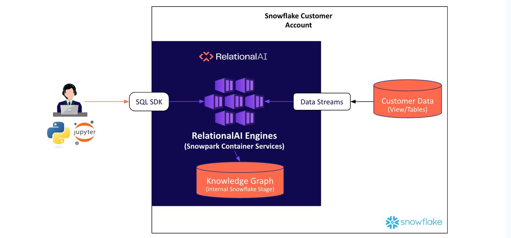

author: RelationalAI Staff
id: discovering-the-social-graph-of-your-customers-using-relationalai-and-snowflake
summary: This solution architecture shows how to build a social graph of your customers for community detection using RelationalAI and Snowflake.
categories: snowflake-site:taxonomy/solution-center/certification/partner-solution
environments: web
language: en
status: Published
feedback link: https://github.com/Snowflake-Labs/sfguides/issues
fork repo link: https://github.com/Snowflake-Labs/sfquickstarts/tree/master/site/sfguides/src/discovering-the-social-graph-of-your-customers-using-relationalai-and-snowflake

# Discovering the Social Graph of your Customers using RelationalAI
<!-- ------------------------ -->
## Overview

This solution architecture shows how to build a social graph of your customers for community detection using RelationalAI and Snowflake.

* Load Point-of-Sales data of all the food truck
* Install RelationalAI Native app from Snowflake Marketplace
* Run community detection algorithms on the Point-of-sales data

<!-- ------------------------ -->
## Solution Architecture: Community Detection using Relational AI and Snowflake

* In this use-case, we build a harmonized view of the Point-of-sales data from TastyBytes food truck company.
* Install RelationalAI native app from Snowflake marketplace to create customer-to-customer relationships
* Create a community graph and run the Louvain graph algorithm to discover communities inside the graph
* Visualize the graph to understand the shape of the graph
