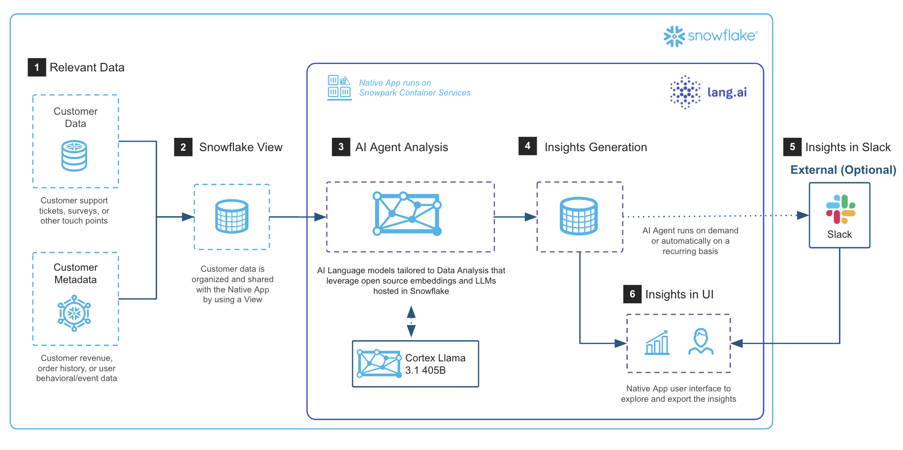

author: Lang.ai Staff
id: driving-customer-growth-and-retention-with-lang-ai
summary: This solution architecture shows you how to use Lang.ai and Snowflake to build AI agents that drive growth and retention.
categories: snowflake-site:taxonomy/solution-center/certification/partner-solution
environments: web
language: en
status: Published
feedback link: https://github.com/Snowflake-Labs/sfguides/issues
fork repo link: https://www.snowflake.com/en/developers/guides/create-ai-agents-on-snowflake-with-lang-ai/#0

# Driving Customer Growth and Retention with Lang.ai
<!-- ------------------------ -->
## Overview

This solution architecture shows you how to use Lang.ai and Snowflake to build AI agents that drive growth and retention.

* Automate complex data engineering for unstructured data, eliminating time-consuming manual processes.
* Bring normally separate data from product, customer interactions, and revenue together into one clear story.

<!-- ------------------------ -->
## Solution Architecture: Snowflake AI Agents by Lang.ai

|  |  |
| --- | --- |
| Quickly build AI agents to automate analysis of multichannel customer data, identifying key product frictions  * Prioritize product frictions by impact, aligning with your specific business goals * Deploy custom AI models fine-tuned to your company’s context, evolving continuously with new data | |

<!-- ------------------------ -->
## Get Started

- [view quickstart](https://quickstarts.snowflake.com/guide/create_ai_agents_on_snowflake_with_lang_ai/?_fsi=JPxvZrjh#0)
- [fork repo](https://github.com/Snowflake-Labs/sf-samples/tree/main/samples/create_ai_agents_on_snowflake_with_lang_ai)
- [Download reference architecture](https://www.snowflake.com/content/dam/snowflake-site/developers/2024/10/Snowflake-AI-Agents-by-Lang.ai_.pdf)
- [Read the blog](https://medium.com/snowflake/ai-agents-in-snowflake-for-data-analysis-055c9f97338a)
