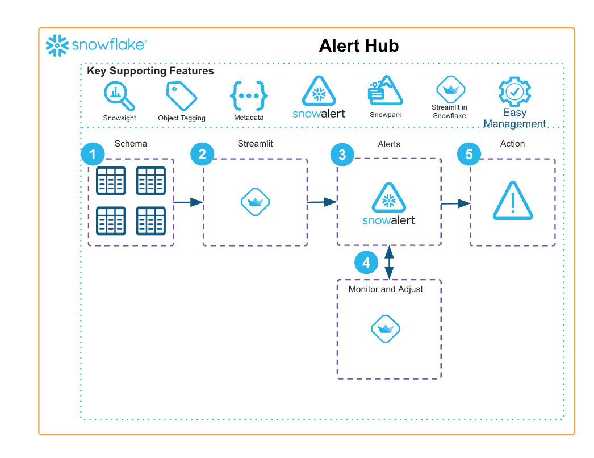

author: Hartland Brown
id: enhance-snowflakes-native-alerting-capabilities-using-alert-hub-framework
summary: The Alert Hub is a rule-based meta-data driven framework for alerts and notifications. It enhances Snowflake’s native alerting capabilities by adding a UI and support for Jinja templating.
categories: snowflake-site:taxonomy/solution-center/certification/community-solution
environments: web
language: en
status: Published
feedback link: https://github.com/Snowflake-Labs/sfguides/issues
fork repo link: https://github.com/Snowflake-Labs/sfquickstarts/tree/master/site/sfguides/src/enhance-snowflakes-native-alerting-capabilities-using-alert-hub-framework

# Enhance Snowflake's Native Alerting Capabilities
<!-- ------------------------ -->
## Overview

The Alert Hub is a rule-based meta-data driven framework for alerts and notifications.

* It enhances Snowflake’s native alerting capabilities by adding a UI and support for Jinja templating.
* The framework can be tailored through custom condition/action queries or applying query templates that monitor the account objects or any type of events within the account and send out multi-channel notifications.

<!-- ------------------------ -->
## Solution Architecture: Alert Hub Framework

* Condition and Action Templates allow for easy repeatability across alerts
* Configuring specific alert conditions and actions from templates is a matter of providing values for variable attributes into the UI
* Actions can be set up to leverage output from the Condition query

<!-- ------------------------ -->
## Get Started

- [view quickstart](https://medium.com/snowflake/easier-monitoring-with-the-alert-hub-framework-b4d68fb66738)
- [fork repo](https://github.com/Snowflake-Labs/emerging-solutions-toolbox/tree/main/sfguide-alert-hub)
- [Download reference architecture](https://www.snowflake.com/content/dam/snowflake-site/developers/2024/05/Alert-Hub-Reference-Architecture.pdf)
- [Explore emerging solutions toolbox](https://emerging-solutions-toolbox.streamlit.app/)
