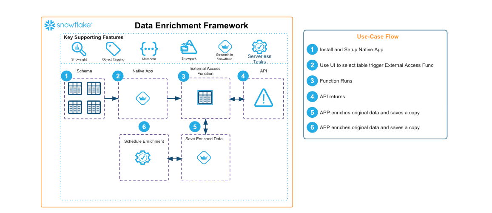

author: Hartland Brown
id: enriching-consumer-data-through-a-snowflake-native-app
summary: This solution helps a provider setup a native app that allows a consumer to push snowflake data to an API and enrich it with the response of the API.
categories: snowflake-site:taxonomy/solution-center/certification/certified-solution
environments: web
language: en
status: Published
feedback link: https://github.com/Snowflake-Labs/sfguides/issues
fork repo link: https://github.com/Snowflake-Labs/sfquickstarts/tree/master/site/sfguides/src/enriching-consumer-data-through-a-snowflake-native-app

# Enriching consumer data through a Snowflake Native App
<!-- ------------------------ -->
## Overview

This solution helps a provider setup a native app that allows a consumer to push snowflake data to an API and enrich it with the response of the API. The supporting features allow the provider to:

* Control the outbound fields necessary for the API call with the included Enrichment Manager Application, the changes here will automatically be sent to all consumers
* Customize the parsing logic for the outbound call as well as parse the returned API load
* Automatically request all necessary permissions for the API and scheduled tasks using the Python Permissions API
* Schedule a configured enrichment on the consumer side to run regularly

<!-- ------------------------ -->
## Solution Architecture: Enriching consumer data through a Native App

* This framework leverages External Access Functions to expose a Provider API to a consumer to enrich a table with the API response
* The Python permissions API is used to provide no-code setup
* A SIS app is provided to help provider configure metadata

<!-- ------------------------ -->
## Get Started

- [view quickstart](https://medium.com/snowflake/api-enrichment-framework-c5703a01463b)
- [fork repo](https://github.com/Snowflake-Labs/emerging-solutions-toolbox/tree/main/sfguide-getting-started-with-api-enrichment-framework)
- [Download reference architecture](https://www.snowflake.com/content/dam/snowflake-site/developers/2024/08/Enriching-consumer-data-through-a-Native-App.pdf)
- [Explore emerging solutions toolbox](https://emerging-solutions-toolbox.streamlit.app/)
