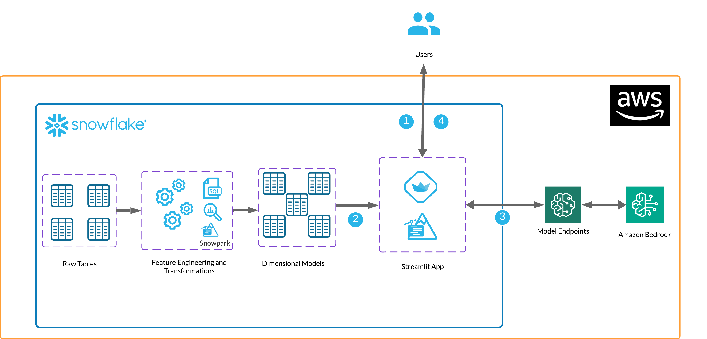

author: AWS Staff
id: fine-tuning-llms-using-snowpark-container-services-and-amazon-bedrock
summary: This solution architecture shows how to build an AI application that uses Amazon Bedrock and Snowflake to create personalized marketing messages to customers.
categories: snowflake-site:taxonomy/solution-center/certification/community-solution
environments: web
language: en
status: Published
feedback link: https://github.com/Snowflake-Labs/sfguides/issues
fork repo link: https://github.com/Snowflake-Labs/sfguide-getting-started-with-bedrock-streamlit-and-snowflake/tree/main

# Fine tuning LLMs using Snowpark Container Services and Amazon Bedrock
<!-- ------------------------ -->
## Overview

This solution architecture shows how to build an AI application that uses Amazon Bedrock and Snowflake to create personalized marketing messages to customers.

* Set up environments in both Snowflake and AWS.
* Create a function that leverages Snowpark External Access to make a call to Amazon Bedrock.
* Create a Streamlit app that leverages the above function to generate responses using data from Snowflake and prompts.

<!-- ------------------------ -->
## Solution Architecture: Fine tuning LLMs using Snowpark Container Services and Amazon Bedrock

* The user interacts with the Streamlit app and provides a prompt and/or parameters.
* The Streamlit app receives those prompts and accesses relevant data from Snowflake.
* The app passes the prompts from the user and the Snowflake data to a Bedrock model endpoint using Snowpark External Access to generate a response.
* The Streamlit app materializes the response back to the user.

<!-- ------------------------ -->
## Get Started

- [view quickstart](https://quickstarts.snowflake.com/guide/getting_started_with_bedrock_streamlit_and_snowflake/index.html?index=..%2F..index#0)
- [fork repo](https://github.com/Snowflake-Labs/sfguide-getting-started-with-bedrock-streamlit-and-snowflake/tree/main)
- [Download reference architecture](https://www.snowflake.com/content/dam/snowflake-site/developers/2024/04/AWS-Bedrock-and-Streamlit-Reference-Architecture.pdf)
