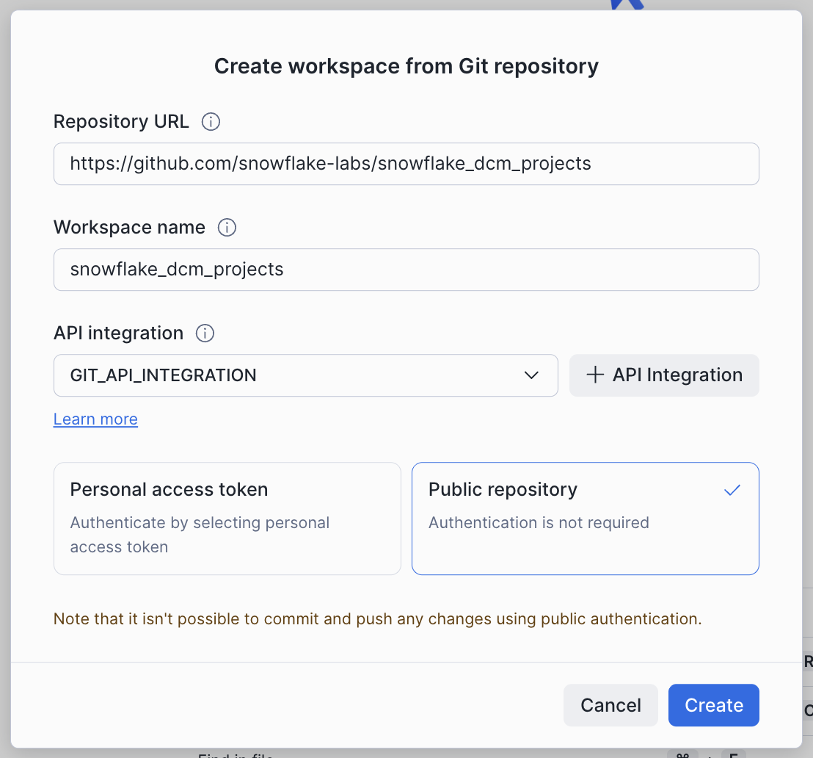
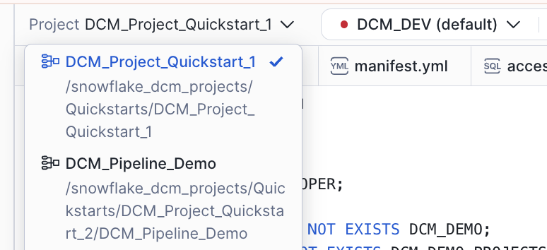
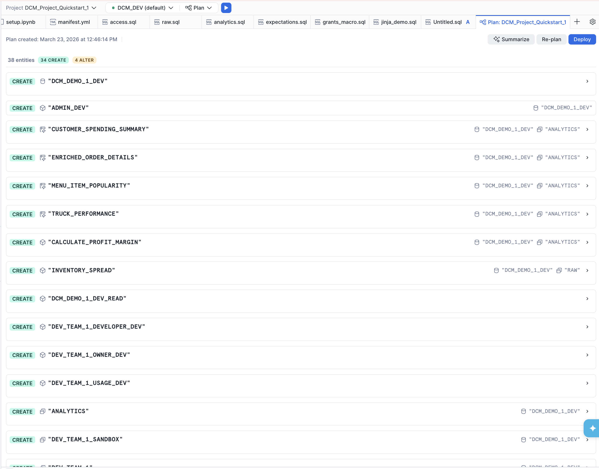
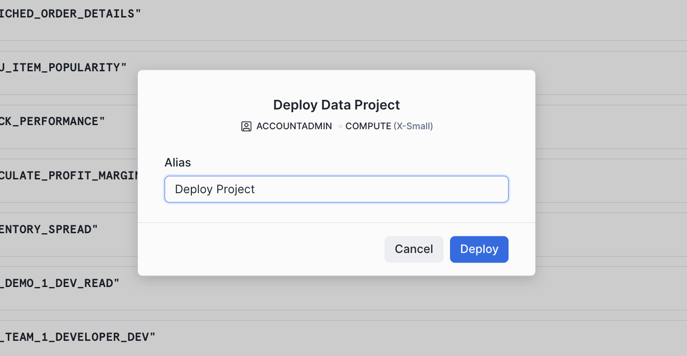
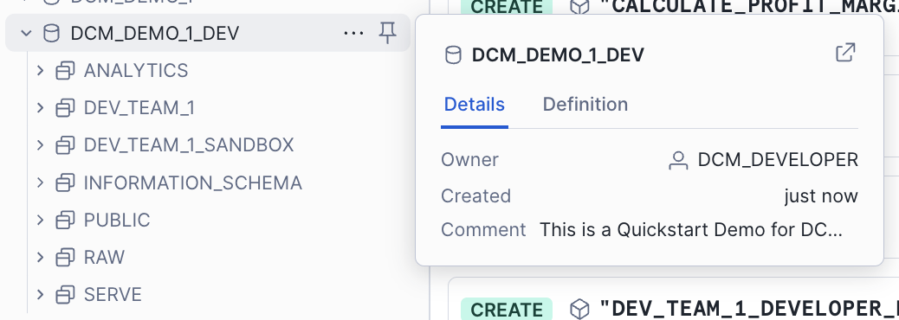

author: Jan Sommerfeld, Gilberto Hernandez, Yoav Ostrinsky
id: get-started-snowflake-dcm-projects
summary: Learn how to define and deploy Snowflake infrastructure as code using DCM Projects.
categories: snowflake-site:taxonomy/solution-center/certification/quickstart, snowflake-site:taxonomy/product/platform, snowflake-site:taxonomy/product/data-engineering, snowflake-site:taxonomy/snowflake-feature/dynamic-tables
environments: web
status: Published
language: en
feedback link: https://github.com/Snowflake-Labs/sfguides/issues
fork repo link: https://github.com/Snowflake-Labs/snowflake-dcm-projects

# Get Started with Snowflake DCM Projects
<!-- ------------------------ -->
## Overview

Snowflake DCM (Database Change Management) Projects let you define your Snowflake infrastructure as code using SQL-based definition files. Databases, schemas, tables, dynamic tables, views, warehouses, roles, grants, and more can all be defined declaratively, then planned and deployed across multiple environments using Jinja templating.

In this guide, you'll work with a sample DCM Project that defines a food truck analytics pipeline. You'll explore the project files, plan a deployment, deploy the infrastructure to your account, and insert sample data — all from Snowsight Workspaces.

> **Note:** DCM Projects is currently in Public Preview. See the [DCM Projects documentation](https://docs.snowflake.com/en/user-guide/dcm-projects/dcm-projects-overview) for the latest details.

### Prerequisites
- Basic knowledge of Snowflake concepts (databases, schemas, tables, roles)
- Familiarity with SQL

### What You'll Learn
- How DCM Projects define Snowflake infrastructure as code
- How to structure a DCM Project with a manifest and definition files
- How to use Jinja templating to parameterize definitions across environments
- How to plan (dry-run) and deploy changes using Snowsight Workspaces or Snowflake CLI
- How to attach data quality expectations to objects using Data Metric Functions

### What You'll Need
- A [Snowflake account](https://signup.snowflake.com/?utm_source=snowflake-devrel&utm_medium=developer-guides&utm_cta=developer-guides) with ACCOUNTADMIN access (or a role with sufficient privileges)
- (Optional) [Snowflake CLI](https://docs.snowflake.com/en/developer-guide/snowflake-cli/installation/installation) v3.16.0+ if you prefer CLI over the Snowsight UI

### What You'll Build
- A fully deployed food truck analytics pipeline consisting of databases, schemas, tables, dynamic tables, views, roles, grants, and data quality expectations — all defined as code in a DCM Project

<!-- ------------------------ -->
## Create a Workspace from Git

In this step, you'll create a Snowsight Workspace linked to the sample DCM Project repository on GitHub.

1. Navigate to **Projects > Workspaces** in Snowsight.
2. Click **Create** (+) and select **Git repository**.
3. Enter the repository URL: `https://github.com/snowflake-labs/snowflake-dcm-projects`
4. Select an API Integration for GitHub ([create one if needed](https://docs.snowflake.com/en/user-guide/ui-snowsight/workspaces-git#label-create-a-git-workspace)).
5. Select **Public repository**.



Once the workspace is created, you'll see the repository files in the file explorer. Navigate to **Quickstarts/get-started-snowflake-dcm-projects** to find two directories:

- **`DCM_Projects_Get_Started/`** — The DCM Project itself (manifest, definitions, macros). This is what DCM reads during Plan & Deploy.
- **`scripts/`** — Numbered SQL files that you'll run in Snowsight worksheets at different stages of this guide. These live outside the DCM project directory so they don't interfere with it.

| File | When to Run |
|:-----|:------------|
| `scripts/01_pre_deploy.sql` | Before the first DCM Plan & Deploy |
| `scripts/02_post_deploy.sql` | After the first successful deployment |
| `scripts/03_cleanup.sql` | When you're done and want to tear everything down |

Open `scripts/01_pre_deploy.sql` in a Snowsight worksheet — you'll use it in the next step.

<!-- ------------------------ -->
## Set Up Roles and Permissions

Before deploying the pipeline, you need to create a dedicated role for managing DCM Projects and a DCM Project object.

Open `scripts/01_pre_deploy.sql` in a Snowsight worksheet and run each section in order. This script lives outside the DCM project directory, so it won't be picked up by Plan or Deploy. The script does the following:

### 1. Create a DCM Developer Role

```sql
USE ROLE ACCOUNTADMIN;

CREATE ROLE IF NOT EXISTS dcm_developer;
SET user_name = (SELECT CURRENT_USER());
GRANT ROLE dcm_developer TO USER IDENTIFIER($user_name);
```

### 2. Grant Infrastructure Privileges

The DCM_DEVELOPER role needs privileges to create infrastructure objects through DCM deployments:

```sql
GRANT CREATE WAREHOUSE ON ACCOUNT TO ROLE dcm_developer;
GRANT CREATE ROLE ON ACCOUNT TO ROLE dcm_developer;
GRANT CREATE DATABASE ON ACCOUNT TO ROLE dcm_developer;
GRANT EXECUTE MANAGED TASK ON ACCOUNT TO ROLE dcm_developer;
GRANT EXECUTE TASK ON ACCOUNT TO ROLE dcm_developer;
GRANT MANAGE GRANTS ON ACCOUNT TO ROLE dcm_developer;
```

### 3. Grant Data Quality Privileges

To define and test data quality expectations, grant the following:

```sql
GRANT APPLICATION ROLE SNOWFLAKE.DATA_QUALITY_MONITORING_VIEWER TO ROLE dcm_developer;
GRANT APPLICATION ROLE SNOWFLAKE.DATA_QUALITY_MONITORING_ADMIN TO ROLE dcm_developer;
GRANT DATABASE ROLE SNOWFLAKE.DATA_METRIC_USER TO ROLE dcm_developer;
GRANT EXECUTE DATA METRIC FUNCTION ON ACCOUNT TO ROLE dcm_developer;
```

### 4. Create the DCM Project Object

```sql
USE ROLE dcm_developer;

CREATE DATABASE IF NOT EXISTS dcm_demo;
CREATE SCHEMA IF NOT EXISTS dcm_demo.projects;

CREATE OR REPLACE DCM PROJECT dcm_demo.projects.dcm_project_dev
    COMMENT = 'for testing DCM Projects Quickstarts';
```

The DCM Project object `dcm_project_dev` is now created in `dcm_demo.projects`. This is the object referenced in the manifest's `DCM_DEV` target.

> **Note:** After running this script, refresh your browser so Snowsight picks up the newly created DCM Project object. It won't appear in the Workspaces project selector until you do.

> **CLI Alternative:** You can also create the DCM Project object from the command line using [Snowflake CLI](https://docs.snowflake.com/developer-guide/snowflake-cli/data-pipelines/dcm-projects):
> ```
> snow dcm create --target DCM_DEV
> ```

<!-- ------------------------ -->
## Explore the Project Files

Now that the infrastructure is in place, take a moment to explore the DCM Project structure before deploying. Navigate into the `DCM_Projects_Get_Started/` directory — this is the actual DCM Project that the Plan & Deploy operations read. A DCM Project consists of a **manifest file** and one or more **definition files** organized in a `sources/` directory.

### Manifest

Open `DCM_Projects_Get_Started/manifest.yml` in the file explorer. The manifest is the configuration file for your DCM Project. It defines:

- **Targets** — Named deployment environments (e.g., DEV, STAGE, PROD), each pointing to a specific Snowflake account and DCM Project object
- **Templating configurations** — Variable values that change per environment (e.g., database suffixes, warehouse sizes, team lists)

Here's the manifest for this project:

```yaml
manifest_version: 2
type: DCM_PROJECT

default_target: DCM_DEV

targets:
  DCM_DEV:
    account_identifier: MYORG-MY_DEV_ACCOUNT        # update to your account identifier
    project_name: DCM_DEMO.PROJECTS.DCM_PROJECT_DEV
    project_owner: DCM_DEVELOPER
    templating_config: DEV

  DCM_STAGE:
    account_identifier: MYORG-MY_STAGE_ACCOUNT
    project_name: DCM_DEMO.PROJECTS.DCM_PROJECT_STG
    project_owner: DCM_STAGE_DEPLOYER
    templating_config: STAGE

  DCM_PROD_US:
    account_identifier: MYORG-MY_ACCOUNT_US
    project_name: DCM_DEMO.PROJECTS.DCM_PROJECT_PROD
    project_owner: DCM_PROD_DEPLOYER
    templating_config: PROD

templating:
  defaults:
    user: "GITHUB_ACTIONS_SERVICE_USER"
    wh_size: "X-SMALL"

  configurations:
    DEV:
      env_suffix: "_DEV"
      user: "INSERT_YOUR_USER"                          # update to your username
      project_owner_role: "DCM_DEVELOPER"
      teams:
        - name: "DEV_TEAM_1"
          data_retention_days: 1
          needs_sandbox_schema: true

    PROD:
      env_suffix: ""
      wh_size: "LARGE"
      project_owner_role: "DCM_PROD_DEPLOYER"
      teams:
        - name: "Marketing"
          data_retention_days: 1
          needs_sandbox_schema: true
        - name: "Finance"
          data_retention_days: 30
          needs_sandbox_schema: false
        - name: "HR"
          data_retention_days: 7
          needs_sandbox_schema: false
        - name: "IT"
          data_retention_days: 14
          needs_sandbox_schema: true
        - name: "Sales"
          data_retention_days: 1
          needs_sandbox_schema: false
        - name: "Research"
          data_retention_days: 7
          needs_sandbox_schema: true
```

> **Important:** Before running a Plan, update `account_identifier` (line 8) and `user` (line 28) under the `DCM_DEV` target in `manifest.yml` to match your Snowflake account. The last query in `scripts/01_pre_deploy.sql` (step 6) returns both values — copy them from that output.

Notice how the `DEV` configuration uses `env_suffix: "_DEV"` while `PROD` uses `env_suffix: ""`. This allows the same definition files to create `DCM_DEMO_1_DEV` in development and `DCM_DEMO_1` in production. The `teams` list is also different per environment — DEV has a single team, while PROD has six.

### Definition Files

The `sources/definitions/` directory contains SQL files that define your Snowflake infrastructure. Each file uses `DEFINE` statements and Jinja templating variables (like `{{env_suffix}}`):

| File | What It Defines |
|:-----|:----------------|
| `raw.sql` | Database, schemas, and raw landing tables (TRUCK, MENU, CUSTOMER, etc.) |
| `access.sql` | Warehouse, database roles, account roles, and grants |
| `analytics.sql` | Dynamic tables for transformations and a UDF for profit margin calculation |
| `serve.sql` | Views for dashboards and reporting |
| `ingest.sql` | A stage and a Task for loading data from CSV files |
| `expectations.sql` | Data quality expectations using Data Metric Functions |
| `jinja_demo.sql` | Examples of Jinja loops, conditionals, and macros |

For example, here's how `raw.sql` defines the database and a table:

```sql
DEFINE DATABASE dcm_demo_1{{env_suffix}}
    COMMENT = 'This is a Quickstart Demo for DCM Projects';

DEFINE SCHEMA dcm_demo_1{{env_suffix}}.raw;

DEFINE TABLE dcm_demo_1{{env_suffix}}.raw.menu (
    menu_item_id NUMBER,
    menu_item_name VARCHAR,
    item_category VARCHAR,
    cost_of_goods_usd NUMBER(10, 2),
    sale_price_usd NUMBER(10, 2)
)
CHANGE_TRACKING = TRUE;
```

The `{{env_suffix}}` variable is replaced at deployment time based on the target configuration — `_DEV` for development, empty string for production.

And here's how `analytics.sql` defines a dynamic table that joins across several raw tables to create enriched order details:

```sql
DEFINE DYNAMIC TABLE dcm_demo_1{{env_suffix}}.analytics.enriched_order_details
WAREHOUSE = dcm_demo_1_wh{{env_suffix}}
TARGET_LAG = 'DOWNSTREAM'
INITIALIZE = 'ON_SCHEDULE'
DATA_METRIC_SCHEDULE = 'TRIGGER_ON_CHANGES'
AS
SELECT
    oh.order_id,
    oh.order_ts,
    od.quantity,
    m.menu_item_name,
    m.item_category,
    m.sale_price_usd,
    (od.quantity * m.sale_price_usd) AS line_item_revenue,
    (od.quantity * (m.sale_price_usd - m.cost_of_goods_usd)) AS line_item_profit,
    c.customer_id,
    c.first_name,
    c.last_name,
    INITCAP(c.city) AS customer_city,
    t.truck_id,
    t.truck_brand_name
FROM dcm_demo_1{{env_suffix}}.raw.order_header oh
JOIN dcm_demo_1{{env_suffix}}.raw.order_detail od ON oh.order_id = od.order_id
JOIN dcm_demo_1{{env_suffix}}.raw.menu m ON od.menu_item_id = m.menu_item_id
JOIN dcm_demo_1{{env_suffix}}.raw.customer c ON oh.customer_id = c.customer_id
JOIN dcm_demo_1{{env_suffix}}.raw.truck t ON oh.truck_id = t.truck_id;
```

> **Why `INITIALIZE = ON_SCHEDULE`?** By default, dynamic tables use `INITIALIZE = ON_CREATE`, which runs a full synchronous refresh during the `CREATE` statement. When a project creates many tables at once, those synchronous refreshes can make deployments slow. `INITIALIZE = ON_SCHEDULE` skips the refresh at creation time and lets DCM finish the deployment quickly — each dynamic table populates itself in the background on its normal schedule. This is the recommended pattern for DCM deployments where speed and predictability matter most.

### Macros

The `sources/macros/` directory contains reusable Jinja macros. Open `grants_macro.sql` to see a macro that creates a standard set of roles for each team:

```sql


    DEFINE ROLE {{team}}_OWNER{{env_suffix}};
    DEFINE ROLE {{team}}_DEVELOPER{{env_suffix}};
    DEFINE ROLE {{team}}_USAGE{{env_suffix}};

    GRANT USAGE ON DATABASE dcm_demo_1{{env_suffix}}
        TO ROLE {{team}}_USAGE{{env_suffix}};
    GRANT OWNERSHIP ON SCHEMA dcm_demo_1{{env_suffix}}.{{team}}
        TO ROLE {{team}}_OWNER{{env_suffix}};

    GRANT CREATE DYNAMIC TABLE, CREATE TABLE, CREATE VIEW
        ON SCHEMA dcm_demo_1{{env_suffix}}.{{team}}
        TO ROLE {{team}}_DEVELOPER{{env_suffix}};

    GRANT ROLE {{team}}_USAGE{{env_suffix}} TO ROLE {{team}}_DEVELOPER{{env_suffix}};
    GRANT ROLE {{team}}_DEVELOPER{{env_suffix}} TO ROLE {{team}}_OWNER{{env_suffix}};
    GRANT ROLE {{team}}_OWNER{{env_suffix}} TO ROLE {{project_owner_role}};


```

This macro is called in `jinja_demo.sql` inside a `` loop that iterates over the `teams` list from the manifest configuration. For each team, it creates a schema, a set of roles, a products table, and optionally a sandbox schema — all driven by the manifest's templating values:

```sql

    

    DEFINE SCHEMA dcm_demo_1{{env_suffix}}.{{team_name}}
        COMMENT = 'using JINJA dictionary values'
        DATA_RETENTION_TIME_IN_DAYS = {{ team.data_retention_days }};

    {{ create_team_roles(team_name) }}

    
        DEFINE SCHEMA dcm_demo_1{{env_suffix}}.{{team_name}}_SANDBOX
            COMMENT = 'Sandbox schema defined via dictionary flag'
            DATA_RETENTION_TIME_IN_DAYS = 1;
    


```

When deployed to **DEV**, this loop runs once (for `DEV_TEAM_1`). When deployed to **PROD**, it runs six times — once for each team — creating a unique set of schemas and roles for Marketing, Finance, HR, IT, Sales, and Research.

<!-- ------------------------ -->
## Plan and Deploy the Pipeline

Before deploying changes, always run a **Plan** first. A Plan is a dry-run that shows you exactly what changes DCM will make without actually executing them.

### Select the Project

1. You should see the DCM control panel in the first tab in the bottom panel. Select the project **get-started-snowflake-dcm-projects/DCM_Projects_Get_Started**.
2. The `DCM_DEV` target should already be selected (it's the default in the manifest).
3. Click on the target profile to verify it uses `DCM_PROJECT_DEV` and the `DEV` templating configuration.



> **CLI Alternative:** From the command line, plan with:
> ```
> snow dcm plan --target DCM_DEV -D "user='YOUR_USERNAME'"
> ```

### Execute the Plan

Click the play button to the right of **Plan** and wait for the definitions to render, compile, and dry-run.

Since none of the defined objects exist yet, the plan will show only **CREATE** statements. You should see planned operations for:

- 1 database (`DCM_DEMO_1_DEV`)
- Multiple schemas (`RAW`, `ANALYTICS`, `SERVE`, plus team schemas from the Jinja demo)
- Tables with change tracking enabled
- Dynamic tables with various target lags
- Views and secure views
- A warehouse, roles, and grants
- A stage and a task for data ingestion
- Data quality expectations (Data Metric Functions attached to columns)



### Review the Plan Output

In the file explorer, notice that a new `out` folder was created above `sources`. This contains the **rendered Jinja output** for all definition files.

Open the `jinja_demo.sql` file from the plan output side-by-side with the original `jinja_demo.sql` in `sources/definitions/` to see how the Jinja templating was resolved — loops expanded, conditionals evaluated, and variables replaced with their DEV configuration values.

### Deploy

If the plan result looks correct and all planned changes match your expectations, deploy:

1. Instead of **Plan**, set the operation to **Deploy**.
2. Optionally, add a **Deployment alias** (e.g., "Initial pipeline deployment") — think of it as a commit message that appears in the deployment history of your project.
3. DCM will create all objects and attach grants and expectations using the owner role of the project object.



> **CLI Alternative:** From the command line, deploy with:
> ```
> snow dcm deploy --target DCM_DEV --alias "Initial pipeline deployment"
> ```

Once the deployment completes successfully, refresh the Database Explorer on the left side of Snowsight. You should see the `DCM_DEMO_1_DEV` database and all of the created objects inside it.



<!-- ------------------------ -->
## Insert Sample Data

The deployment created the table structures, but they're empty. Now you'll insert sample data to populate the raw tables and bring the dynamic tables and views to life.

Open `scripts/02_post_deploy.sql` in a Snowsight worksheet and run each section in order.

### 1. Insert Sample Data

The script inserts data into the raw tables: trucks, menu items, customers, inventory, order headers, and order details. Run all the `INSERT` statements.

### 2. Refresh Dynamic Tables

Because all dynamic tables use `INITIALIZE = ON_SCHEDULE`, they were created without data. Use `EXECUTE DCM PROJECT ... REFRESH ALL` to kick off the first refresh of every DT the project manages in one statement:

```sql
EXECUTE DCM PROJECT DCM_DEMO.PROJECTS.DCM_PROJECT_DEV REFRESH ALL;
```

DCM triggers refreshes in dependency order — upstream tables refresh before downstream ones.

### 3. Verify

Run the final queries in the script to see the pipeline output:

```sql
SELECT * FROM dcm_demo_1_dev.serve.v_dashboard_daily_sales;

SELECT * FROM dcm_demo_1_dev.analytics.enriched_order_details;
SELECT * FROM dcm_demo_1_dev.analytics.menu_item_popularity;
SELECT * FROM dcm_demo_1_dev.analytics.customer_spending_summary;
```

You should see rows in the serving view and all three dynamic tables — the pipeline is live.

<!-- ------------------------ -->
## Cleanup

When you're done, open `scripts/03_cleanup.sql` in a Snowsight worksheet and run it to tear down all objects:

```sql
USE ROLE dcm_developer;
EXECUTE DCM PROJECT dcm_demo.projects.dcm_project_dev PURGE;

USE ROLE ACCOUNTADMIN;
DROP DCM PROJECT IF EXISTS dcm_demo.projects.dcm_project_dev;
DROP SCHEMA IF EXISTS dcm_demo.projects;
DROP DATABASE IF EXISTS dcm_demo;

DROP ROLE IF EXISTS dcm_developer;
```

<!-- ------------------------ -->
## Conclusion and Resources

In this guide, you learned how to:

- **Define Snowflake infrastructure as code** using DCM Project definition files with `DEFINE` statements
- **Structure a DCM Project** with a manifest file, definition files, and reusable Jinja macros
- **Use Jinja templating** to parameterize definitions across environments (DEV, STAGE, PROD) from a single set of source files
- **Plan a deployment** to dry-run and preview all changes before applying them
- **Deploy a project** to create databases, schemas, tables, dynamic tables, views, roles, grants, and data quality expectations in one operation
- **Attach data quality expectations** using Data Metric Functions to monitor data quality declaratively

### What's Next

Ready for Level 2? Continue the series:

- **Part 2 — [Build Data Pipelines with Snowflake DCM Projects](https://www.snowflake.com/en/developers/guides/build-data-pipelines-with-snowflake-dcm-projects/)** — split platform infrastructure from transformation pipelines and build a medallion architecture with Dynamic Tables.

### Related Resources
- [DCM Projects Documentation](https://docs.snowflake.com/en/user-guide/dcm-projects/dcm-projects-overview)
- [Managing DCM Projects using Snowflake CLI](https://docs.snowflake.com/developer-guide/snowflake-cli/data-pipelines/dcm-projects)
- [Build Data Pipelines with Snowflake DCM Projects](https://www.snowflake.com/en/developers/guides/build-data-pipelines-with-snowflake-dcm-projects/)
- [DCM Projects for Dynamic Tables](https://www.snowflake.com/en/developers/guides/dcm-projects-for-dynamic-tables/)
- [Sample DCM Projects Repository](https://github.com/Snowflake-Labs/snowflake-dcm-projects)
