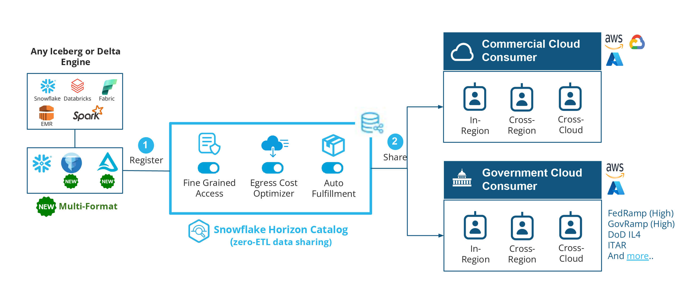

author: Jenna Roering, Amit Gupta
id: getting-started-with-global-interoperable-data-products
summary: Snowflake zero-ETL data sharing now enables easy and secure open table format sharing, with support for Apache Iceberg and Delta Lake, across regions and clouds.
categories: snowflake-site:taxonomy/solution-center/certification/quickstart
environments: web
language: en
status: Published
feedback link: https://github.com/Snowflake-Labs/sfguides/issues
fork repo link: https://github.com/Snowflake-Labs/sfquickstarts/tree/master/site/sfguides/src/getting-started-with-global-interoperable-data-products

# Getting Started with Open and Interoperable Data Product Sharing
<!-- ------------------------ -->
## Overview

Snowflake zero-ETL data sharing **now enables easy and secure open table format sharing, with support for Apache Iceberg and Delta Lake, across regions and clouds.** Providers can securely share data stored in open table formats across any cloud and region without complex pipelines and without incurring exponential per-query egress charges.

Snowflake data sharing already leads in the market when it comes to collaboration capabilities and adoption. With 2.5X the data sharing ecosystem compared to leading competitors, Snowflake collaboration provides increasing value to a growing, global user base. With thousands of customers already sharing data, businesses can use open table format sharing to get the best of both worlds: open format data sharing and all of the core benefits of Snowflake sharing, including:

* Near real-time data access
* [Horizon Catalog’s policy-based governance](https://docs.snowflake.com/en/guides-overview-govern) controls for shared data
* [Cross-cloud auto-fulfillment](https://docs.snowflake.com/en/collaboration/provider-listings-auto-fulfillment) and [Egress Cost Optimizer](https://docs.snowflake.com/en/collaboration/provider-listings-auto-fulfillment-eco) for simplified and economical cross-region and cross-cloud sharing
* Delivery into regulated regions including [US Government Cloud](https://docs.snowflake.com/en/user-guide/intro-regions#label-us-gov-regions) and [Virtual Private Snowflake](https://docs.snowflake.com/en/user-guide/intro-editions#virtual-private-snowflake-vps)

#### Why is this important?

For many years, Snowflake customers have been able to securely share data and collaborate with a vast ecosystem of customers and partners. Data sharing has been a cornerstone of the Snowflake platform, with many customers using Snowflake and data sharing to develop connections and build strong data ecosystems in Snowflake Data Cloud. 

**With the introduction of open table format sharing, Snowflake collaboration capabilities have been expanded to:**

* Data stored outside of Snowflake, in customers' own cloud storage (AWS S3, Azure Storage, Google GCS)
* In open table formats, including

  + Apache Iceberg managed by Snowflake Horizon Catalog or managed by external Catalogs (AWS Glue, Apache Polaris)
  + Delta Lake managed by external Catalogs (Databricks Unity, Hive Metastore)

This means businesses choosing open table formats are also now connected into Snowflake Data Cloud and enjoy the benefits of a thriving data ecosystem

#### What challenge does this solve?

Most organizations frequently need to share diverse data formats, both internally and externally, yet they often encounter several obstacles, including:

* **Security and Compliance**: Enforcing fine-grained data-access policies on shared data is crucial for maintaining security and compliance.
* **Geographic and Cloud Dispersion:** Collaboration among business units (LOBs, vendors, customers) that are often spread across different regions and clouds, including commercial and government cloud environments.
* **Varied Data Formats:** Data exists in diverse formats, such as Snowflake Native, Apache Iceberg, and Delta Lake.

Snowflake data sharing, and specifically open table format sharing, directly addresses the key obstacles that data engineers and data architects face when collaborating on data. It reduces geographic and cloud barriers with the ability to share open format tables, it extends core governance capabilities, and it gives customers the flexibility to standardize on a data format like Iceberg, all while allowing global organizations to share with any business unit, vendor, and/or customer. 

#### How does it work?

**Open table format sharing is enabled by cross-cloud auto-fulfillment** (supported on commercial, Virtual Private Snowflake and US Government clouds), which simplifies data sharing for Apache Iceberg and Delta Lake directly from your cloud storage. You can share this data with a Snowflake consumer in any region or cloud without needing to manage the underlying infrastructure or requiring you to maintain Extract, Transform, and Load (ETL) jobs. In addition, open table format sharing optimizes data transfer costs through [egress cost optimizer](https://docs.snowflake.com/en/collaboration/provider-listings-auto-fulfillment-eco); which can lead to [unpredictable and astronomical per-query egress charges](https://medium.com/@nickakincilar/snowflake-vs-delta-sharing-for-providers-consumers-pros-cons-76dae3a7d211) if not properly managed.

Snowflake Horizon Catalog provides comprehensive [policy-based governance controls](https://docs.snowflake.com/en/guides-overview-govern) that can be applied to open table format data shared with consumers across different regions or clouds. This capability ensures data residency and facilitates the compliance necessary for collaboration, particularly within or in conjunction with regulated sectors, such as public sectors, financial services, healthcare, and life sciences.

When combined with [Delta Direct](https://docs.snowflake.com/en/sql-reference/sql/create-iceberg-table-delta) and [Catalog Federation](https://docs.snowflake.com/en/user-guide/tables-iceberg-configure-catalog-integration-rest-unity#example-bearer-token) (leveraging [Unity Catalog + Uniform's IRC AP](https://docs.snowflake.com/en/user-guide/tables-iceberg-configure-catalog-integration-rest-unity)I), Snowflake **Cross-Cloud Auto-Fulfillment** extends this capability to a Delta Lake residing in your cloud storage and written by Delta engines like Microsoft Fabric or Databricks, or managed by catalogs like Databricks Unity or Hive Metastore. This extends open table sharing to Delta Lake tables with Snowflake consumers in any region or cloud, again, without the need to manage underlying infrastructure.

<!-- ------------------------ -->
## Solution Architecture

<!-- ------------------------ -->
## Get Started

- [view quickstart](https://quickstarts.snowflake.com/guide/horizon_intra_org_sharing/#0)
