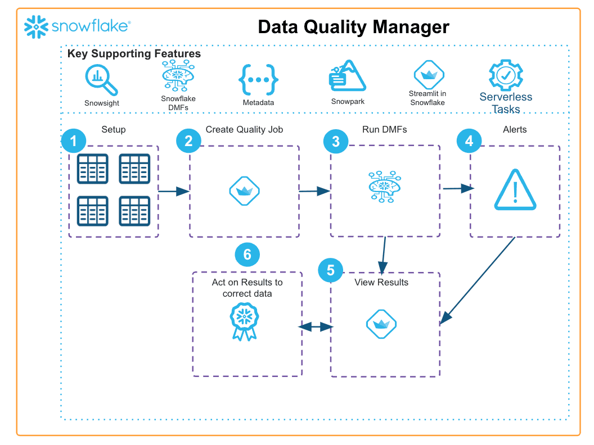

author: Hartland Brown
id: getting-started-with-the-data-quality-manager
summary: This application allows you to manage and run different Data Quality checks: Run native snowflake DMFs (or a few included custom ones) as a Job that can be triggered manually, or apply DMFs directly to a table View the results of these jobs Be alerte
categories: snowflake-site:taxonomy/solution-center/certification/community-solution
environments: web
language: en
status: Published
feedback link: https://github.com/Snowflake-Labs/sfguides/issues
fork repo link: https://github.com/Snowflake-Labs/sfquickstarts/tree/master/site/sfguides/src/getting-started-with-the-data-quality-manager

# Application Framework: Getting started with the Data Quality Manager
<!-- ------------------------ -->
## Overview

This application allows you to manage and run different Data Quality checks:

* Run native snowflake DMFs (or a few included custom ones) as a Job that can be triggered manually, or apply DMFs directly to a table
* View the results of these jobs
* Be alerted when a job has not met the expectations you set with a threshold

<!-- ------------------------ -->
## Solution Architecture: Data Quality Manager App Architecture

* For this solution, Streamlit is used to present native and local DMF functions to the user, the user can specify the specs of this job
* When the specs have been saved, a serverless task is generated that allows the specs to be retrieved and acted upon, the results are then saved for analysis
* If the user specifies a threshold, this will trigger an alert on the main page that the user can view and comment on
* If the job is scheduled directly on a table with a native DMF, the user can view all results of the event table.
