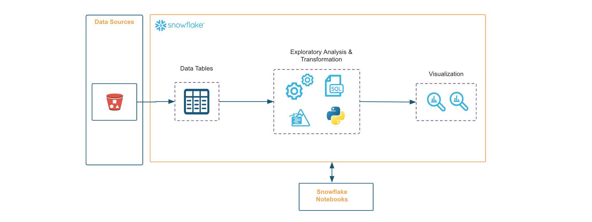

author: Charlie Hammond
id: getting-started-with-your-first-snowflake-notebook-project
summary: This solution architecture helps you understand how to use Snowflake Notebooks as a first time user Use pre-installed libraries in Notebooks and add additional packages from package picker Switch between SQL and Python cells in the same notebook Use
categories: snowflake-site:taxonomy/solution-center/certification/certified-solution
environments: web
language: en
status: Published
feedback link: https://github.com/Snowflake-Labs/sfguides/issues
fork repo link: https://github.com/Snowflake-Labs/sfquickstarts/tree/master/site/sfguides/src/getting-started-with-your-first-snowflake-notebook-project

# Getting Started with Your First Snowflake Notebook Project
<!-- ------------------------ -->
## Overview

This solution architecture helps you understand how to use Snowflake Notebooks as a first time user

* Use pre-installed libraries in Notebooks and add additional packages from package picker
* Switch between SQL and Python cells in the same notebook
* Use Altair and Matplotlib to visualize your data
* Use Jinja syntax to refer to Python variables within SQL queries, to reference previous cell outputs in your SQL query, and more

<!-- ------------------------ -->
## Solution Architecture: Getting Started with Snowflake Notebooks

* In this use-case, we use Snowflake Notebooks to write and execute code, visualize results, and tell the story of your analysis all in one place.
* Contextualize results and make notes about different results with Markdown cells.
* Make use of the role-based access control and other data governance functionality available in Snowflake to allow other users with the same role to view and collaborate on the notebook.
