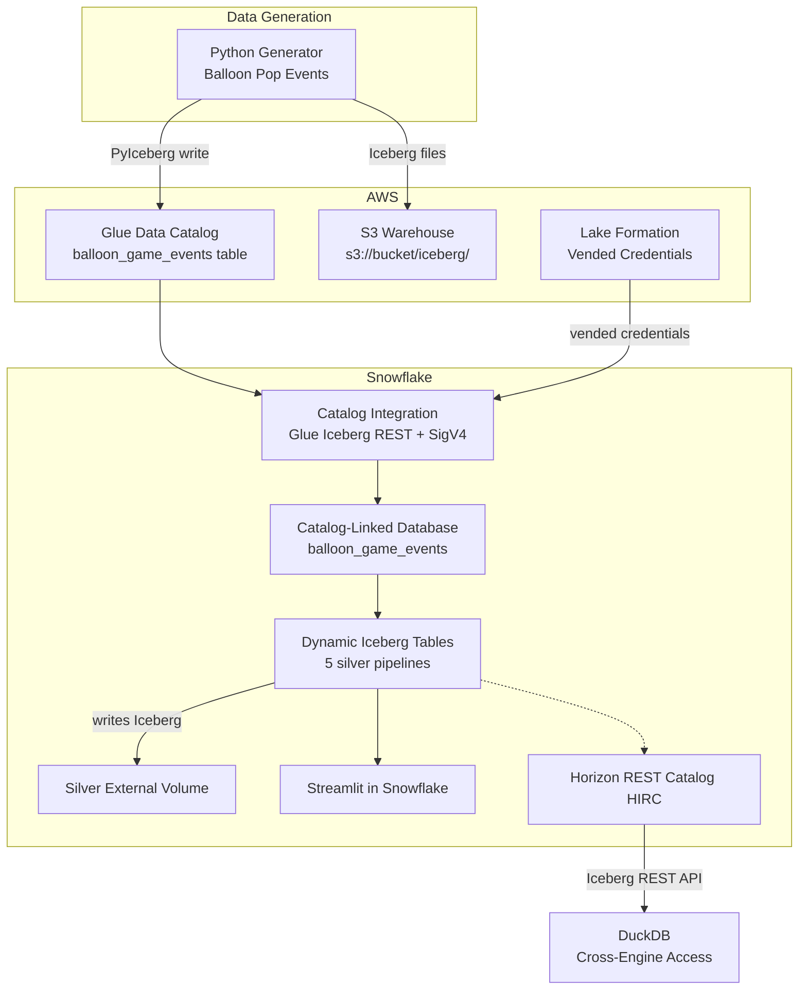
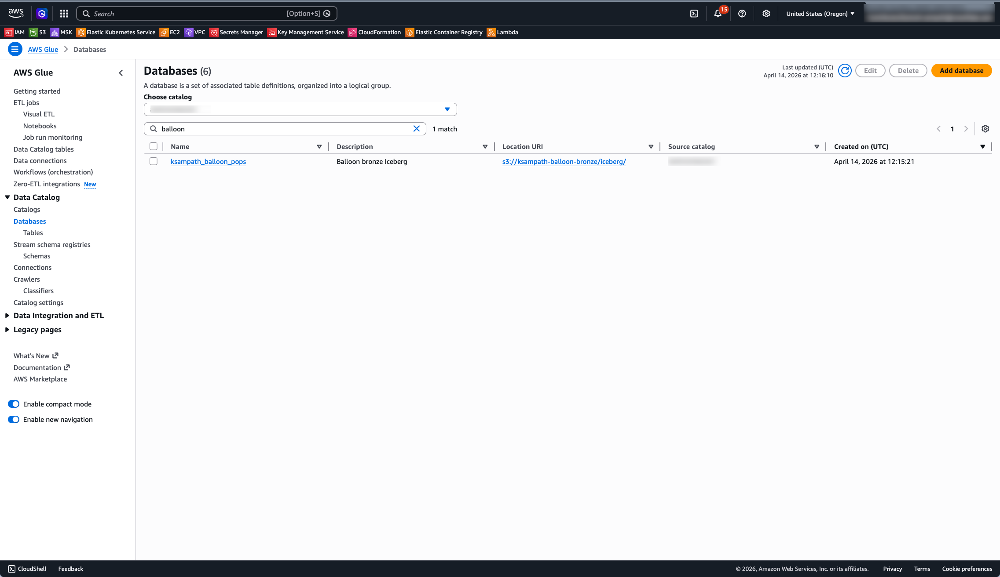
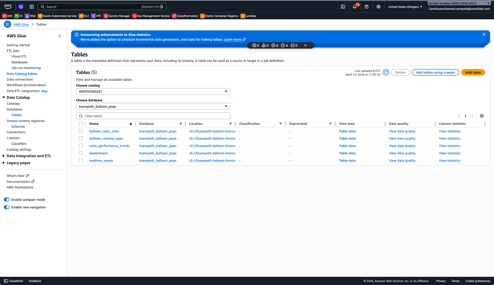
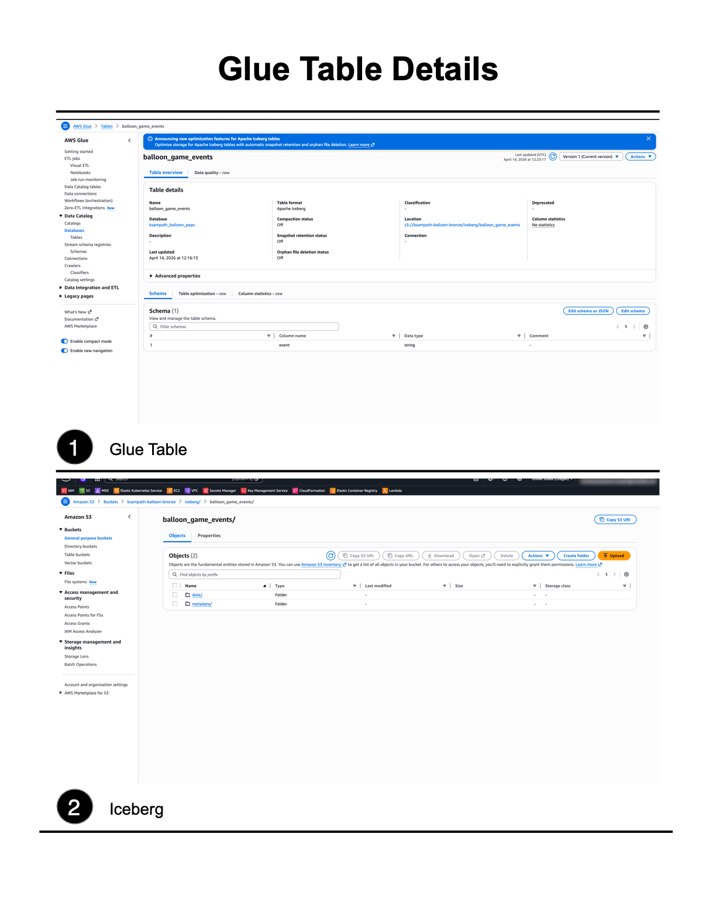
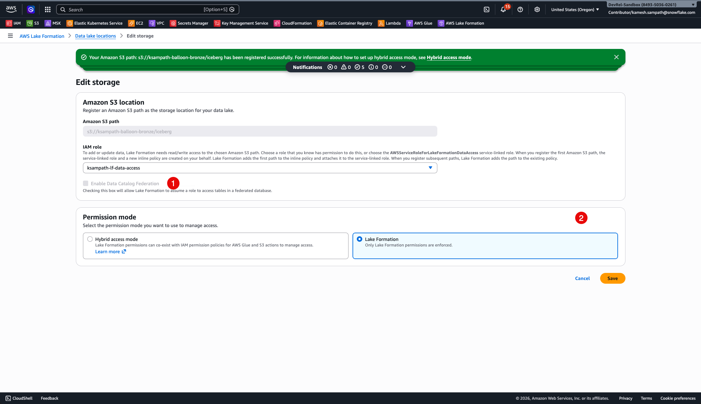
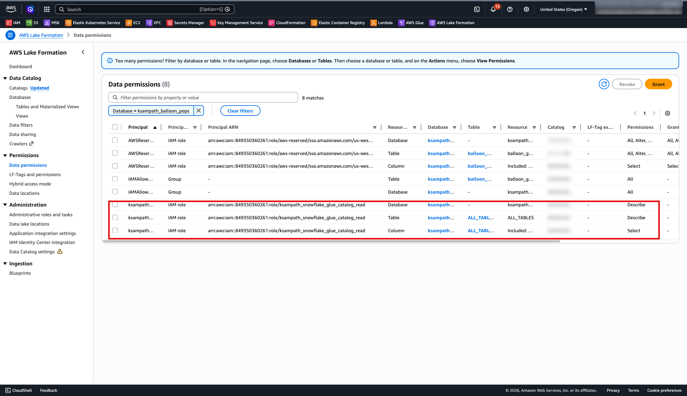

author: Kamesh Sampath, Gilberto Hernandez
id: lakehouse-iceberg-production-pipelines
categories: snowflake-site:taxonomy/solution-center/certification/quickstart,snowflake-site:taxonomy/product/data-engineering,snowflake-site:taxonomy/product/analytics
language: en
summary: Stop pipeline sprawl and the cost of data duplication. In this advanced lab, you will learn to perform secure, in-place transformations across your entire data estate. You will connect externally managed Iceberg tables with Catalog Linked Databases to always work on fresh data without ETL, build efficient and declarative pipelines with Dynamic Tables for Iceberg preserving multi-engine access to your data, and implement business continuity to ensure your production data is always available.
environments: web
status: Published
feedback link: https://github.com/Snowflake-Labs/sfguides/issues
fork repo link: https://github.com/Snowflake-Labs/sfguide-lakehouse-iceberg-production-pipelines

# Lakehouse Transformations: Build Production Pipelines for your Iceberg Tables
<!-- ------------------------ -->
## Overview

This quickstart shows how to build a bronze-to-silver Iceberg pipeline with AWS and Snowflake — without copying data into a second storage system. You prepare a bronze Iceberg landing zone in AWS (Glue catalog, S3 warehouse, and optional S3 Tables), connect Snowflake to the same catalog using Catalog Linked Databases, build Snowflake-managed Dynamic Iceberg Tables that refresh into silver storage you control, and visualize results using Streamlit in Snowflake. A final chapter queries the same silver tables from DuckDB via Snowflake's Horizon Iceberg REST Catalog.

The guide is bronze-first: each layer is verified before the next one starts, so any failure is easy to isolate.

### What You'll Learn

- How to prepare a bronze layer in AWS using Glue, S3, Lake Formation, and task-driven automation
- How Snowflake uses a catalog integration and Catalog Linked Databases to query externally managed Iceberg metadata without ETL duplication
- How Dynamic Iceberg Tables transform bronze JSON into production-ready silver aggregates while preserving Iceberg format and multi-engine access
- How to build a live Streamlit in Snowflake dashboard over silver Dynamic Tables
- How to query Snowflake-managed Iceberg tables from DuckDB via the Horizon Iceberg REST Catalog

### What You'll Build

A repeatable lakehouse workflow: bronze Iceberg tables loaded in AWS, consumed and transformed in Snowflake via a Catalog Linked Database and Dynamic Iceberg Tables, surfaced as a Streamlit in Snowflake dashboard, and queried from DuckDB. Every layer is auditable and every file stays in open Iceberg format.

### Prerequisites

- Access to a [Snowflake account](https://signup.snowflake.com/?utm_source=snowflake-devrel&utm_medium=developer-guides&utm_cta=developer-guides)
- Access to an AWS account with permissions for Glue, S3, Lake Formation, and IAM
- Local workstation with required CLIs — see **Local Toolchain** in the next section
- A configured Snowflake CLI connection; verify with `snow connection test` before any `snow sql` steps ([Snowflake CLI installation](https://docs.snowflake.com/developer-guide/snowflake-cli/installation/installation))

<!-- ------------------------ -->
## Use Case and Architecture

### The Balloon Game

The lab uses a balloon-popping game as the sample workload. A Python generator simulates players popping balloons of different colors, producing a stream of game events. Each event is a JSON object with these fields:

| Field | Type | Description |
|-------|------|-------------|
| **player** | string | Player identifier |
| **balloon_color** | string | Color of the popped balloon |
| **score** | integer | Points scored for this pop |
| **page_id** | string | Game page where the pop occurred |
| **favorite_color_bonus** | boolean | Whether a scoring bonus was applied |
| **event_ts** | timestamp | Event time |

Events land as raw JSON strings in a single **event** column in the bronze Iceberg table **balloon_game_events**. The silver layer uses `PARSE_JSON` to project and aggregate these fields into five production-ready tables.

### Architecture



### Lab Layers

| Layer | Technology | What it does |
|-------|------------|--------------|
| Bronze | Glue + S3 + PyIceberg | Loads raw game events as Iceberg in AWS |
| Catalog | Snowflake Catalog Integration | Connects Snowflake to Glue Iceberg REST with SigV4 + LF vended credentials |
| CLD | Catalog-Linked Database | Mirrors Glue namespaces and tables as Snowflake schemas — no data copy |
| Silver | Dynamic Iceberg Tables | Transforms JSON bronze into 5 aggregation tables; writes Iceberg back to S3 |
| Dashboard | Streamlit in Snowflake | Live dashboard over silver DTs; zero local server |
| Cross-engine | DuckDB via HIRC | Queries silver Iceberg tables through Snowflake's Horizon REST Catalog |

<!-- ------------------------ -->
## Tools and Prerequisites

### Clone Repository

This quickstart's narrative lives on Snowflake Quickstarts; all automation lives in the companion repository. Clone it and use the repo root as your working directory for every `task`, `uv run`, and path reference.

```bash
git clone https://github.com/Snowflake-Labs/sfguide-lakehouse-iceberg-production-pipelines.git
```

```bash
cd sfguide-lakehouse-iceberg-production-pipelines
```

Repository: [Snowflake-Labs/sfguide-lakehouse-iceberg-production-pipelines](https://github.com/Snowflake-Labs/sfguide-lakehouse-iceberg-production-pipelines)

### Accounts and Permissions

- AWS account with a named profile (**AWS_PROFILE**) that can create and update Glue databases, manage IAM roles, and access S3
- Snowflake account with `ACCOUNTADMIN` or a role with `CREATE INTEGRATION`, `CREATE DATABASE`, and `CREATE STREAMLIT` privileges
- Snowflake CLI connection configured for that account — `snow connection list` and `snow connection test` both succeed

### Required Tools

This repo targets Python 3.12+. `uv` manages the interpreter and all dependencies.

| Tool | Role | macOS | Linux (Debian/Ubuntu) | Windows |
|------|------|-------|-----------------------|---------|
| **Git** | Clone the companion repository | *brew install git* | *sudo apt install git* | [Git for Windows](https://git-scm.com/download/win) |
| **uv** | Python deps and *uv run* entrypoints | *brew install uv* | [Astral installer](https://docs.astral.sh/uv/getting-started/installation/) | [PowerShell installer](https://docs.astral.sh/uv/getting-started/installation/) |
| **Task** | *task bronze:\**, *task check-tools* | *brew install go-task* | [Install script](https://taskfile.dev/installation/) | *scoop install task* |
| **AWS CLI v2** | Glue, S3, STS; S3 Tables needs v2.34+ | *brew install awscli* | [AWS bundled installer](https://docs.aws.amazon.com/cli/latest/userguide/getting-started-install.html) | [AWS MSI](https://docs.aws.amazon.com/cli/latest/userguide/getting-started-install.html) |
| **Snowflake CLI** | Snowflake steps; also available via *uv sync* | [Snowflake CLI docs](https://docs.snowflake.com/developer-guide/snowflake-cli/installation/installation) | [Snowflake CLI docs](https://docs.snowflake.com/developer-guide/snowflake-cli/installation/installation) | [Snowflake CLI docs](https://docs.snowflake.com/developer-guide/snowflake-cli/installation/installation) |
| **envsubst** | Renders IAM policy templates (gettext package) | *brew install gettext* | *sudo apt install gettext-base* | WSL2 recommended |
| **jq** | JSON checks at the shell | *brew install jq* | *sudo apt install jq* | *scoop install jq* |

After `uv sync`, use `uv run snow …` from the repo root, or add `.venv/bin` (macOS/Linux) or `.venv\Scripts` (Windows) to your `PATH`.

**Windows note:** If `task check-tools` fails only on `envsubst`, use WSL2 or run `uv run bronze-cli render-iam` (the Python path) instead.

### Recommended Tools

| Tool | Why | macOS | Linux (Debian/Ubuntu) | Windows |
|------|-----|-------|-----------------------|---------|
| **direnv** | Auto-loads *.env* when you *cd* into the repo | *brew install direnv* | *sudo apt install direnv* | WSL2 |
| **curl** | Scripts and health checks | pre-installed | pre-installed | [curl.se](https://curl.se/download.html) |
| **openssl** | TLS and common crypto one-liners | pre-installed | pre-installed | [OpenSSL binaries](https://wiki.openssl.org/index.php/Binaries) |

### Verify Installation

Sync Python dependencies:

```bash
uv sync
```

Set your AWS profile and run the prerequisite check:

```bash
export AWS_PROFILE=your-profile
task check-tools
```

`task check-tools` runs `tools/check_lab_prereqs.py`: it fails on missing required binaries, warns for recommended tools, then runs `aws sts get-caller-identity` to confirm your AWS session. Fix any missing entries and refresh credentials if STS fails, then re-run until you see **All required tools are available.**

### Environment Inputs

Copy `.env.example` to `.env` and fill in your values. Never commit `.env`.

```bash
cp .env.example .env
```

The `.env.example` is organized by lab phase. Key sections and variables:

```bash
# =============================================================
# Phase 1 — AWS (bronze landing)
# =============================================================
AWS_PROFILE=                    # AWS named profile
AWS_REGION=                     # e.g. us-west-2

# Shared workshop: set this for per-participant bucket/database name derivation.
# Leave BRONZE_BUCKET_NAME empty when LAB_USERNAME is set.
# LAB_USERNAME=

# =============================================================
# Phase 1 — Iceberg warehouse (Glue + PyIceberg)
# =============================================================
BRONZE_BUCKET_NAME=             # Globally unique S3 bucket name
# GLUE_DATABASE=balloon_pops    # Derived from LAB_USERNAME when unset
# BRONZE_LOAD_DURATION_MINUTES=5

# =============================================================
# Phase 1 — Amazon S3 Tables (optional, AWS CLI 2.34+)
# =============================================================
BRONZE_S3TABLES_BUCKET_NAME=
S3TABLES_NAMESPACE=balloon_pops

# =============================================================
# Phase 2 — Snowflake CLI / SQL
# =============================================================
# SNOWFLAKE_DEFAULT_CONNECTION_NAME=devrel-ent
# SNOWFLAKE_ROLE=ACCOUNTADMIN
# SNOWFLAKE_WAREHOUSE=COMPUTE_WH

# =============================================================
# Phase 2 — Silver external volume (task dt:extvol-*)
# =============================================================
# SILVER_EXTVOLUME_BUCKET_SLUG=myname-balloon-silver
# SNOWFLAKE_ICEBERG_EXTERNAL_VOLUME=   <- fill in after task dt:extvol-create

# =============================================================
# Phase 2 — Dynamic Iceberg Tables (task dt:generate-sql)
# =============================================================
# SNOWFLAKE_SILVER_DATABASE=balloon_silver
# SNOWFLAKE_SILVER_SCHEMA=silver
```

**Key variables:**

| Variable | Phase | Default | Notes |
|----------|-------|---------|-------|
| **AWS_PROFILE** | 1 | required | AWS named profile for all bronze tasks |
| **AWS_REGION** | 1 | required | Keeps all API calls in one region |
| **LAB_USERNAME** | 1 | none | Workshop shared accounts — drives bucket/database name derivation |
| **BRONZE_BUCKET_NAME** | 1 | derived | S3 warehouse bucket; *iceberg/* becomes the Glue warehouse URI |
| **SNOWFLAKE_DEFAULT_CONNECTION_NAME** | 2 | snow default | Override when using a non-default *snow* connection |
| **SNOWFLAKE_ROLE** | 2 | ACCOUNTADMIN | Role for catalog integration and CLD commands |
| **SNOWFLAKE_ICEBERG_EXTERNAL_VOLUME** | 2 | set after extvol-create | External volume for silver DTs |
| **SNOWFLAKE_SILVER_DATABASE** | 2 | balloon_silver | Native Snowflake database for DT objects |
| **SNOWFLAKE_SILVER_SCHEMA** | 2 | silver | Schema for silver Dynamic Iceberg Tables |

<!-- ------------------------ -->
## Bronze Landing Zone

This is the first hands-on chapter. All downstream Snowflake steps assume the bronze Iceberg tables exist in AWS Glue and that the bronze ARNs and Glue metadata are ready.

**Before starting:** Confirm `task check-tools` passes and `aws sts get-caller-identity` succeeds with **AWS_PROFILE** and **AWS_REGION** set in `.env`.

### Set Up and Load

Render the IAM policy template (optional — run first if attaching a new IAM role):

```bash
task bronze:render-iam
```

Create the Glue database and register the S3 warehouse:

```bash
task bronze:glue-setup
```

Provision the S3 Tables control plane (optional — requires AWS CLI 2.34+):

```bash
task bronze:s3tables-setup
```

Load sample balloon game events into the Glue Iceberg table:

```bash
task bronze:load
```

Or run all three setup steps and load in one shot:

```bash
task bronze:all
```

Preview any task without making changes by running its dry-run variant:

```bash
task bronze:glue-setup-dry-run
task bronze:s3tables-setup-dry-run
task bronze:render-iam-dry-run
```

### What Gets Created

| Glue database | Table | Schema |
|---------------|-------|--------|
| **GLUE_DATABASE** (e.g. *ksampath_balloon_pops*) | **balloon_game_events** | **event** — STRING, one JSON object per row |

Each JSON object contains: **player**, **balloon_color**, **score**, **page_id**, **favorite_color_bonus**, **event_ts**. Snowflake Dynamic Iceberg Tables use `PARSE_JSON` and variant paths to project these fields into typed columns.

Print a copy-paste sheet of ARNs and exports needed for Snowflake catalog integration SQL:

```bash
task bronze:snowflake-summary
```

### Lake Formation Setup

After `task bronze:load` and after completing step 1 of the Snowflake CLD chapter (`task snowflake:create-glue-catalog-read-role`), configure Lake Formation for vended credentials:

```bash
task bronze:lakeformation-setup
```

This step registers **BRONZE_BUCKET_NAME** with Lake Formation using a dedicated data-access IAM role (`HybridAccessEnabled=false`, `WithFederation=false`), clears the default Glue IAM-only table permissions on **GLUE_DATABASE**, and grants `SELECT` and `DESCRIBE` to your Snowflake SIGV4 role.

**Keep the SIGV4 and LF data-access roles separate.** Using the same role causes credential vending errors — see the Troubleshooting chapter for error code `094120`.

Preview the Lake Formation setup without any AWS writes:

```bash
task bronze:lakeformation-setup-dry-run
```

### Verify in AWS Console

Use the same AWS account and **AWS_REGION** as your CLI profile.

**Glue Data Catalog:**

1. Open **Glue** → **Data catalog** → **Databases** and confirm **GLUE_DATABASE** exists.
2. Open that database → **Tables** → confirm **balloon_game_events** is listed.
3. Open **balloon_game_events** and confirm **Apache Iceberg** as the table format.








**S3 Warehouse:**

1. Open **S3** → **Buckets** → **BRONZE_BUCKET_NAME**.
2. Open the `iceberg/` prefix — expect `metadata/` and `data/` style keys after load.

**S3 Tables (optional):**

Open **S3 Tables** → **Table buckets** and confirm **BRONZE_S3TABLES_BUCKET_NAME** appears.

### Optional: Query in Athena

Use data source `AwsDataCatalog`, database **GLUE_DATABASE**, and table **balloon_game_events**. Do **not** select the `s3tables/<table-bucket>` federated catalog entry — that path is an empty shell until a separate writer commits metadata.

<!-- ------------------------ -->
## Snowflake CLD

This chapter creates the Glue Iceberg REST catalog integration, tightens IAM trust, creates the catalog-linked database (CLD), and runs discovery and read queries against **balloon_game_events**.

**Before starting:**

- Bronze tables are loaded; `.aws-config/glue-database.json` was written by `task bronze:glue-setup`
- `snow connection test` succeeds
- Lake Formation is configured for `VENDED_CREDENTIALS` — run `task bronze:lakeformation-setup` after completing step 1 of the Detailed Path below

### Easy Path — Interactive Notebook

Open `notebooks/cld_lab_guide.ipynb` in Snowflake Notebooks for an interactive walkthrough. The notebook covers the same steps with inline IAM policy output and live SQL execution.

Follow the **Detailed Path** below for step-by-step shell commands.

### Detailed Path

> **Role requirement:** The commands in this chapter require `ACCOUNTADMIN` or a role with `CREATE INTEGRATION`, `CREATE DATABASE`, and `GRANT` privileges. The lab defaults to **SNOWFLAKE_ROLE** = `ACCOUNTADMIN` set in `.env`. Confirm this before running any `snow sql` commands.

#### Create IAM Role

Create the Snowflake SIGV4 IAM role that Snowflake uses to sign Glue REST requests:

```bash
task snowflake:create-glue-catalog-read-role
```

This writes the IAM role ARN to `.aws-config/snowflake-glue-catalog-iam-role-arn.txt`. All subsequent lab tools read it automatically — no env var override needed.

After this step, return to the Bronze chapter and run `task bronze:lakeformation-setup` to grant the SIGV4 role access via Lake Formation before proceeding.

#### Generate SQL

Generate runnable SQL from your `.aws-config/` artifacts:

```bash
task snowflake:generate-lab-sql
```

This writes two files to `snowflake/lab/generated/`:

- `01_catalog_integration.generated.sql` — CREATE CATALOG INTEGRATION
- `02_cld_verify.generated.sql` — CREATE DATABASE + SHOW + SELECT

To preview the SQL without writing files:

```bash
task snowflake:generate-lab-sql-stdout
```

#### Create Catalog Integration

Apply the generated catalog integration SQL:

```bash
snow sql --filename snowflake/lab/generated/01_catalog_integration.generated.sql
```

The generated SQL creates **glue_rest_catalog_int** (default name) with these settings:

- `CATALOG_SOURCE = ICEBERG_REST`, `TABLE_FORMAT = ICEBERG`
- `CATALOG_URI` = `https://glue.<region>.amazonaws.com/iceberg`
- `CATALOG_API_TYPE = AWS_GLUE`, `ACCESS_DELEGATION_MODE = VENDED_CREDENTIALS`
- `CATALOG_NAME` = your 12-digit AWS account ID (Glue Data Catalog default)
- `CATALOG_NAMESPACE` = **GLUE_DATABASE**
- `SIGV4_IAM_ROLE` = ARN from `.aws-config/snowflake-glue-catalog-iam-role-arn.txt`

#### Describe and Capture Trust Fields

Print catalog integration properties including the Snowflake-generated trust fields:

```bash
task snowflake:describe-catalog-integration
```

Or run the SQL directly:

```sql
DESC CATALOG INTEGRATION glue_rest_catalog_int;
```

Note **GLUE_AWS_IAM_USER_ARN** and **GLUE_AWS_EXTERNAL_ID** from the output — these are needed to tighten the trust policy on the SIGV4 IAM role.

#### Apply IAM Trust

Render the trust document using the `DESC` output:

```bash
task snowflake:render-glue-catalog-trust
```

Apply the rendered trust policy to the SIGV4 IAM role:

```bash
task snowflake:apply-glue-catalog-trust-from-rendered
```

This updates the IAM role's trust policy to scope access to Snowflake's specific IAM user ARN and external ID. Alternatively, paste the rendered JSON from `.aws-config/snowflake-glue-catalog-trust-policy.rendered.json` directly in the IAM console under **Trust relationships**.

#### Create Catalog-Linked Database

Apply the generated CLD and verify script:

```bash
snow sql --filename snowflake/lab/generated/02_cld_verify.generated.sql
```

This creates **balloon_game_events** as a Catalog-Linked Database and runs initial discovery. To create it manually instead:

```sql
CREATE OR REPLACE DATABASE balloon_game_events
  COMMENT = 'CLD: Glue bronze Iceberg'
  LINKED_CATALOG = (
    CATALOG = 'glue_rest_catalog_int'
  );
```

Optional status checks:

```sql
SELECT SYSTEM$CATALOG_LINK_STATUS('balloon_game_events');
```

```sql
SELECT SYSTEM$GET_CATALOG_LINKED_DATABASE_CONFIG('balloon_game_events');
```

#### Discover and Query

List remote namespaces discovered from Glue:

```sql
SHOW SCHEMAS IN DATABASE balloon_game_events;
```

List Iceberg tables in the discovered namespace:

```sql
-- Replace <remote_schema> with your GLUE_DATABASE name in lowercase
SHOW ICEBERG TABLES IN SCHEMA balloon_game_events."<remote_schema>";
```

Read raw events and project fields using `PARSE_JSON`:

```sql
SELECT
  PARSE_JSON(event):player::STRING         AS player,
  PARSE_JSON(event):balloon_color::STRING  AS balloon_color,
  PARSE_JSON(event):score::INTEGER         AS score,
  PARSE_JSON(event):event_ts::TIMESTAMP_TZ AS event_ts
FROM balloon_game_events."<remote_schema>"."balloon_game_events"
LIMIT 10;
```

#### Lake Formation Console Checks

If `task bronze:lakeformation-setup` ran successfully, skip this. Otherwise verify these four settings manually.

**1. Database mode:**

Open **Lake Formation** → **Data catalog** → **Databases** → open **GLUE_DATABASE** → **Edit**. Confirm **Use only IAM access control for new tables** is unchecked.


**2. Data lake location:**

Open **Permissions** → **Data lake locations**. Confirm `s3://<BRONZE_BUCKET_NAME>/iceberg/` is registered with `HybridAccessEnabled=false` and `WithFederation=false` using a dedicated LF data-access role that is **different** from the SIGV4 role.



**3. Data permissions:**

Open **Permissions** → **Data permissions**. Confirm the SIGV4 role has `DESCRIBE` on the database and `SELECT`, `DESCRIBE` on the table wildcard.



**4. Application integration settings:**

Open **Lake Formation** → **Administration** → **Application integration settings**. Confirm **Allow external engines to access data in Amazon S3 locations with full table access** is enabled. This setting is mandatory for Snowflake's vended-credentials flow — without it, Lake Formation will not issue temporary credentials to the SIGV4 role.


#### Full Reference Sequence

End-to-end command sequence from the repo root:

```bash
task check-tools
task bronze:snowflake-summary
task snowflake:create-glue-catalog-read-role
# Return to Bronze chapter here and run: task bronze:lakeformation-setup
task snowflake:generate-lab-sql
snow sql --filename snowflake/lab/generated/01_catalog_integration.generated.sql
task snowflake:describe-catalog-integration
task snowflake:render-glue-catalog-trust
task snowflake:apply-glue-catalog-trust-from-rendered
snow sql --filename snowflake/lab/generated/02_cld_verify.generated.sql
```

<!-- ------------------------ -->
## Dynamic Iceberg Tables

With bronze readable through the CLD, add Snowflake-managed [Dynamic Iceberg Tables](https://docs.snowflake.com/en/user-guide/dynamic-tables-create-iceberg) that write silver Iceberg files to storage you control on a declared **TARGET_LAG**. Five aggregation tables refresh automatically and remain readable by any Iceberg-compatible engine.

### Five Silver Tables

| Table | What it aggregates |
|-------|--------------------|
| **dt_player_leaderboard** | Per-player total score, bonus pops, last event |
| **dt_balloon_color_stats** | Per-player, per-color breakdown (pops, points, bonuses) |
| **dt_realtime_scores** | 15-second windowed scores per player |
| **dt_balloon_colored_pops** | 15-second windows by player and balloon color |
| **dt_color_performance_trends** | Average score per pop by color over 15-second windows |

### Easy Path — Interactive Notebook

Open `notebooks/dt_lab_guide.ipynb` in Snowflake Notebooks for an interactive walkthrough. The notebook covers each DT creation step with inline SQL execution and verification queries.

Follow the **Detailed Path** below for step-by-step shell commands.

### Detailed Path

#### Configure Environment

Set these variables in `.env` before creating the external volume and generating SQL:

| Variable | Default | Notes |
|----------|---------|-------|
| **SILVER_EXTVOLUME_BUCKET_SLUG** | none | Short fragment for sfutils-extvolumes *--bucket*. Unset + **LAB_USERNAME** → resolver uses *balloon-silver* + workshop prefix |
| **SNOWFLAKE_SILVER_DATABASE** | *balloon_silver* | Native Snowflake database for DT objects |
| **SNOWFLAKE_SILVER_SCHEMA** | *silver* | Schema for all silver DTs |
| **SNOWFLAKE_WAREHOUSE** | *COMPUTE_WH* | Warehouse for DT refresh compute |
| **SNOWFLAKE_ICEBERG_EXTERNAL_VOLUME** | set after extvol-create | Required by *task dt:generate-sql* |

Print current environment hints:

```bash
task snowflake:print-env-hints
```

#### Create Silver External Volume

`CREATE DYNAMIC ICEBERG TABLE` requires an `EXTERNAL_VOLUME` — Snowflake writes silver Iceberg files to S3 storage behind that volume. Create a dedicated silver volume before generating DT SQL.

Preview the operation without any AWS or Snowflake changes:

```bash
task dt:extvol-create-dry-run
```

Create the volume (workshop with **LAB_USERNAME** set — resolver uses *balloon-silver* + workshop slug prefix):

```bash
task dt:extvol-create -- --output json
```

Create the volume (solo or custom slug):

```bash
SILVER_EXTVOLUME_BUCKET_SLUG=myname-balloon-silver task dt:extvol-create -- --output json
```

> **After creation:** Copy the volume name from the output and add it to `.env`:
> ```
> SNOWFLAKE_ICEBERG_EXTERNAL_VOLUME=<volume-name-from-output>
> ```
> All subsequent `task dt:*` commands and `task dt:generate-sql` read this variable automatically.

Verify connectivity for the new volume:

```bash
task dt:extvol-verify
```

#### Generate and Apply DT SQL

Generate the silver DT SQL from your env and `.aws-config/` artifacts:

```bash
task dt:generate-sql
```

This writes `snowflake/lab/generated/03_dt_pipelines.generated.sql`. If **SNOWFLAKE_ICEBERG_EXTERNAL_VOLUME** is unset, the generator emits `REPLACE_ME_ICEBERG_EXTERNAL_VOLUME` and warns to stderr — set the variable and regenerate before running `snow sql`.

Apply the generated SQL:

```bash
snow sql --filename snowflake/lab/generated/03_dt_pipelines.generated.sql
```

The unedited scaffold for manual editing lives at `snowflake/lab/03_dt_pipelines.sql`.

#### Verify

Check DT status after creation:

```sql
USE DATABASE balloon_silver;
USE SCHEMA silver;
SHOW DYNAMIC TABLES LIKE 'dt_%' IN SCHEMA;
```

Wait for an initial refresh (check Snowsight → **Data** → **Dynamic Tables**, or inspect **SCHEDULING_STATE** in the `SHOW` output), then query:

```sql
-- Top players by score
SELECT player, total_score, bonus_pops, last_event_ts
FROM balloon_silver.silver.dt_player_leaderboard
ORDER BY total_score DESC NULLS LAST
LIMIT 15;
```

```sql
-- 15-second windowed scores
SELECT player, total_score, window_start, window_end
FROM balloon_silver.silver.dt_realtime_scores
ORDER BY window_start DESC, player
LIMIT 20;
```

Run all verification queries at once:

```bash
snow sql --filename snowflake/lab/04_dt_verify_sample_queries.sql
```

<!-- ------------------------ -->
## SiS Dashboard

After the silver Dynamic Tables are live, deploy a Streamlit in Snowflake app that visualizes `balloon_silver.silver.dt_*` without a local Streamlit server. The app uses `get_active_session()` and runs entirely in your Snowflake account.

**App defaults (from `snowflake/sis/snowflake.yml`):**

| Setting | Value |
|---------|-------|
| Streamlit object location | *balloon_silver.apps* |
| Silver data source | *balloon_silver.silver* |
| Query warehouse | *COMPUTE_WH* (override via **SNOWFLAKE_WAREHOUSE**) |
| Deploy task | *task snowflake:sis-deploy* |

The `snowflake/sis/snowflake.yml` is the ground truth for deployment defaults. The app's schema (**SNOWFLAKE_APPS_SCHEMA** = `apps`) is separate from the silver data schema (**SNOWFLAKE_SILVER_SCHEMA** = `silver`).

**Prerequisites:**

- `03_dt_pipelines` applied; `SHOW DYNAMIC TABLES LIKE 'dt_%' IN SCHEMA balloon_silver.silver` lists all five **dt_*** tables
- Your role has `SELECT` on `balloon_silver.silver.*` and `CREATE STREAMLIT` on `balloon_silver.apps`
- Snowflake CLI 3.14+ installed (via `uv sync`, then use `uv run snow`)

### Deploy the App

Create the target schema if it does not exist:

```sql
CREATE SCHEMA IF NOT EXISTS balloon_silver.apps;
```

Deploy using the task wrapper (recommended — reads **LAB_USERNAME**, **SNOWFLAKE_APPS_SCHEMA**, **SNOWFLAKE_SILVER_DATABASE**, **SNOWFLAKE_SILVER_SCHEMA**, and **SNOWFLAKE_WAREHOUSE** from `.env`):

```bash
task snowflake:sis-deploy -- --open
```

Adding `--open` launches the app in a browser immediately after deploy.

Alternatively, deploy directly with Snowflake CLI:

```bash
snow streamlit deploy balloon_game_dashboard --project snowflake/sis --replace
```

Preview the resolved deploy config without deploying:

```bash
uv run sis-deploy show-config
```

### Open and Share

Open the deployed app in Snowsight. Grant access to analyst roles:

```sql
GRANT USAGE ON STREAMLIT balloon_silver.apps.balloon_game_dashboard TO ROLE <analyst_role>;
```

If the account requires it, promote the live version:

```sql
ALTER STREAMLIT balloon_silver.apps.balloon_game_dashboard ADD LIVE VERSION FROM LAST;
```

### App Pages

| Page | What it shows |
|------|---------------|
| **Home** | Summary cards — total pops, players, top score |
| **Leaderboard** | Ranked player table from **dt_player_leaderboard** |
| **Color Analysis** | Balloon color preference heatmaps from **dt_balloon_color_stats** |
| **Performance Trends** | Time-series scoring from **dt_color_performance_trends** |

<!-- ------------------------ -->
## DuckDB Integration

DuckDB can read Snowflake-managed Iceberg tables directly via the Horizon Iceberg REST Catalog (HIRC), giving cross-engine access to the same silver data without copying files or converting formats.

> **Preview feature:** HIRC is in Public Preview. It works in all Snowflake public regions except government regions. No additional charges apply during preview.

### What Is HIRC

Snowflake exposes Snowflake-managed Iceberg tables via a standard Iceberg REST endpoint:

```
https://<account>.snowflakecomputing.com/polaris/api/catalog
```

DuckDB authenticates using a Programmatic Access Token (PAT). The PAT is exchanged for temporary credentials via the OAuth2 client credentials flow, scoped to a Snowflake role. DuckDB then reads Iceberg metadata and S3 data files directly — Snowflake does not proxy the data.

### Prerequisites

- Silver Dynamic Iceberg Tables created and refreshed at least once
- Snowflake role with `SELECT` on the silver DTs
- DuckDB installed locally (`brew install duckdb` or via `uv`)
- A PAT scoped to a service account role (steps below)

### Service Account Setup

Create a dedicated role and user for DuckDB HIRC access, then grant SELECT on the silver DTs.

Create the role (no hyphens — HIRC requires underscore-only role names):

```sql
CREATE ROLE IF NOT EXISTS duckdb_silver_reader;
```

Grant access to silver DTs:

```sql
GRANT USAGE ON DATABASE balloon_silver TO ROLE duckdb_silver_reader;
GRANT USAGE ON SCHEMA balloon_silver.silver TO ROLE duckdb_silver_reader;
GRANT SELECT ON ALL TABLES IN SCHEMA balloon_silver.silver TO ROLE duckdb_silver_reader;
GRANT SELECT ON FUTURE TABLES IN SCHEMA balloon_silver.silver TO ROLE duckdb_silver_reader;
```

Create the service account user:

```sql
CREATE USER IF NOT EXISTS duckdb_sa
  DEFAULT_ROLE = duckdb_silver_reader
  DEFAULT_WAREHOUSE = COMPUTE_WH
  COMMENT = 'DuckDB HIRC service account for balloon silver';
GRANT ROLE duckdb_silver_reader TO USER duckdb_sa;
```

### Generate a PAT

Use `sfutils-pat` to generate a Programmatic Access Token for **duckdb_sa**, store it in your OS keychain, and copy the value to `.env`.

**1.** Create the PAT and store it in the OS keychain:

```bash
task snowflake:pat-create
```

**2.** Print the PAT value from the keychain to your console:

```bash
task snowflake:pat-print
```

**3.** Copy the printed value into `.env` as `SNOWFLAKE_PASSWORD`:

```bash
# DuckDB HIRC — add to .env
SA_USER=duckdb_sa
SA_ROLE=duckdb_silver_reader
SNOWFLAKE_ACCOUNT_URL=https://<org>-<account>.snowflakecomputing.com
SNOWFLAKE_PASSWORD=<paste-output-of-task-snowflake:pat-print>
```

> **Security:** Writing a PAT to `.env` on disk is a local-development convenience. `.env` is listed in `.gitignore` and must never be committed. The canonical copy lives in your OS keychain — the `.env` entry is a working copy for this session only. For shared or CI environments, inject `SNOWFLAKE_PASSWORD` at runtime from a vault or CI secrets manager.

### Easy Path — Interactive Notebook

Open `notebooks/duckdb_lab_guide.ipynb` for a step-by-step walkthrough. The notebook loads the PAT from `.env`, installs the DuckDB Iceberg extension, attaches **balloon_silver** via HIRC, and queries all five silver DTs.

### Key DuckDB SQL

Install and load the Iceberg and HTTPFS extensions:

```sql
INSTALL iceberg;
LOAD iceberg;
INSTALL httpfs;
LOAD httpfs;
```

Create a PAT-based Iceberg secret:

```sql
CREATE SECRET iceberg_pat_secret (
  TYPE iceberg,
  CLIENT_ID '',
  CLIENT_SECRET '<your_pat>',
  OAUTH2_SERVER_URI 'https://<account>.snowflakecomputing.com/polaris/api/catalog/v1/oauth/tokens',
  OAUTH2_GRANT_TYPE 'client_credentials',
  OAUTH2_SCOPE 'session:role:duckdb_silver_reader'
);
```

Attach the **balloon_silver** database:

```sql
ATTACH 'balloon_silver' AS balloon_silver (
  TYPE iceberg,
  SECRET iceberg_pat_secret,
  ENDPOINT 'https://<account>.snowflakecomputing.com/polaris/api/catalog',
  SUPPORT_NESTED_NAMESPACES false
);
```

Discover all tables:

```sql
SHOW ALL TABLES;
```

Query the player leaderboard:

```sql
SELECT player, total_score, bonus_pops, last_event_ts
FROM balloon_silver.SILVER.DT_PLAYER_LEADERBOARD
ORDER BY total_score DESC NULLS LAST
LIMIT 10;
```

Detach when done:

```sql
DETACH balloon_silver;
```

### Case-Sensitive Identifiers

Snowflake identifiers are UPPERCASE when accessed through HIRC. Always use uppercase schema and table names in DuckDB:

```sql
-- Wrong: lowercase identifiers fail with "table does not exist"
SELECT * FROM balloon_silver.silver.dt_player_leaderboard;

-- Correct: uppercase matches Snowflake's internal representation
SELECT * FROM balloon_silver.SILVER.DT_PLAYER_LEADERBOARD;
```

### Limitations

- External engines can query but cannot write to Iceberg tables via HIRC
- Reads work on Iceberg v2 or earlier only
- Tables with row access policies or masking policies are not accessible via HIRC
- Only Snowflake-managed Iceberg tables are supported — not externally managed, Delta, or Parquet Direct tables

<!-- ------------------------ -->
## Cleanup

Remove lab resources in reverse order of creation.

### Snowflake Objects

Drop Dynamic Tables and the silver database:

```sql
DROP DATABASE IF EXISTS balloon_silver;
```

Drop the Streamlit app (if deployed):

```sql
DROP STREAMLIT IF EXISTS balloon_silver.apps.balloon_game_dashboard;
```

Drop the catalog-linked database:

```sql
DROP DATABASE IF EXISTS balloon_game_events;
```

Drop the catalog integration:

```sql
DROP CATALOG INTEGRATION IF EXISTS glue_rest_catalog_int;
```

Drop the DuckDB service account objects (if created):

Revoke the DuckDB service account PAT before dropping the user:

```bash
task snowflake:pat-revoke
```

```sql
DROP USER IF EXISTS duckdb_sa;
DROP ROLE IF EXISTS duckdb_silver_reader;
```

After any `CREATE OR REPLACE DATABASE … LINKED_CATALOG`, re-apply `GRANT USAGE ON INTEGRATION` and any other privileges your role needs.

### Silver External Volume

Preview the teardown without making changes:

```bash
task dt:extvol-delete -- --dry-run
```

Delete the external volume, IAM role, and IAM policy:

```bash
task dt:extvol-delete -- --yes
```

Add `--delete-bucket` to also remove the S3 bucket. Add `--force` if the bucket is non-empty.

### Bronze (AWS)

Preview what will be deleted:

```bash
task bronze:cleanup-dry-run
```

Remove Glue tables, the Glue database, and S3 Tables control-plane resources:

```bash
task bronze:cleanup
```

`bronze:cleanup` removes Glue and S3 Tables metadata only. It does **not** delete **BRONZE_BUCKET_NAME** or objects under `iceberg/` in S3. Remove those manually:

```bash
aws s3 rm "s3://$BRONZE_BUCKET_NAME/iceberg/" --recursive
```

Lake Formation registrations and IAM roles created for LF are not removed by `bronze:cleanup` — delete those in the AWS console or via CLI as needed.

### Optional: Delete SIGV4 Lab Role

If `task snowflake:create-glue-catalog-read-role` created the IAM role, remove it after Snowflake teardown:

```bash
task bronze:cleanup-dry-run -- --delete-snowflake-catalog-iam-role
```

```bash
task bronze:cleanup -- --yes --delete-snowflake-catalog-iam-role
```

This deletes only roles tagged `project=balloon-popper-demo` and `purpose=snowflake-glue-catalog-read`.

<!-- ------------------------ -->
## Troubleshooting

### Credential Vending Error 094120

If `SYSTEM$CATALOG_LINK_STATUS` returns error code `094120` ("Failed to retrieve credentials from the Catalog"), work through this checklist in order:

1. **Two separate IAM roles:** The SIGV4 role (Snowflake catalog signer) and the LF data-access role passed to `register-resource --role-arn` must be different principals. Using the same role causes credential vending failures.
2. **Register-resource flags:** The warehouse S3 location must be registered with `HybridAccessEnabled=false` and `WithFederation=false`. Hybrid mode produces unpredictable vending behavior.
3. **Glue default permissions:** Run `aws glue update-database` with empty `CreateTableDefaultPermissions` on **GLUE_DATABASE** so new tables follow Lake Formation mode, not IAM-only defaults.
4. **LF grants:** The SIGV4 role must have `DESCRIBE` on the database and `SELECT`, `DESCRIBE` on the table wildcard via Lake Formation `grant-permissions`.
5. **Recreate the CLD:** After fixing any LF or IAM setting, run `CREATE OR REPLACE DATABASE … LINKED_CATALOG = ( … )`. `ALTER DATABASE … RESUME DISCOVERY` only retries table/schema discovery — it does not re-establish the catalog connection.

### Glue Schema Not Found

Glue database names surface as lowercase schema identifiers in the CLD. Always use double-quoted lowercase:

```sql
-- See the exact name Snowflake discovered:
SHOW SCHEMAS IN DATABASE balloon_game_events;
```

```sql
-- Use it in double quotes:
SHOW ICEBERG TABLES IN SCHEMA balloon_game_events."ksampath_balloon_pops";
```

### Integration DISABLED After Trust Apply

IAM trust policy changes can take up to 30 seconds to propagate. Wait briefly and re-run `DESC CATALOG INTEGRATION` — the status should update. If it stays DISABLED, confirm **GLUE_AWS_IAM_USER_ARN** and **GLUE_AWS_EXTERNAL_ID** in the rendered trust JSON match the current `DESC` output exactly.

### Empty Windowed DTs

**dt_realtime_scores**, **dt_balloon_colored_pops**, and **dt_color_performance_trends** use 15-second `TIME_SLICE` windows. They are empty when all bronze events fall in a single bucket or when DTs have not yet completed an initial refresh.

Load additional events:

```bash
task bronze:load-more
```

Wait for **TARGET_LAG** to elapse, then re-query.

### Missing USAGE on External Volume

If Dynamic Iceberg Table creation fails with a permissions error:

```sql
GRANT USAGE ON EXTERNAL VOLUME <volume_name> TO ROLE <your_role>;
```

```sql
GRANT USAGE ON WAREHOUSE <warehouse_name> TO ROLE <your_role>;
```

### Privileges Lost After CLD Recreate

After `CREATE OR REPLACE DATABASE … LINKED_CATALOG`, re-apply integration usage:

```sql
GRANT USAGE ON INTEGRATION glue_rest_catalog_int TO ROLE <your_role>;
```

See the [BCR-2114 behavior change](https://docs.snowflake.com/en/release-notes/bcr-bundles/2025_07/bcr-2114) in Snowflake release notes regarding catalog integration usage requirements.

### DuckDB HIRC: Role Not Found

HIRC does not support role names with hyphens. If you see "Role not found", ensure the role name uses underscores only — `duckdb_silver_reader` not `duckdb-silver-reader`.

### DuckDB HIRC: Table Does Not Exist

If `SHOW ALL TABLES` returns results but a `SELECT` fails with "table does not exist", the identifiers are case-sensitive. Use uppercase schema and table names:

```sql
SELECT * FROM balloon_silver.SILVER.DT_PLAYER_LEADERBOARD LIMIT 5;
```

<!-- ------------------------ -->
## Task References

Quick reference for all lab tasks. Run `task --list` from the repo root to see all available tasks with their current status.

### Root Tasks

| Task | Description |
|------|-------------|
| **check-tools** | Verify lab CLIs on PATH and run *aws sts get-caller-identity* |
| **default** | List all available tasks |
| **dashboard-local** | Optional dev: run the Streamlit dashboard locally (not the lab outcome) |
| **generator-local** | Run the balloon game data generator locally |

### bronze:* Tasks

| Task | Description |
|------|-------------|
| **bronze:glue-setup** | Create Glue database and register S3 warehouse |
| **bronze:glue-setup-dry-run** | Preview Glue setup without making changes |
| **bronze:s3tables-setup** | Create S3 Tables table bucket, namespace, and Iceberg table |
| **bronze:s3tables-setup-dry-run** | Preview S3 Tables setup without creating resources |
| **bronze:render-iam** | Render IAM policy template to *.aws-config/* |
| **bronze:render-iam-dry-run** | Print rendered IAM policy JSON without writing files |
| **bronze:lakeformation-setup** | Create LF data-access role, register S3, grant permissions to SIGV4 role |
| **bronze:lakeformation-setup-dry-run** | Preview Lake Formation setup without AWS writes |
| **bronze:load** | Load sample balloon game events into Glue Iceberg table |
| **bronze:load-more** | Append a second batch of events (different RNG seed) |
| **bronze:snowflake-summary** | Print resolved bucket, database, and ARNs for Snowflake catalog setup |
| **bronze:snowflake-summary-json** | Same as snowflake-summary with JSON output |
| **bronze:cleanup** | Delete bronze metadata: Glue tables/database and S3 Tables resources |
| **bronze:cleanup-dry-run** | Preview bronze cleanup without deleting anything |
| **bronze:all** | Run glue-setup, s3tables-setup, and load in sequence |

### snowflake:* Tasks

| Task | Description |
|------|-------------|
| **snowflake:create-glue-catalog-read-role** | Create SIGV4 IAM role with Glue/LF permissions; write ARN to *.aws-config/* |
| **snowflake:create-glue-catalog-read-role-dry-run** | Print IAM trust and permissions JSON without creating AWS resources |
| **snowflake:apply-glue-catalog-trust-from-rendered** | Apply rendered trust policy to the SIGV4 IAM role |
| **snowflake:describe-catalog-integration** | Print catalog integration properties from DESC |
| **snowflake:describe-catalog-integration-json** | Same as describe-catalog-integration with JSON output |
| **snowflake:render-glue-catalog-trust** | Write rendered trust policy JSON from DESC output |
| **snowflake:render-glue-catalog-trust-dry-run** | Print rendered trust JSON without writing to *.aws-config/* |
| **snowflake:generate-lab-sql** | Write 01_catalog_integration and 02_cld_verify generated SQL files |
| **snowflake:generate-lab-sql-stdout** | Print catalog and CLD SQL to stdout only |
| **snowflake:generate-lab-sql-all** | Write all three generated SQL files in one shot |
| **snowflake:print-env-hints** | Print Snowflake CLD env defaults and SIGV4 hints |
| **snowflake:sis-deploy** | Deploy the Streamlit in Snowflake app to *balloon_silver.apps* |
| **snowflake:pat-create** | Create PAT for duckdb_sa and store in OS keychain |
| **snowflake:pat-print** | Print PAT value from keychain to stdout |
| **snowflake:pat-revoke** | Revoke and delete PAT from keychain and Snowflake |

### dt:* Tasks

| Task | Description |
|------|-------------|
| **dt:generate-sql** | Write 03_dt_pipelines.generated.sql with all five silver DTs |
| **dt:generate-sql-stdout** | Print DT SQL to stdout only |
| **dt:extvol-help** | Show sfutils-extvolumes top-level CLI help |
| **dt:extvol-create-help** | Show sfutils-extvolumes create subcommand help |
| **dt:extvol-create-dry-run** | Preview S3/IAM/Snowflake external volume creation without changes |
| **dt:extvol-create** | Create S3 bucket, IAM role/policy, and Snowflake external volume |
| **dt:extvol-verify** | Verify connectivity for an existing Snowflake external volume |
| **dt:extvol-describe** | Describe an existing Snowflake external volume |
| **dt:extvol-update-trust** | Re-sync IAM trust policy from Snowflake to the IAM role |
| **dt:extvol-delete** | Drop Snowflake external volume and IAM resources |

<!-- ------------------------ -->
## Conclusion And Resources

Congratulations! You have successfully built an end-to-end Iceberg lakehouse pipeline with AWS and Snowflake.

Starting from a raw event stream in AWS Glue, you connected Snowflake directly to externally managed Iceberg tables without an ETL copy, layered in Dynamic Iceberg Tables that write silver aggregates back to open Iceberg format, shipped a live Streamlit in Snowflake dashboard, and queried the same silver tables from DuckDB via the Horizon Iceberg REST Catalog — all while keeping every layer in open format and every file in storage you control.

### What You Learned

- How to prepare a bronze Iceberg landing zone in AWS using Glue, S3, and Lake Formation with vended credentials configured for Snowflake
- How to configure a Snowflake Glue Iceberg REST catalog integration with a two-role Lake Formation setup
- How to create a catalog-linked database that reflects externally managed Iceberg tables without data duplication
- How to build Dynamic Iceberg Tables that transform bronze JSON into production-ready silver aggregates on a declared target lag
- How to deploy a Streamlit in Snowflake dashboard that reads from silver Dynamic Tables
- How to query Snowflake-managed Iceberg tables from DuckDB via the Horizon REST Catalog using a Programmatic Access Token

### Related Resources

Documentation:

- [Snowflake Iceberg tables](https://docs.snowflake.com/en/user-guide/tables-iceberg)
- [Configure a catalog integration for AWS Glue Iceberg REST](https://docs.snowflake.com/en/user-guide/tables-iceberg-configure-catalog-integration-rest-glue)
- [Use a catalog-linked database](https://docs.snowflake.com/en/user-guide/tables-iceberg-catalog-linked-database)
- [Create dynamic Apache Iceberg tables](https://docs.snowflake.com/en/user-guide/dynamic-tables-create-iceberg)
- [Getting started with Streamlit in Snowflake](https://docs.snowflake.com/en/developer-guide/streamlit/getting-started/overview)
- [Programmatic Access Tokens](https://docs.snowflake.com/en/user-guide/programmatic-access-tokens)

AWS Documentation:

- [AWS Glue: connect using the Iceberg REST endpoint](https://docs.aws.amazon.com/glue/latest/dg/connect-glu-iceberg-rest.html)
- [AWS Lake Formation](https://docs.aws.amazon.com/lake-formation/latest/dg/what-is-lake-formation.html)
- [S3 Tables: Iceberg REST endpoint for open-source clients](https://docs.aws.amazon.com/AmazonS3/latest/userguide/s3-tables-integrating-open-source.html)

Additional Reading:

- [Companion repository: sfguide-lakehouse-iceberg-production-pipelines](https://github.com/Snowflake-Labs/sfguide-lakehouse-iceberg-production-pipelines)
- [DuckDB HIRC demo: hirc-duckdb-demo](https://github.com/kameshsampath/hirc-duckdb-demo)
- [sfutils-extvolumes](https://github.com/Snowflake-Labs/sfutils-extvolumes)
- [Apache Iceberg REST Catalog API spec](https://iceberg.apache.org/spec/#rest-catalog-api)
