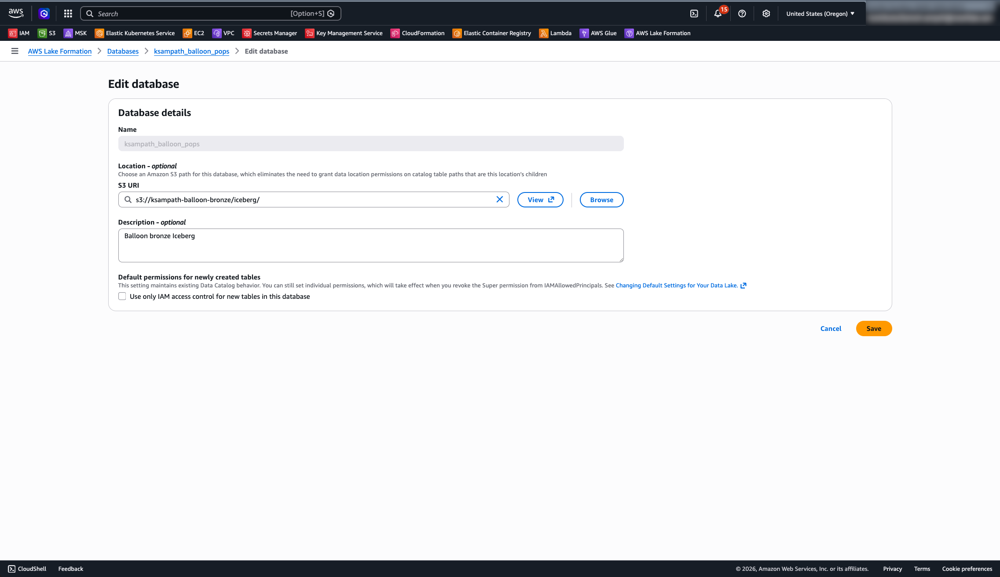

author: Kamesh Sampath, Gilberto Hernandez
id: lakehouse-iceberg-production-pipelines
categories: snowflake-site:taxonomy/solution-center/certification/quickstart,snowflake-site:taxonomy/product/data-engineering,snowflake-site:taxonomy/product/analytics
language: en
summary: Stop pipeline sprawl and the cost of data duplication. In this advanced lab, you will learn to perform secure, in-place transformations across your entire data estate. You will connect externally managed Iceberg tables with Catalog Linked Databases to always work on fresh data without ETL, build efficient and declarative pipelines with Dynamic Tables for Iceberg preserving multi-engine access to your data, and implement business continuity to ensure your production data is always available.
environments: web
status: Published
feedback link: https://github.com/Snowflake-Labs/sfguides/issues

<style>
  /* Softer inline `code` chips for dense env-var tables (default Quickstarts styling can read very heavy). */
  :not(pre) > code {
    background-color: rgba(55, 65, 81, 0.08) !important;
    color: #1f2937 !important;
    border: 1px solid rgba(17, 24, 39, 0.1);
    font-size: 0.92em;
    font-weight: 500;
    padding: 0.12em 0.4em;
    border-radius: 0.25rem;
  }
  @media (prefers-color-scheme: dark) {
    :not(pre) > code {
      background-color: rgba(255, 255, 255, 0.08) !important;
      color: #e5e7eb !important;
      border-color: rgba(255, 255, 255, 0.14);
    }
  }
</style>

# Lakehouse Transformations: Build Production Pipelines for your Iceberg Tables

## Overview

This quickstart shows how to build a bronze-to-silver Iceberg pipeline with AWS and Snowflake, without introducing a separate ETL copy into a second storage system. You first prepare a bronze Iceberg landing zone in AWS (Glue catalog, S3 warehouse, and optional S3 Tables control plane), then connect Snowflake to the same catalog and continue with Catalog Linked Databases and Dynamic Iceberg Tables.

The guide is intentionally bronze-first so learners can see exactly what data exists before running Snowflake catalog integration SQL.

### What You'll Learn

- How to prepare a workshop-safe bronze layer on AWS using Glue, S3, Lake Formation (for vended Snowflake reads), and task-driven automation.
- How Snowflake uses catalog integration and linked catalogs to query externally managed Iceberg metadata.
- How to evolve bronze data into production-friendly Dynamic Iceberg Tables and analytics surfaces.

### What You'll Build

You will build a working lakehouse workflow where bronze Iceberg tables are created and loaded in AWS, then consumed and transformed in Snowflake. The end state is a repeatable pattern for cross-engine Iceberg access with Snowflake-managed transformation layers.

### Prerequisites

- Access to a [Snowflake account](https://signup.snowflake.com/?utm_source=snowflake-devrel&utm_medium=developer-guides&utm_cta=developer-guides)
- Access to an AWS account with permissions for Glue, S3, **Lake Formation**, and IAM (plus S3 Tables if you run that optional control-plane setup)
- Local workstation with the **required CLIs** installed (see **Local toolchain** below—`aws`, `uv`, `task`, `snow`, `envsubst`, `jq`, `cortex`, plus **Python 3.12+** via `uv`)
- **Snowflake CLI (`snow`) connection** configured before any **`snow sql`** steps: add a connection (for example **`snow connection add`**) or edit **`~/.snowflake/config.toml`**, then verify with **`snow connection list`** / **`snow connection test`** ([Snowflake CLI installation](https://docs.snowflake.com/developer-guide/snowflake-cli/installation/installation), [Managing Snowflake connections](https://docs.snowflake.com/developer-guide/snowflake-cli/connecting/configure-connections)). The companion repo’s **`.env.example`** documents optional **`SNOWFLAKE_DEFAULT_CONNECTION_NAME`**, **`SNOWFLAKE_ROLE`**, and **`SNOWFLAKE_WAREHOUSE`** for trials.
- A local clone of the **companion GitHub repository** for this quickstart: [Snowflake-Labs/sfguide-lakehouse-iceberg-production-pipelines](https://github.com/Snowflake-Labs/sfguide-lakehouse-iceberg-production-pipelines). The repo contains the **Taskfile**, **Python loaders** (`tools/bronze_preload/`), **`lab/`** runbooks, **`.env.example`**, and other scripts and commands referenced below—run all tasks from the **root of that clone**.

## Tools and prerequisites

### Clone the companion repository

This quickstart’s narrative lives on Snowflake Quickstarts; the **automation and deep documentation** live in GitHub. Clone the repo and use its root as your working directory for every `task`, `uv run`, and path reference in this guide.

```bash
git clone https://github.com/Snowflake-Labs/sfguide-lakehouse-iceberg-production-pipelines.git
cd sfguide-lakehouse-iceberg-production-pipelines
```

Repository: [https://github.com/Snowflake-Labs/sfguide-lakehouse-iceberg-production-pipelines](https://github.com/Snowflake-Labs/sfguide-lakehouse-iceberg-production-pipelines)

### Accounts and permissions

- AWS account and profile (`AWS_PROFILE`) that can create/update Glue database metadata and access your bronze S3 warehouse bucket.
- Snowflake account with permissions to create catalog integration and linked database objects in your target role/database.
- **Snowflake CLI:** configure at least one **`snow`** connection to that account (account URL, auth method, default role/warehouse as you prefer), then confirm **`snow connection test`** succeeds. Repo tasks that invoke **`snow sql`** honor **`SNOWFLAKE_DEFAULT_CONNECTION_NAME`** when set ([Managing Snowflake connections](https://docs.snowflake.com/developer-guide/snowflake-cli/connecting/configure-connections)).

### Local toolchain

Install the following on your laptop or jump host **before** running bronze tasks. Versions are not pinned except where noted; use current stable releases.

**Python:** this repository targets **Python 3.12+** (see [`pyproject.toml`](https://github.com/Snowflake-Labs/sfguide-lakehouse-iceberg-production-pipelines/blob/main/pyproject.toml) in the clone). **`uv`** manages the interpreter and dependencies.

#### Required tools (download and install)

| Tool | Role in this quickstart | Where to install |
|------|-------------------------|------------------|
| **Git** | Clone the companion repository | [git-scm.com/downloads](https://git-scm.com/downloads) |
| **uv** | Sync Python deps, `uv run …` entrypoints | [docs.astral.sh/uv/getting-started/installation](https://docs.astral.sh/uv/getting-started/installation/) |
| **Task** | `task bronze:*`, `task check-tools` | [taskfile.dev/installation](https://taskfile.dev/installation/) |
| **AWS CLI v2** | Glue, S3, STS; **`aws s3tables`** for optional S3 Tables steps needs **v2.34+** | [AWS CLI install guide](https://docs.aws.amazon.com/cli/latest/userguide/getting-started-install.html) |
| **Snowflake CLI (`snow`)** | Snowflake-side steps when you add them; repo installs via **`uv sync`**—use **`uv run snow`** or put **`.venv/bin`** on `PATH` (e.g. [direnv](https://direnv.net/docs/installation.html)) | [Snowflake CLI installation](https://docs.snowflake.com/developer-guide/snowflake-cli/installation/installation) |
| **envsubst** | Renders IAM policy templates (`gettext` package) | [GNU gettext / envsubst](https://www.gnu.org/software/gettext/manual/gettext.html#envsubst-invocation) (macOS: often via Homebrew `brew install gettext` and follow PATH notes; Linux: `gettext` package) |
| **jq** | JSON at the shell for checks and snippets | [jqlang.github.io/jq/download](https://jqlang.github.io/jq/download/) |
| **Cortex Code CLI (`cortex`)** | Lab prerequisite check includes Cortex | [Cortex Code CLI](https://docs.snowflake.com/en/user-guide/cortex-code/cortex-code-cli) |

#### Recommended (comfort, not enforced by `check-tools` failure)

| Tool | Why | Where to install |
|------|-----|------------------|
| **direnv** | Auto-load `.env` / `.envrc` when you `cd` into the clone | [direnv installation](https://direnv.net/docs/installation.html) |
| **curl** | Scripts and health checks in docs | [curl.se/download](https://curl.se/download.html) |
| **openssl** | TLS and common crypto one-liners | [OpenSSL binaries](https://wiki.openssl.org/index.php/Binaries) |

#### Install paths by OS (quick reference)

Official docs for each tool are in the tables above. Use this matrix for **typical** install commands; adjust for your distro or IT policy.

| Tool | macOS | Linux (Debian/Ubuntu) | Linux (RHEL/Fedora) | Windows |
|------|-------|------------------------|---------------------|---------|
| **Git** | [Xcode CLT](https://developer.apple.com/xcode/resources/) or `brew install git` | `sudo apt install git` | `sudo dnf install git` | [Git for Windows](https://git-scm.com/download/win) |
| **uv** | [Standalone installer](https://docs.astral.sh/uv/getting-started/installation/) or `brew install uv` | Same installer / [Astral docs](https://docs.astral.sh/uv/getting-started/installation/) | Same | PowerShell installer on [Astral docs](https://docs.astral.sh/uv/getting-started/installation/) |
| **Task** | `brew install go-task` or [Task releases](https://github.com/go-task/task/releases) | [Install script](https://taskfile.dev/installation/) or package | `sudo dnf install go-task` (if available) or releases | [Scoop](https://scoop.sh/) `scoop install task`, [Chocolatey](https://community.chocolatey.org/) `choco install go-task`, or `.exe` from [releases](https://github.com/go-task/task/releases) |
| **AWS CLI v2** | `brew install awscli` or [AWS macOS pkg](https://docs.aws.amazon.com/cli/latest/userguide/getting-started-install.html) | [AWS bundled installer](https://docs.aws.amazon.com/cli/latest/userguide/getting-started-install.html) | Same | [AWS MSI](https://docs.aws.amazon.com/cli/latest/userguide/getting-started-install.html) |
| **envsubst** (`gettext`) | `brew install gettext` then add `$(brew --prefix gettext)/bin` to `PATH` | `sudo apt install gettext-base` (or `gettext`) | `sudo dnf install gettext` | Often missing in plain **cmd.exe** / **PowerShell**. Prefer **[WSL2](https://learn.microsoft.com/en-us/windows/wsl/install)** (Ubuntu: `sudo apt install gettext-base`) or **[MSYS2](https://www.msys2.org/)** (`pacman -S gettext`) so `envsubst` is on `PATH`; **Git Bash** alone may not ship it. |
| **jq** | `brew install jq` | `sudo apt install jq` | `sudo dnf install jq` | `scoop install jq` or [jq releases](https://github.com/jqlang/jq/releases) |
| **openssl** | Ships with macOS; `brew install openssl` if you need a newer build | `sudo apt install openssl` | Usually preinstalled; `sudo dnf install openssl` | Bundled with Git for Windows / or [installers](https://wiki.openssl.org/index.php/Binaries) |
| **direnv** (optional) | `brew install direnv` + [hook shell](https://direnv.net/docs/hook.html) | `sudo apt install direnv` | `sudo dnf install direnv` | [WSL](https://learn.microsoft.com/en-us/windows/wsl/install) or use manual `source .venv/bin/activate` instead |

**`snow`:** after `uv sync` in the clone, use **`uv run snow …`** from the repo root (works on all OSes), or add **`.venv\Scripts`** (Windows) / **`.venv/bin`** (macOS/Linux) to `PATH`.

**Windows note:** If `task check-tools` fails only on **`envsubst`**, use **WSL2** with the Linux column, or run **`uv run bronze-cli render-iam`** (Python path) where the guide allows—still keep **`jq`**, **`aws`**, and **`task`** on Windows `PATH` for the rest of the lab.

#### Verify from the repository root

From the **cloned** [sfguide-lakehouse-iceberg-production-pipelines](https://github.com/Snowflake-Labs/sfguide-lakehouse-iceberg-production-pipelines) repository root:

```bash
uv sync
export AWS_PROFILE=your-profile   # so STS uses the same credentials as bronze tasks
task check-tools
```

`task check-tools` runs [`tools/check_lab_prereqs.py`](https://github.com/Snowflake-Labs/sfguide-lakehouse-iceberg-production-pipelines/blob/main/tools/check_lab_prereqs.py): it **fails** if any **required** binary above is missing from `PATH`, **warns** for **recommended** tools, then runs **`aws sts get-caller-identity`** (when `aws` is on `PATH`) to confirm your **AWS session is valid** (catch expired SSO or missing profile before `task bronze:*`). Fix missing entries using the install links, refresh credentials if STS fails, then re-run until you see **All required tools are available.**

### Environment inputs

Use [`.env.example`](https://github.com/Snowflake-Labs/sfguide-lakehouse-iceberg-production-pipelines/blob/main/.env.example) from the clone as your source of truth, then set values in `.env` (never commit `.env`):

| Variable | Used by | Why it matters |
|----------|---------|----------------|
| `AWS_PROFILE` | all bronze tasks | Selects real AWS credentials for Glue/S3/S3 Tables actions |
| `AWS_REGION` | all bronze tasks | Keeps Glue, S3, and S3 Tables API calls in the intended region |
| `LAB_USERNAME` | `bronze-cli` derivation logic | Derives `GLUE_DATABASE` when unset; prefixes `BRONZE_BUCKET_NAME` / `BRONZE_S3TABLES_BUCKET_NAME` for shared AWS workshops |
| `BRONZE_BUCKET_NAME` | `task bronze:glue-setup`, `task bronze:load`, `task bronze:render-iam` | General-purpose S3 bucket; with `LAB_USERNAME`, defaults to `<slug>-balloon-bronze` or `<slug>-<suffix>`; Iceberg uses `s3://<bucket>/iceberg/` (printed after `glue-setup`). IAM policy ARN is always derived from this bucket. |
| `GLUE_DATABASE` (optional) | `task bronze:glue-setup`, `task bronze:load` | Overrides derived/default Glue DB name |
| `BRONZE_LOAD_DURATION_MINUTES` (optional) | `task bronze:load`, `task bronze:load-more` | Generator replay length when not using row mode (default **5** min) |
| `BRONZE_GENERATOR_DELAY` / `DELAY` (optional) | `task bronze:load` | Seconds between simulated pops (same as Kafka generator; default **1.0**) |
| `BRONZE_SAMPLE_ROW_COUNT` (optional) | `task bronze:load`, `task bronze:load-more` | If set, **synthetic** mode: that many raw JSON rows into `balloon_game_events` (cap **100000**); use `uv run load-bronze-sample --row-count N` or `--duration-minutes M` on CLI |
| `BRONZE_S3TABLES_BUCKET_NAME` | `task bronze:s3tables-setup` | S3 Tables bucket; empty + `LAB_USERNAME` → `<slug>-balloon-s3tables` (same suffix pattern as warehouse bucket) |
| `S3TABLES_NAMESPACE` (optional) | `task bronze:s3tables-setup` | Namespace created/managed inside the S3 Tables bucket (default `balloon_pops`) |
| *(optional)* | `task bronze:snowflake-summary`, `task bronze:snowflake-summary-json` | Read-only: resolved ARNs, Glue REST URI, and table names for Snowflake catalog / CLD prep (same env as other bronze tasks; JSON variant needs no `task … --` forwarding). |

### Task and script entrypoints

Bronze automation uses `task bronze:*` and Python entrypoints declared in `pyproject.toml`:

- `uv run bronze-cli ...`
- `uv run load-bronze-sample`

For command details and expected outputs, see [`tools/bronze_preload/README.md`](https://github.com/Snowflake-Labs/sfguide-lakehouse-iceberg-production-pipelines/blob/main/tools/bronze_preload/README.md) in the cloned repository.

## Bronze landing zone

This section is the first hands-on chapter because all downstream Snowflake steps assume these tables already exist.

### Run bronze setup

Use these tasks in order (or `task bronze:all` once prerequisites are in place):

```bash
task bronze:render-iam          # optional policy render helper
task bronze:glue-setup
task bronze:s3tables-setup
task bronze:load
```

After **`task bronze:load`** and **`task snowflake:create-glue-catalog-read-role`**, run **`task bronze:lakeformation-setup`** (or **`task bronze:lakeformation-setup-dry-run`**) to configure **AWS Lake Formation** for Snowflake **Glue Iceberg REST** with **`ACCESS_DELEGATION_MODE = VENDED_CREDENTIALS`**: register **`BRONZE_BUCKET_NAME`** with LF using a **dedicated data-access IAM role** (trusted by **`lakeformation.amazonaws.com`**, S3 read on the bucket) with **`HybridAccessEnabled=false`** and **`WithFederation=false`** on **`RegisterResource`** (Lake Formation–only location registration; avoid hybrid and Data Catalog federation on that S3 resource for predictable vending), clear default Glue **IAM-only** table permissions on **`GLUE_DATABASE`**, and **`grant-permissions`** **to** your Snowflake **`SIGV4_IAM_ROLE`**. **Keep two roles** (SIGV4 vs LF data-access); **do not merge them**—that often causes **credential vending errors**. Why each step exists: **[`lab/bronze-landing-zone.md` — Lake Formation (after bronze load)](https://github.com/Snowflake-Labs/sfguide-lakehouse-iceberg-production-pipelines/blob/main/lab/bronze-landing-zone.md#lake-formation-after-bronze-load)** (rationale table + manual CLI).

Dry-run variants are available to preview behavior:

```bash
task bronze:render-iam-dry-run
task bronze:glue-setup-dry-run
task bronze:s3tables-setup-dry-run
```

### Verify what you have

After bronze setup (and before Snowflake catalog integration SQL), you can run **`task bronze:snowflake-summary`** for a copy-paste sheet of exports and ARNs, or **`task bronze:snowflake-summary-json`** for the same payload as JSON. This does not modify AWS; it uses your current `.env` and optional live S3 Tables lookups.

You should have this raw-events Iceberg table in your Glue database: **`balloon_game_events`**. Rows use a single JSON payload column **`event`** (one object per row). Snowflake Dynamic Iceberg Tables use **`PARSE_JSON`** / semi-structured paths to project fields and build aggregates—see [`snowflake/lab/REFERENCE.md`](https://github.com/Snowflake-Labs/sfguide-lakehouse-iceberg-production-pipelines/blob/main/snowflake/lab/REFERENCE.md) in the cloned repository for the field list and DT patterns.

- `balloon_game_events`

Full console steps (Glue + S3 warehouse + S3 Tables) live in **`lab/bronze-landing-zone.md`**. The quickstart embeds screenshots from this guide’s **`assets/`** folder (Snowflake Quickstarts convention). Author captures under **`lab/images/`**, then copy PNGs into **`assets/`** — see **`assets/README.md`**.

#### Verify in the AWS Console (screenshots)

Use the same account and **`AWS_REGION`** as your CLI profile.

**Glue + general S3 warehouse** (after **`task bronze:load`**):

1. **Glue** → **Data catalog** → **Databases** — confirm **`GLUE_DATABASE`** exists.
2. Open that database → **Tables** — confirm **`balloon_game_events`**.
3. Open **`balloon_game_events`** — confirm **Apache Iceberg**.
4. **S3** → warehouse bucket **`BRONZE_BUCKET_NAME`** — confirm the bucket; optional: open **`iceberg/`** and capture `metadata/` / `data/` when you add **`assets/bronze-s3-iceberg-prefix.png`**.

**Amazon S3 Tables** (after **`task bronze:s3tables-setup`**): open **S3 Tables** → **Table buckets** and confirm **`BRONZE_S3TABLES_BUCKET_NAME`** appears. Default **`bronze:load`** writes to the Glue-backed S3 warehouse above; S3 Tables is the second Iceberg surface for Snowflake / Glue REST alignment (see **`lab/bronze-landing-zone.md`**).


**S3 warehouse + S3 Tables screenshots:** the numbered steps above cover the same checks. Optional figures **`assets/bronze-s3-bucket.png`** and **`assets/bronze-s3tables-list.png`** are not bundled in this repo yet; after you capture them under **`lab/images/`**, copy them into **`assets/`** per **`assets/README.md`**, then add standard Markdown image embeds here if you want them in the published quickstart.

### Optional: Query bronze in Amazon Athena

To run SQL on the **loaded** Iceberg tables, use the **Glue** catalog where **`task bronze:load`** registered them—not the **S3 Tables** catalog entry (those tables are empty shells until a separate writer commits metadata). See [Query Apache Iceberg tables](https://docs.aws.amazon.com/athena/latest/ug/querying-iceberg.html) in the Athena documentation.

1. **Data source:** **`AwsDataCatalog`**.
2. **Catalog:** leave **default** / **None** (or choose the account’s native Glue catalog). **Do not** select **`s3tables/<table-bucket>`** in the Catalog dropdown—that path is the S3 Tables federated catalog and will return errors such as missing **`metadata_location`** for this lab’s seed data.
3. **Database:** your **`GLUE_DATABASE`** from bronze (for example **`ksampath_balloon_pops`** when **`LAB_USERNAME`** derived it). It is usually **`<glue_slug>_balloon_pops`**, not the literal **`balloon_pops`** string alone—that name is often the **S3 Tables namespace** (`S3TABLES_NAMESPACE`), which is a different object. Confirm with **`task bronze:snowflake-summary`** or **`Name`** in **`.aws-config/glue-database.json`**.

More detail and troubleshooting: [Athena (and other SQL clients)](https://github.com/Snowflake-Labs/sfguide-lakehouse-iceberg-production-pipelines/blob/main/lab/bronze-landing-zone.md#athena-and-other-sql-clients) in the repo’s **`lab/bronze-landing-zone.md`**.

Use this detailed runbook for full step-by-step setup, validation, and troubleshooting (paths are relative to the [cloned repository](https://github.com/Snowflake-Labs/sfguide-lakehouse-iceberg-production-pipelines)):

- [`lab/bronze-landing-zone.md`](https://github.com/Snowflake-Labs/sfguide-lakehouse-iceberg-production-pipelines/blob/main/lab/bronze-landing-zone.md)
- [`lab/bronze-landing-zone-MANUAL-TEST.md`](https://github.com/Snowflake-Labs/sfguide-lakehouse-iceberg-production-pipelines/blob/main/lab/bronze-landing-zone-MANUAL-TEST.md)

## Snowflake CLD path

This section is the **main learner path** for Snowflake: create the **Glue Iceberg REST** catalog integration, tighten **IAM trust** on **`SIGV4_IAM_ROLE`**, create the **catalog-linked database (CLD)**, then run **discovery and read queries** against **`balloon_game_events`**. Complete **AWS-side** prerequisites (bronze tables, IAM role, and—when you use **vended** Glue credentials—**Lake Formation**) before step 1. **Snowflake CLI:** have a working **`snow`** connection (**`snow connection test`**) and optional **`SNOWFLAKE_DEFAULT_CONNECTION_NAME`** / **`SNOWFLAKE_ROLE`** / **`SNOWFLAKE_WAREHOUSE`** before running **`snow sql`** ([Managing Snowflake connections](https://docs.snowflake.com/developer-guide/snowflake-cli/connecting/configure-connections)). Long-form rationale and alternate **external volume** setups are **Additional reading** at the end of this section—not steps you must read first.

SQL scaffolds: [`snowflake/lab/01_catalog_integration.sql`](https://github.com/Snowflake-Labs/sfguide-lakehouse-iceberg-production-pipelines/blob/main/snowflake/lab/01_catalog_integration.sql), [`snowflake/lab/02_cld_verify.sql`](https://github.com/Snowflake-Labs/sfguide-lakehouse-iceberg-production-pipelines/blob/main/snowflake/lab/02_cld_verify.sql). Generated copies: run **`task snowflake:generate-lab-sql`** after **`task bronze:snowflake-summary`** and a **`SIGV4`** role ARN (see **Additional reading**).

### Create catalog integration

Run **`CREATE CATALOG INTEGRATION`** (or **`CREATE OR REPLACE`**) with **`CATALOG_SOURCE = ICEBERG_REST`**, **`CATALOG_API_TYPE = AWS_GLUE`**, **`CATALOG_URI = https://glue.<region>.amazonaws.com/iceberg`**, and **`REST_AUTHENTICATION`** (**`TYPE = SIGV4`**, **`SIGV4_IAM_ROLE`**, **`SIGV4_SIGNING_REGION`**). **Default (Glue Data Catalog):** **`CATALOG_NAME`** = 12-digit AWS account id, **`CATALOG_NAMESPACE`** = **`GLUE_DATABASE`** per Snowflake [Step 2](https://docs.snowflake.com/en/user-guide/tables-iceberg-configure-catalog-integration-rest-glue#step-2-create-a-catalog-integration-in-snowflake). Align every property with [Configure a catalog integration for AWS Glue Iceberg REST](https://docs.snowflake.com/en/user-guide/tables-iceberg-configure-catalog-integration-rest-glue) and [CREATE CATALOG INTEGRATION (REST)](https://docs.snowflake.com/en/sql-reference/sql/create-catalog-integration-rest).

```bash
snow sql --connection <your_connection> --filename snowflake/lab/generated/01_catalog_integration.generated.sql
```

Hand-edited alternative: **`snowflake/lab/01_catalog_integration.sql`**. Default integration name in the repo is **`glue_rest_catalog_int`**.

### Describe integration

In Snowflake, run **`DESC CATALOG INTEGRATION <name>`** and capture **`GLUE_AWS_IAM_USER_ARN`** and **`GLUE_AWS_EXTERNAL_ID`** for the next step. Repo helper: **`task snowflake:describe-catalog-integration`** (see [`snowflake/lab/README.md`](https://github.com/Snowflake-Labs/sfguide-lakehouse-iceberg-production-pipelines/blob/main/snowflake/lab/README.md)).

### Apply IAM trust

On the **same** IAM role passed as **`SIGV4_IAM_ROLE`**, set **trust** so **`Principal.AWS`** is Snowflake’s **`GLUE_AWS_IAM_USER_ARN`** and **`sts:ExternalId`** matches **`GLUE_AWS_EXTERNAL_ID`**. Render JSON with **`task snowflake:render-glue-catalog-trust`**, then **`task snowflake:apply-glue-catalog-trust-from-rendered`** or paste **`.aws-config/snowflake-glue-catalog-trust-policy.rendered.json`** in the IAM console. Keep **permissions** on that role aligned with Snowflake [Step 1](https://docs.snowflake.com/en/user-guide/tables-iceberg-configure-catalog-integration-rest-glue#step-1-configure-access-permissions-for-the-aws-glue-data-catalog).

### Create linked database

Run **`CREATE DATABASE … LINKED_CATALOG = ( CATALOG = '<integration_name>' )`** per [CREATE DATABASE (catalog-linked)](https://docs.snowflake.com/en/sql-reference/sql/create-database-catalog-linked) and [Use a catalog-linked database](https://docs.snowflake.com/en/user-guide/tables-iceberg-catalog-linked-database). This lab’s default linked database name is **`balloon_game_events`** (same spelling as the bronze Iceberg table).

### Verify and discover

Optional: **`SELECT SYSTEM$CATALOG_LINK_STATUS('balloon_game_events');`** and **`SELECT SYSTEM$GET_CATALOG_LINKED_DATABASE_CONFIG('balloon_game_events');`**. List remote namespaces and tables: **`SHOW SCHEMAS IN DATABASE balloon_game_events;`** then **`SHOW ICEBERG TABLES IN SCHEMA balloon_game_events."<remote_schema>";`** (Glue-backed names are often **lowercase**—use **double-quoted** identifiers). If **`SHOW ICEBERG TABLES`** is unavailable in your edition, use **`SHOW TABLES`** / Information Schema per current Snowflake documentation.

### Run query checks

Read raw JSON from **`event`**, then project with **`PARSE_JSON`** as in [`snowflake/lab/REFERENCE.md`](https://github.com/Snowflake-Labs/sfguide-lakehouse-iceberg-production-pipelines/blob/main/snowflake/lab/REFERENCE.md). One-shot script:

```bash
snow sql --connection <your_connection> --filename snowflake/lab/generated/02_cld_verify.generated.sql
```

### Solo lab walkthrough

From the **repository root** after **`uv sync`**, use this **task-first** path when you want a single thread to follow alone. Add **`snow sql`** connection flags as needed ([Managing Snowflake connections](https://docs.snowflake.com/developer-guide/snowflake-cli/connecting/configure-connections)).

**Pre-flight**

- **`task check-tools`** — **`snow`**, **`aws`**, **`task`**, **`uv`** on **`PATH`**; **`aws sts get-caller-identity`** succeeds for the profile you will use in IAM.
- **Snowflake CLI connection** — add or edit a connection in **`~/.snowflake/config.toml`** (or use **`snow connection add`**) so **`snow connection list`** shows the profile you want. Run **`snow connection test`** (optionally with **`--connection <name>`**) before **`snow sql`**. If you use a non-default connection name, set **`SNOWFLAKE_DEFAULT_CONNECTION_NAME`** (see clone **`.env.example`**) or pass **`--connection`** on every **`snow sql`** invocation ([Managing Snowflake connections](https://docs.snowflake.com/developer-guide/snowflake-cli/connecting/configure-connections)).
- **`.aws-config/glue-database.json`** — exists after bronze **`glue-setup`**; Glue already has **`balloon_game_events`**.
- **`SIGV4` IAM role** — set **`SNOWFLAKE_GLUE_CATALOG_IAM_ROLE_ARN`** *or* put the role ARN on the first non-comment line of **`.aws-config/snowflake-glue-catalog-iam-role-arn.txt`**. **`task snowflake:create-glue-catalog-read-role`** creates the role and that file. Do **not** use the bronze **PyIceberg writer** role or the **Lake Formation `register-resource` data-access** role as **`SIGV4_IAM_ROLE`** (vending breaks when those principals are merged).
- **Vended catalog SQL** — if **`01_catalog_integration.generated.sql`** includes **`ACCESS_DELEGATION_MODE = VENDED_CREDENTIALS`**, complete **Lake Formation** for **`SIGV4`** first (**`task bronze:lakeformation-setup`** after **`task bronze:load`**, or the **Lake Formation console** steps below). Warehouse **S3** must be registered under an **LF data-access** role that is **not** the **`SIGV4`** role.
- **Same region/profile** — use the same **`AWS_PROFILE`** / **`AWS_REGION`** as bronze when you edit IAM trust for **`SIGV4`**.

**Env overrides (only when you need them)**

- **`SNOWFLAKE_CATALOG_INTEGRATION_NAME`** — defaults to **`glue_rest_catalog_int`**; set if you created the integration under another name (used by **`describe-catalog-integration`** / **`render-glue-catalog-trust`**).
- **`SNOWFLAKE_LINKED_DATABASE_NAME`** — defaults to **`balloon_game_events`** for **`generate-lab-sql`**.
- **`SNOWFLAKE_DEFAULT_CONNECTION_NAME`**, **`SNOWFLAKE_ROLE`**, **`SNOWFLAKE_WAREHOUSE`** — trial-friendly defaults often live in **`.env`** (see clone **`.env.example`**).
- **S3 Tables REST shape** — **`SNOWFLAKE_GLUE_REST_USE_S3TABLES_CATALOG=1`** (or generator **`--glue-s3tables-catalog`**); supply **`BRONZE_S3TABLES_BUCKET_NAME`** / **`.aws-config/bronze-s3tables-last-bucket-name.txt`** and **`S3TABLES_NAMESPACE`** as needed.
- **Air-gapped trust render** — set **`GLUE_AWS_IAM_USER_ARN`** and **`GLUE_AWS_EXTERNAL_ID`** so **`render-glue-catalog-trust`** can run without **`snow sql`** **`DESC`**.

**Copy-paste command chain**

```bash
task check-tools
task bronze:snowflake-summary
task snowflake:print-env-hints
task snowflake:create-glue-catalog-read-role    # optional if ARN file or SNOWFLAKE_GLUE_CATALOG_IAM_ROLE_ARN already set
task snowflake:generate-lab-sql
snow sql --filename snowflake/lab/generated/01_catalog_integration.generated.sql
task snowflake:describe-catalog-integration
task snowflake:render-glue-catalog-trust
task snowflake:apply-glue-catalog-trust-from-rendered
snow sql --filename snowflake/lab/generated/02_cld_verify.generated.sql
```

**Dry-runs (no writes):** **`task snowflake:create-glue-catalog-read-role-dry-run`**, **`task snowflake:generate-lab-sql-stdout`**, **`task snowflake:render-glue-catalog-trust-dry-run`**.

**Step-by-step checks**

1. **Bronze summary** — **`task bronze:snowflake-summary`** (or **`task bronze:snowflake-summary-json`**). **Pass:** exit **0**; output includes **`GLUE_ICEBERG_REST_URI`**, **`AWS_ACCOUNT_ID`**, **`GLUE_DATABASE`**, **`balloon_game_events`** and matches **`glue-database.json`** **`Name`** / **`CatalogId`**.
2. **SIGV4 role (optional)** — **`task snowflake:create-glue-catalog-read-role`**. **Pass:** stderr shows **`IAM role name=…`**; **`.aws-config/snowflake-glue-catalog-iam-role-arn.txt`** matches **`aws iam get-role --role-name <that-name> --query Role.Arn --output text`**. **Skip** if you supply the ARN yourself.
3. **Generate SQL** — **`task snowflake:generate-lab-sql`**. **Pass:** **`snowflake/lab/generated/01_catalog_integration.generated.sql`** and **`02_cld_verify.generated.sql`** exist (gitignored). Open **`01_…`**: default Glue Data Catalog shape uses **12-digit** **`CATALOG_NAME`**, **`CATALOG_NAMESPACE`** = **`GLUE_DATABASE`**, **`CATALOG_URI`** / **`SIGV4_*`** match your region and role.
4. **Create integration** — **`snow sql --filename snowflake/lab/generated/01_catalog_integration.generated.sql`**. **Pass:** **`DESC CATALOG INTEGRATION`** returns **`GLUE_AWS_IAM_USER_ARN`** and **`GLUE_AWS_EXTERNAL_ID`**. Assume-role errors until step **7** are expected. **Common misses:** wrong **`CATALOG_NAMESPACE`** or account id, typo in **`SIGV4_IAM_ROLE`**.
5. **Describe (repo)** — **`task snowflake:describe-catalog-integration`** (optional **`task snowflake:describe-catalog-integration-json`**). **Pass:** output includes the trust fields (text output may mask the external ID).
6. **Render trust** — **`task snowflake:render-glue-catalog-trust`**. **Pass:** **`.aws-config/snowflake-glue-catalog-trust-policy.rendered.json`** exists and **`python -m json.tool`** on that file exits **0**; **`Principal`** / **`sts:ExternalId`** align with **`DESC`**.
7. **Apply trust** — **`task snowflake:apply-glue-catalog-trust-from-rendered`** or paste the rendered JSON in IAM for the **`SIGV4`** role. **Pass:** trust saves; after a short wait **`DESC CATALOG INTEGRATION`** stops reporting persistent assume-role failures. Permissions still include Glue + Lake Formation APIs Snowflake documents for vended reads.
8. **CLD and reads** — **`snow sql --filename snowflake/lab/generated/02_cld_verify.generated.sql`**. **Pass:** **`CREATE DATABASE … LINKED_CATALOG`** succeeds; **`SYSTEM$CATALOG_LINK_STATUS`** is healthy; **`SHOW SCHEMAS` / `SHOW ICEBERG TABLES`** show **`balloon_game_events`**; **`SELECT event … LIMIT 10`** returns JSON strings. **Common misses:** trust not propagated; wrong **lowercase** quoted schema for Glue; integration **DISABLED**; **094120** / “Failed to retrieve credentials from the Catalog” → LF registration + grants for **`SIGV4`**, separate LF data-access role, and **`SnowflakeGlueCatalogRead`** policy shape per [Snowflake Glue REST + Lake Formation](https://docs.snowflake.com/en/user-guide/tables-iceberg-configure-catalog-integration-rest-glue).
9. **Optional — repo hygiene** — **`uv run ruff check tools/snowflake_lab/`**; **`task --list | rg snowflake`** to confirm Snowflake tasks are registered.
10. **Optional — Snowflake teardown** — in a worksheet or **`snow sql`**, adjust names if you overrode defaults:

```sql
DROP DATABASE IF EXISTS balloon_game_events;
DROP CATALOG INTEGRATION IF EXISTS glue_rest_catalog_int;
```

**Pass:** objects disappear from **`SHOW DATABASES`** / **`SHOW CATALOG INTEGRATIONS`**. Follow current [DROP DATABASE](https://docs.snowflake.com/en/sql-reference/sql/drop-database) and [DROP CATALOG INTEGRATION](https://docs.snowflake.com/en/sql-reference/sql/drop-catalog-integration) docs before running in shared accounts.

11. **Optional — delete lab SIGV4 role** — if step **2** created **`snowflake_glue_catalog_read`** (or your **`SNOWFLAKE_GLUE_CATALOG_IAM_ROLE_NAME`**), after Snowflake teardown and when you no longer need AWS side: **`task bronze:cleanup --yes -- --delete-snowflake-catalog-iam-role`**. Preview: **`task bronze:cleanup-dry-run -- --delete-snowflake-catalog-iam-role`**. Deletes only roles tagged **`project=balloon-popper-demo`** and **`purpose=snowflake-glue-catalog-read`**.

### Additional reading

Use these when you need **AWS depth**, **Lake Formation** for **`ACCESS_DELEGATION_MODE = VENDED_CREDENTIALS`**, or the **external volume** pattern (see **`lab/cld-with-extvol-setup-guide.md`** and Snowflake **`CREATE CATALOG INTEGRATION`** documentation for delegation and storage credentials).

### Lake Formation console

When your catalog integration uses **vended** Glue credentials (**`ACCESS_DELEGATION_MODE = VENDED_CREDENTIALS`**), Lake Formation must govern the warehouse **S3** prefix and grant access to Snowflake’s **`SIGV4_IAM_ROLE`**. The figures below are from a single workshop account—your **`GLUE_DATABASE`**, **`BRONZE_BUCKET_NAME`**, LF **data-access** role, and Snowflake **catalog** IAM role names will differ. Full CLI and API steps: **[`lab/bronze-landing-zone.md` — Lake Formation (after bronze load)](https://github.com/Snowflake-Labs/sfguide-lakehouse-iceberg-production-pipelines/blob/main/lab/bronze-landing-zone.md#lake-formation-after-bronze-load)**.

1. **Glue database (Lake Formation view):** **Lake Formation** → **Data catalog** → **Databases** → open your Glue database → **Edit**. Leave **Use only IAM access control for new tables in this database** **unchecked** so new tables remain under Lake Formation permissions (consistent with clearing Glue **default table permissions** in the bronze lab).



2. **Data lake location:** Register **`s3://<warehouse-bucket>/iceberg/`** (or the prefix where bronze metadata and data live) with the **LF data-access** role from **`register-resource`**—**not** the same IAM role as **`SIGV4_IAM_ROLE`**. Select **Lake Formation** permission mode (not **Hybrid**), and keep **Enable Data Catalog Federation** off for this lab path. API alignment: **`HybridAccessEnabled=false`** and **`WithFederation=false`** on **[`RegisterResource`](https://docs.aws.amazon.com/lake-formation/latest/APIReference/API_RegisterResource.html)**.


3. **Data permissions:** In **Lake Formation** → **Permissions** → **Data permissions**, grant the Snowflake **Glue REST catalog** signer (**`SIGV4_IAM_ROLE`**) the database, table, and underlying data location permissions Snowflake documents for vended reads (see [Configure a catalog integration for AWS Glue Iceberg REST](https://docs.snowflake.com/en/user-guide/tables-iceberg-configure-catalog-integration-rest-glue)).


**Lab links (deeper narrative)**

- **[`lab/snowflake-catalog-cld.md`](https://github.com/Snowflake-Labs/sfguide-lakehouse-iceberg-production-pipelines/blob/main/lab/snowflake-catalog-cld.md)** — full Snowflake + IAM narrative, S3 Tables **`CATALOG_NAME`** shape, identifier rules, and automation tip from the repo.
- **[`lab/bronze-landing-zone.md` — Lake Formation (after bronze load)](https://github.com/Snowflake-Labs/sfguide-lakehouse-iceberg-production-pipelines/blob/main/lab/bronze-landing-zone.md#lake-formation-after-bronze-load)** — CLI **`register-resource`** / **`grant-permissions`** sequence and rationale for splitting **SIGV4** vs LF data-access roles.
- **[`lab/cld-with-extvol-setup-guide.md`](https://github.com/Snowflake-Labs/sfguide-lakehouse-iceberg-production-pipelines/blob/main/lab/cld-with-extvol-setup-guide.md)** — **external volume** path, **dual external IDs** on one IAM trust, **`ALLOW_WRITES = FALSE`**, and troubleshooting. Compare with [CREATE CATALOG INTEGRATION (REST)](https://docs.snowflake.com/en/sql-reference/sql/create-catalog-integration-rest) for **`ACCESS_DELEGATION_MODE`** and storage credentials.

## Troubleshooting

### "Failed to retrieve credentials from the Catalog"

If the link status shows this error:

```json
{"failureDetails":[{"errorCode":"094120","errorMessage":"SQL Execution Error: Failed to retrieve credentials from the Catalog for table balloon_game_events. Please ensure that the catalog vends credentials and retry."}],"executionState":"RUNNING"}
```

**Root cause:** The Lake Formation **Data lake location** for your warehouse bucket is not configured correctly for **credential vending** (Glue Iceberg REST with **`ACCESS_DELEGATION_MODE = VENDED_CREDENTIALS`**). Short recap below; full LF checklist and the **external volume** alternative live under **Additional reading** in **`## Snowflake CLD path`** above.

**Required Lake Formation settings (Data lake locations):**

- **Permission mode** must be **Lake Formation** (not **Hybrid**). In the API, that means **`HybridAccessEnabled=false`** on **`RegisterResource`** (this quickstart’s **`task bronze:lakeformation-setup`** path matches that). See [RegisterResource](https://docs.aws.amazon.com/lake-formation/latest/APIReference/API_RegisterResource.html) and [Hybrid access mode](https://docs.aws.amazon.com/lake-formation/latest/dg/hybrid-access-mode.html).
- Choosing **Lake Formation** mode in the console aligns with **not** treating the registered S3 location as a **federated** Data Catalog resource for this path—do **not** enable **`WithFederation`** on that registration ([`WithFederation`](https://docs.aws.amazon.com/lake-formation/latest/APIReference/API_RegisterResource.html)).
- The location must be registered with an **IAM role** that **Lake Formation can assume** and that has **S3 read** access to the warehouse objects (the lab’s **separate** LF data-access role—not the Snowflake **`SIGV4_IAM_ROLE`**). Full checklist: **[`lab/bronze-landing-zone.md` — Lake Formation (after bronze load)](https://github.com/Snowflake-Labs/sfguide-lakehouse-iceberg-production-pipelines/blob/main/lab/bronze-landing-zone.md#lake-formation-after-bronze-load)** and **[`lab/snowflake-catalog-cld.md`](https://github.com/Snowflake-Labs/sfguide-lakehouse-iceberg-production-pipelines/blob/main/lab/snowflake-catalog-cld.md)** (IAM + `SYSTEM$CATALOG_LINK_STATUS`).

**Important notes (Snowflake catalog-linked database):**

- **`ALTER DATABASE … RESUME DISCOVERY`** does **not** re-establish the catalog connection. It only retries table/schema discovery against the existing link.
- After you change **Lake Formation** (or related IAM) settings, you **must** run **`CREATE OR REPLACE DATABASE … LINKED_CATALOG = ( … )`** so Snowflake re-establishes the link to the catalog integration ([CREATE DATABASE (catalog-linked)](https://docs.snowflake.com/en/sql-reference/sql/create-database-catalog-linked), [Use a catalog-linked database](https://docs.snowflake.com/en/user-guide/tables-iceberg-catalog-linked-database)).
- After **`CREATE OR REPLACE DATABASE`**, re-apply the privileges your working role needs on the **catalog integration** and the **linked database**—for example **`GRANT USAGE ON INTEGRATION <integration_name> TO ROLE <role>`** (required for many CLD operations when the [2025_07 behavior change](https://docs.snowflake.com/en/release-notes/bcr-bundles/2025_07/bcr-2114) applies) and **`GRANT OWNERSHIP`** (or your org’s equivalent) as you did when you first created the CLD. Align every statement with current Snowflake documentation for your account edition.

## TODO (WIP)

- Add one consolidated **Cleanup** section at the end of the full guide (covering bronze and Snowflake resources) instead of adding cleanup after each section.
