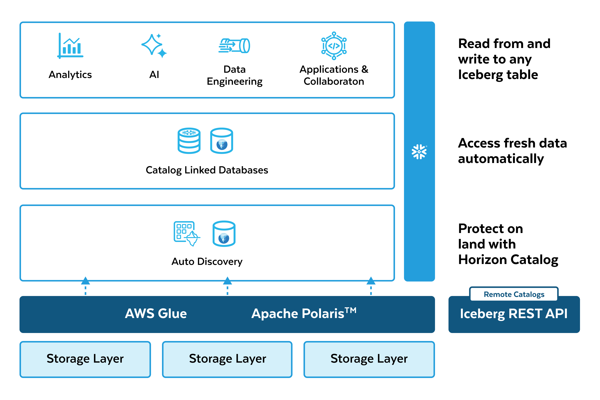

author: Carlos Nai
id: make-your-lakehouse-ai-ready
summary: Snowflake’s Enterprise Lakehouse solutions, grounded in Apache Iceberg™ tables, enables any customer to overcome data and security fragmentation to conquer data complexity.
categories: snowflake-site:taxonomy/solution-center/certification/quickstart
environments: web
language: en
status: Published
feedback link: https://github.com/Snowflake-Labs/sfguides/issues

# Confidently Power Iceberg Pipelines with Any Data
<!-- ------------------------ -->
## Overview

Snowflake’s Enterprise Lakehouse solutions, grounded in Apache Iceberg™ tables, enables any customer to overcome data and security fragmentation to conquer data complexity.

It starts by connecting existing Iceberg tables on any catalog, region, or cloud to build a single, connected and secured view of your entire data estate and apply precise security policies.

Customers can also connect new data, with improved economics, by streaming data with Snowpipe, together with Snowpipe Streaming, to any Iceberg Table in their choice of latency, or simply connect multi-modal data from anywhere with Openflow.

As data comes in, built-in automated data quality monitoring offers customizable quality controls and proactive alerts (PrPr) to monitor the health of their data pipelines.

With Snowflake, customers can streamline pipelines via automated and declarative solutions with a fully managed infrastructure with Dynamic Tables for Iceberg and the option to run existing Apache Spark in Snowpark Connect for lower TCO and greater scalability.

Customer’s business ecosystem extends beyond their architectures.  Support for secure data sharing in open formats connects this last-fragmentation-mile with support to share governed access to Iceberg and Delta tables with any team, customer or partner.

<!-- ------------------------ -->
## Solution Architecture

<!-- ------------------------ -->
## Get Started

- [View the quickstart guide](https://quickstarts.snowflake.com/guide/data_lake_using_apache_iceberg_with_snowflake_and_aws_glue/index.html?index=..%2F..index#0)
- [Watch the launch event](https://www.snowflake.com/webinars/product-demo/data-engineering-connect-architect-for-ai-with-open-formats-2025-10-15/)
- [Read the blog](https://www.snowflake.com/en/blog/data-engineering-lakehouse-open-formats/)
