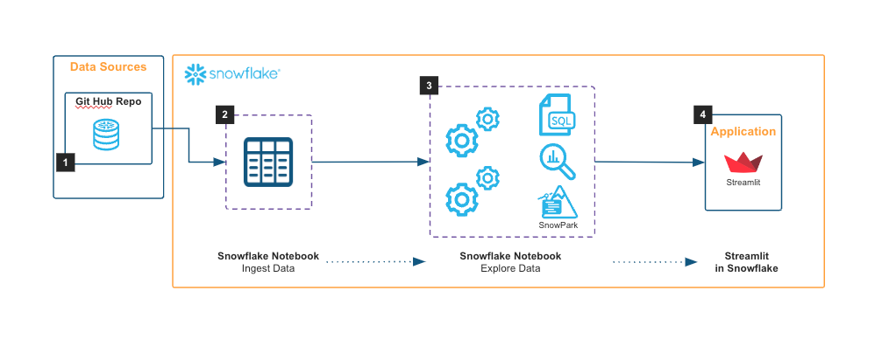

author: Matteo Consoli
id: olympic-games-analytics-using-notebook-and-streamlit
summary: This solution architecture shows how to use The Olympic Games Data Hub to explore, analyze and visualize Olympic games data.
categories: snowflake-site:taxonomy/solution-center/certification/community-solution
environments: web
language: en
status: Published
feedback link: https://github.com/Snowflake-Labs/sfguides/issues
fork repo link: https://github.com/Snowflake-Labs/sfquickstarts/tree/master/site/sfguides/src/olympic-games-analytics-using-notebook-and-streamlit

# Olympic Games Analytics using Notebook and Streamlit
<!-- ------------------------ -->
## Overview

This solution architecture shows how to use The Olympic Games Data Hub to explore, analyze and visualize Olympic games data. 

* Ingest data from GitHub into Snowflake tables.
* Perform statistical analysis on the Olympic games dataset
* Streamlit app for exploring and visualizing the Olympic Games data from 1896 to 2022.

<!-- ------------------------ -->
## Solution Architecture: Olympic Games Analytics

The Olympic Games Data Hub consists of the following components:

* *setup.sql*: Script to set up the database, schema, warehouse, and external access integration.
* *olympic\_games\_ingest\_explore.ipynb*: Notebook to fetch data from GitHub and push it into Snowflake tables.
* *olympics\_games\_data\_hub.py*: Streamlit app for exploring and visualizing the Olympic Games data.
* *dataset*: folder containing csv dataset that will be uploaded in your Snowflake account.

<!-- ------------------------ -->
## Get Started

- [view quickstart](https://medium.com/snowflake/olympic-games-analytics-with-snowflake-0af45453bbd2)
- [fork repo](https://github.com/sfc-gh-mconsoli/olympic_games_data_hub/tree/main)
- [Download reference architecture](https://www.snowflake.com/content/dam/snowflake-site/developers/2024/08/Olympic-Games-Architecture-Diagram.pdf)
