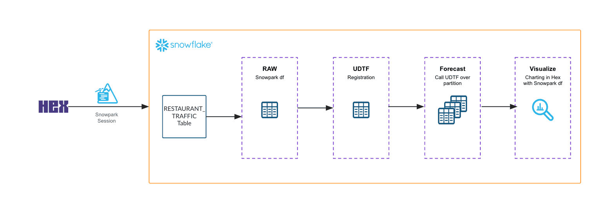

author: Hex Staff
id: optimizing-marketing-budget-using-snowpark-ml-in-hex-notebooks
summary: This solution architecture shows how to use Snowpark ML and stored procedures to analyze the marketing spend and optimize marketing budget.
categories: snowflake-site:taxonomy/solution-center/certification/partner-solution
environments: web
language: en
status: Published
feedback link: https://github.com/Snowflake-Labs/sfguides/issues
fork repo link: https://github.com/Snowflake-Labs/sfquickstarts/tree/master/site/sfguides/src/optimizing-marketing-budget-using-snowpark-ml-in-hex-notebooks

# Optimizing Marketing Budget using Snowpark ML
<!-- ------------------------ -->
## Overview

This solution architecture shows how to use Snowpark ML and stored procedures to analyze the marketing spend and optimize marketing budget. 

* Run pre-processing, feature engineering and selection, and model training using Snowpark
* Evaluate the model performance against precision, accuracy and recall metrics
* Deploy a stored procedure to upsample the data to address class imbalance problem in model training

<!-- ------------------------ -->
## Solution Architecture: Optimizing Marketing Budget using Snowpark ML

* In this use-case, you learn how to use Snowpark ML and Stored procedures to analyze the marketing spend and ROI data.
* The solution shows how to use Hex notebooks to build end to end machine learning workflows.
