author: Becky O'Connor, Piotr Paczewski, Oleksii Bielov
id: oss-install-openrouteservice-native-app
categories: snowflake-site:taxonomy/solution-center/certification/quickstart, snowflake-site:taxonomy/product/ai, snowflake-site:taxonomy/product/analytics, snowflake-site:taxonomy/product/applications-and-collaboration, snowflake-site:taxonomy/snowflake-feature/snowpark-container-services, snowflake-site:taxonomy/snowflake-feature/geospatial, snowflake-site:taxonomy/snowflake-feature/cortex-llm-functions
language: en
summary: Build Routing Solution in Snowflake using Cortex Code AI-powered skills. Deploy routing functions (Directions, Optimization, Isochrones, Time-Distance Matrix) via Snowpark Container Services with no external APIs - customize for any city worldwide.
environments: web
status: Published
feedback link: https://github.com/Snowflake-Labs/sfguides/issues
fork repo link: https://github.com/Snowflake-Labs/sfguide-create-a-route-optimisation-and-vehicle-route-plan-simulator

# Build Routing Solution in Snowflake with Cortex Code

> 🚀 **Build. Customize. Optimize.** Use natural language to deploy a complete route optimization solution in Snowflake - no code, no external APIs, just results.

<!-- ------------------------ -->
## Overview 

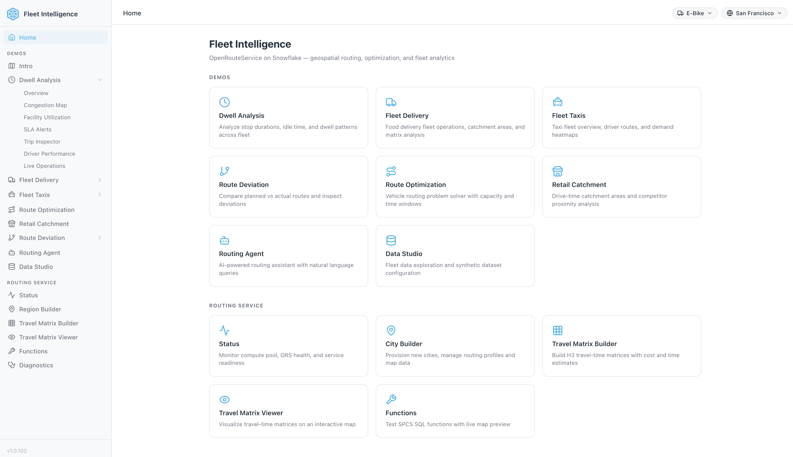

**Build a complete routing platform in minutes using just natural language commands.**

This solution deploys [OpenRouteService](https://openrouteservice.org/) directly in your Snowflake account using **Cortex Code** — Snowflake's AI-powered CLI. It runs as a set of Snowpark Container Services, callable as plain SQL functions. No complex setup, no external APIs, no data leaving Snowflake.

### What You'll Build

🔧 **Openrouteservice on SPCS** - A self-contained routing engine running in Snowpark Container Services with SQL-callable functions.

📍 **Four Powerful Routing Functions:**
- **Directions** - Calculate optimal routes between multiple waypoints
- **Optimization** - Match delivery jobs to vehicles based on time windows, capacity, and skills
- **Isochrones** - Generate catchment polygons showing reachable areas within a given drive time
- **Time-Distance Matrix** - Calculate travel time and distance matrices between multiple locations

📐 **Native GEOGRAPHY Output** — `DIRECTIONS`, `ISOCHRONES`, and `OPTIMIZATION` return route and polygon geometry as a native Snowflake `GEOGRAPHY` column directly — ready for geospatial analysis with `ST_LENGTH`, `ST_AREA`, `ST_WITHIN`, and more.

🗺️ **Any Location** - Customize to Paris, London, New York, or anywhere in the world with downloadable OpenStreetMap data.

🧪 **Function Tester** - An interactive web UI (ORS Control App) to test the routing functions with sample addresses.

### Why This Matters

| Traditional Approach | This Solution |
|---------------------|---------------|
| External API dependencies | Self-contained SPCS deployment |
| Data leaves your environment | Everything stays in Snowflake |
| Complex integration work | Deploy with natural language commands |
| Pay-per-call API limits | Unlimited calls, you control compute |
| Hours of setup | Minutes to deploy |

### Prerequisites

**This is what you will need**:

-   **ACCOUNTADMIN** access to your Snowflake account (or a custom role with CREATE DATABASE, CREATE WAREHOUSE, CREATE COMPUTE POOL, and IMPORT SHARE privileges)
    
-   [Snowpark Container Services Activated](https://docs.snowflake.com/en/developer-guide/snowpark-container-services/overview)

> **_NOTE:_** This is enabled by default with the exception of Free Trials where you would need to contact your snowflake representative to activate it.  

-   [External Access Integration Activated](https://docs.snowflake.com/en/sql-reference/sql/create-external-access-integration) - Required to download map files from the internet

-   **Cortex Code CLI** installed and configured
    - Installation: See the [Cortex Code documentation](https://docs.snowflake.com/en/user-guide/cortex-code/cortex-code) for setup instructions
    - Add to your PATH: `export PATH="$HOME/.local/bin:$PATH"` (add to `~/.zshrc` or `~/.bashrc`)
    - Verify: `cortex --version`

-   **Container Runtime** - One of the following:
    - [Podman](https://podman.io/) (recommended): `brew install podman` (macOS) 
    - [Docker Desktop](https://www.docker.com/products/docker-desktop/)

-   **Node.js >= 20** and npm - Required to build the ORS Control App
    - macOS: `brew install node`
    - Verify: `node --version`

-   [VSCode](https://code.visualstudio.com/download) recommended for running Cortex Code commands

### Route Planning And Optimization Architecture

The architecture below shows the solution which uses Snowpark Container Services to power sophisticated routing and optimisation functions. 

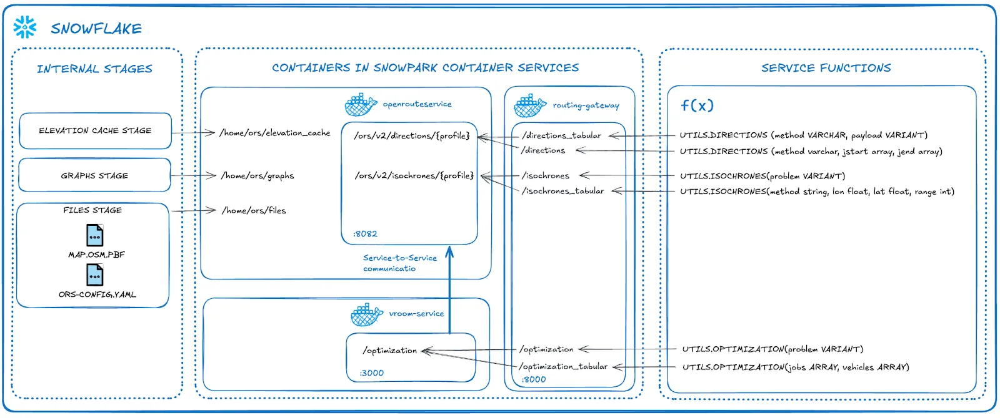

This is a self-contained service which is managed by you. There are no API calls outside of Snowflake and no API limitations. This solution uses a small high-memory pool (HIGHMEM_X64_S) which is capable of running unlimited service calls within **San Francisco** (the default map). If you wish to use a larger map such as Europe or the World, you can increase the size of the compute.


### What You'll Learn 

- Deploy a self-managed routing solution using **Cortex Code** AI-powered CLI with natural language commands
- Use **Snowpark Container Services** to run OpenRouteService as a self-managed routing engine
- Understand **Geospatial** data in Snowflake and how it integrates with routing functions
- Work with 4 routing functions deployed as SQL-callable SPCS services:
  - **Directions** - Simple and multi-waypoint routing based on road network and vehicle profile
  - **Optimization** - Route optimization matching demands with vehicle availability
  - **Isochrones** - Catchment area analysis based on travel time
  - **Time-Distance Matrix** - Calculate travel time and distance matrices between multiple locations
- Call all routing functions directly via **SQL** — including concrete query examples you can run immediately
- Customize map regions and vehicle profiles for your specific use case

<!-- ------------------------ -->
## Build the Routing Solution

Use Cortex Code, Snowflake's AI-powered coding assistant, to deploy the routing solution using natural language commands and automated skills.

### Setup Cortex Code

1. **Clone the repository**:
     ```bash
   git clone https://github.com/Snowflake-Labs/sfguide-create-a-route-optimisation-and-vehicle-route-plan-simulator
     cd sfguide-create-a-route-optimisation-and-vehicle-route-plan-simulator
     ```
   
   **Without Git**: Download the ZIP from the repository and extract it, then navigate to the folder in VS Code

   After cloning, open the folder in VS Code. You should see the following structure in your Explorer:

   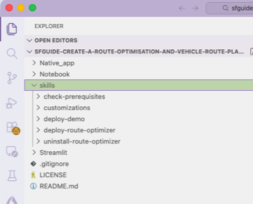

2. **Launch Cortex Code CLI** in the VS Code terminal:
   ```bash
   cortex
   ```

3. **Connect to Snowflake** - Cortex Code will prompt you to select or create a connection.  once a connection has ben created using one of the authentication methods, you will now be able to start cortex code in the terminal by using the **cortex** command which will give you a similar screen as below.

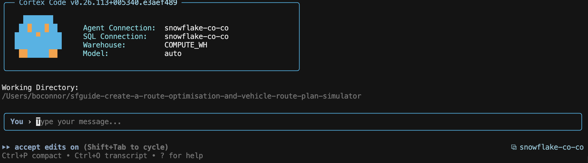

### Understanding Cortex Code Skills

Before running any commands, it's helpful to understand what **skills** are and how they power this solution.

**What are Skills?**

Skills are structured specifications that instruct Cortex Code how to perform a procedure. Think of them as detailed recipes - they define the exact steps, parameters, and verification checks needed to accomplish a task. Each skill is a markdown file that describes:

- **What the skill does** - A clear description of the outcome
- **Step-by-step instructions** - The exact sequence of actions to perform
- **Stopping points** - Where to pause for user input or verification
- **Success criteria** - How to verify the task completed correctly

**Benefits of Using Skills**

| Benefit | Description |
|---------|-------------|
| **Consistency** | Skills ensure the same steps are followed every time, reducing human error |
| **Reusability** | Once created, skills can be shared and reused across projects and teams |
| **Transparency** | You can read the skill file to understand exactly what will happen before running it |
| **Customizability** | Skills can be modified to fit your specific requirements |
| **AI-Assisted Creation** | Cortex Code can help you create new skills from natural language descriptions |

**How This Solution Uses Skills**

This repository demonstrates how skills can manage the **complete lifecycle** of an end-to-end Snowflake analytical solution - from installation through customization to uninstallation. There are multiple pre-built skills in the `.cortex/skills/skill_name/SKILL.md`:

| Stage | Skill | What It Does |
|-------|-------|--------------|
| **✅ Prerequisites** | `routing-prerequisites` | Check and install all build prerequisites (Docker/Podman, Snowflake CLI, Node.js) |
| **📦 Build** | `build-routing-solution` | Deploy the full routing solution: build container images, push to SPCS, run SQL modules |
| **⚙️ Customize** | `routing-customization` | Change the map region, city, or enabled vehicle/routing profiles |
| **🚚 Demo** | `route-optimization` | Deploy the Route Optimization demo with Marketplace data and notebook |
| **🚕 Demo** | `fleet-intelligence-taxis` | Generate realistic taxi driver location data and deploy fleet intelligence dashboards |
| **🛵 Demo** | `deploy-fleet-intelligence-food-delivery` | Deploy the Food Delivery fleet intelligence solution with a React Native app and Streamlit dashboard |
| **🏪 Demo** | `retail-catchment` | Deploy the Retail Catchment Analysis demo using Overture Maps and isochrone analysis |
| **📍 Demo** | `route-deviation` | Deploy the Route Deviation Analysis demo with ETL pipeline and React dashboard |
| **⏱️ Demo** | `dwell-analysis` | Deploy the Dwell & Congestion Analysis pipeline with Dynamic Tables and H3 heatmaps |
| **🤖 Demo** | `routing-agent` | Create a Snowflake Intelligence (Cortex) agent for natural language routing queries |
| **🗑️ Cleanup** | `routing-solution-cleanup` | Discover and drop all Snowflake objects created by this solution |

To run any skill, simply tell Cortex Code:
```
$<skill-name>
```

Cortex Code reads the skill's markdown file and executes each step, asking for input when needed and verifying success before moving on.

> **_TIP:_** Want to see what a skill does before running it? Open the skill's `.md` file in the `.cortex/skills/skill_name/` folder to review the exact steps.

### Verify Prerequisites (Optional)

Run the prerequisites check skill to ensure all dependencies are installed:
   ```
   $routing-prerequisites
   ```

### Build the Routing Solution

To deploy the plain-vanilla app execute command below in Cortex Code:

```
$build-routing-solution
```

If you are also interested in deploying the demos you can type: 

```
$build-routing-solution and deploy all available demoes
```

You can also choose to only deploy specific demoes, just specify them using natural language.

Cortex Code will automatically:
- Create the required databases (`OPENROUTESERVICE_APP`, `SYNTHETIC_DATASETS`, `FLEET_INTELLIGENCE`), stages, and image repository
- Upload configuration files and service specs
- Detect your container runtime (Docker or Podman)
- Build and push all 5 container images
- Run 6 SQL modules to deploy the routing services

The skill will guide you through any required steps, including:
- Selecting your preferred container runtime if both are available
- Authenticating with the Snowflake image registry
- Monitoring the build progress

The skill uses interactive prompting to gather required information.

**What gets installed:**

| Component | Name | Description |
|-----------|------|-------------|
| Database | `OPENROUTESERVICE_APP` | Main database with stages, functions, and SPCS services |
| Database | `SYNTHETIC_DATASETS` | Seed telemetry and trip data for demos |
| Database | `FLEET_INTELLIGENCE` | Fleet demo configuration and region registry |
| Warehouse | `ROUTING_ANALYTICS` | Warehouse for ORS operations |
| Stage | `ORS_SPCS_STAGE` | Configuration files, map data, and service specs |
| Stage | `ORS_GRAPHS_SPCS_STAGE` | Generated routing graphs |
| Stage | `ORS_ELEVATION_CACHE_SPCS_STAGE` | Elevation data cache |
| Image Repository | `IMAGE_REPOSITORY` | 5 container images for SPCS services |
| SPCS Service | `ORS_SERVICE` | OpenRouteService routing engine |
| SPCS Service | `DOWNLOADER` | Downloads OSM map data on demand |
| SPCS Service | `VROOM_SERVICE` | Vehicle Route Problem optimizer |
| SPCS Service | `ROUTING_GATEWAY_SERVICE` | Reverse proxy / concurrency layer |
| SPCS Service | `ORS_CONTROL_APP` | React-based web UI (service manager, function tester, city provisioning) |

Simply confirm each prompt as the skill progresses. The skill handles all the complex setup automatically — creating databases, uploading files, building containers, and deploying all 5 services.

The skill also:
- Loads seed datasets (500 intro routes, 472K telemetry points, 29K travel-time matrix pairs, 460 region catalog entries)
- Installs Overture Maps datasets from Snowflake Marketplace (required for taxi and retail demos)
- Lets you select which demo skills to deploy on top of the base installation

Once complete, the skill prints the ORS Control App URL:

```sql
SHOW ENDPOINTS IN SERVICE OPENROUTESERVICE_APP.CORE.ORS_CONTROL_APP;
SELECT 'https://' || ingress_url AS control_app_url
FROM TABLE(RESULT_SCAN(LAST_QUERY_ID()))
WHERE name = 'ors-control-app';
```

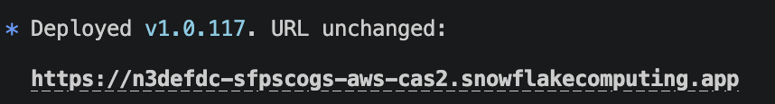

<!-- ------------------------ -->
## Access the ORS Control App

Once deployment completes, the build skill prints the ORS Control App URL. You can also retrieve it at any time by running:

```sql
SHOW ENDPOINTS IN SERVICE OPENROUTESERVICE_APP.CORE.ORS_CONTROL_APP;
SELECT 'https://' || ingress_url AS control_app_url
FROM TABLE(RESULT_SCAN(LAST_QUERY_ID()))
WHERE name = 'ors-control-app';
```

Open the URL in your browser to access the **ORS Control App** — a React-based web dashboard that manages all aspects of the routing solution.

> **_NOTE:_** The ORS Control App is secured by Snowflake authentication. You will be prompted to log in with your Snowflake credentials on first access.

### ORS Control App

The ORS Control App is the central management interface for the routing solution. It provides:

- **Service Manager** - Start/Stop controls for all 5 running SPCS services:
  - **Data Downloader** - Downloads and updates map data
  - **Open Route Service** - Core routing and directions engine
  - **Routing Gateway** - API gateway for routing requests
  - **VROOM Service** - Route optimization engine
  - **ORS Control App** - This web UI itself

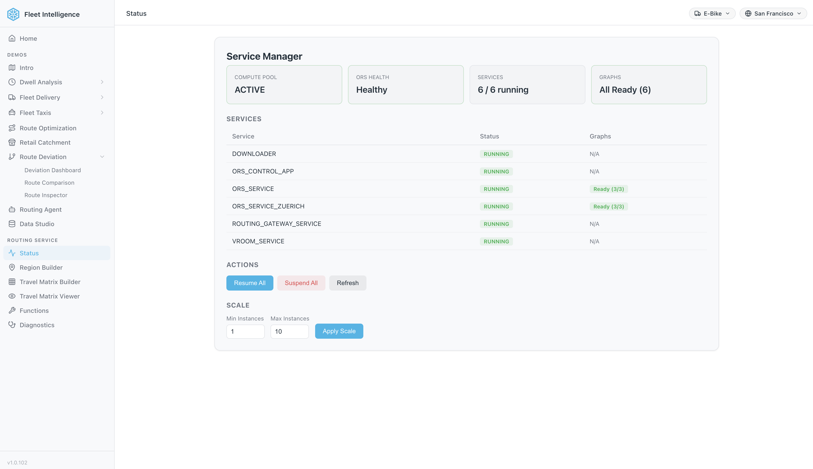

- **Function Tester** - Test all four routing functions interactively with sample addresses
- **City Provisioning** - Browse the region catalog and provision new map regions
- **Matrix Builder** - Build and view travel-time matrix datasets

Use the **Start All** / **Stop All** buttons for bulk service operations, or manage services individually. Click **Refresh Status** to update the dashboard.

> **_TIP:_** All 5 services should show ✅ RUNNING status before using the routing functions.

> **_NOTE:_** Graph build time depends on your configuration:
> - **Map size**: Larger country or state maps take longer than city maps
> - **Vehicle profiles**: Each enabled profile (driving-car, cycling, walking, etc.) generates its own routing graph
>
> A city map with 2 profiles will complete in minutes; a country map with 5+ profiles can take several hours.

<!-- ------------------------ -->
## Function Tester

The ORS Control App includes a **Functions** page for testing all routing functions interactively with a live map preview.

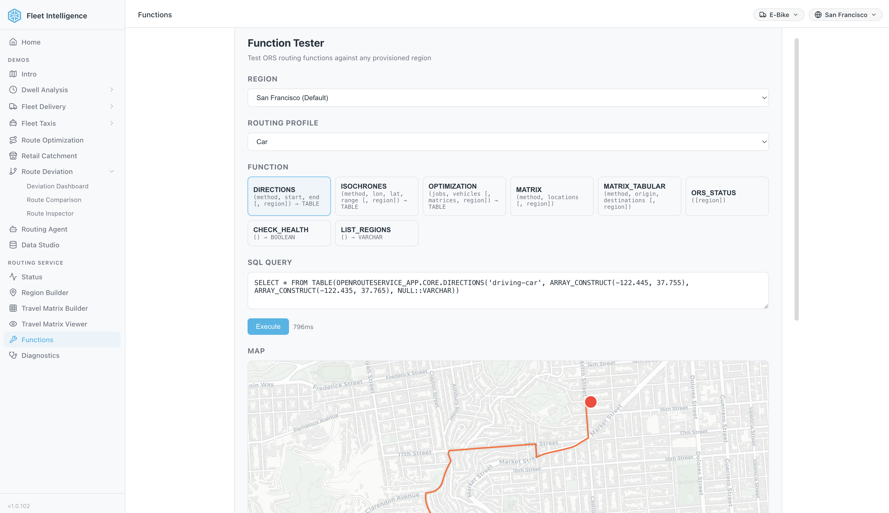

To access the Functions page:
1. Open the ORS Control App URL (printed at the end of the build skill, or retrieved via `SHOW ENDPOINTS IN SERVICE OPENROUTESERVICE_APP.CORE.ORS_CONTROL_APP`)
2. Navigate to the **Functions** page in the app

The Functions page allows you to test all routing functions:

**🗺️ DIRECTIONS**
- Select start and end locations from preset addresses
- Choose a routing profile (car, truck, bicycle)
- View the calculated route on an interactive map
- See step-by-step directions and distance/duration

**🚚 OPTIMIZATION**
- Configure multiple vehicles with different:
  - Time windows (start/end hours)
  - Capacity limits
  - Skill sets (refrigeration, hazardous goods, etc.)
- Add delivery jobs with:
  - Locations
  - Time windows
  - Required skills
- Run the optimization to see assigned routes per vehicle
- View detailed itinerary for each vehicle

**⏰ ISOCHRONES**
- Select a center point location
- Choose travel time in minutes
- Generate a catchment polygon showing how far you can travel
- Useful for delivery zone planning and coverage analysis

**🗺️ TIME-DISTANCE MATRIX**
- Calculate travel time and distance matrices between multiple locations

> **_TIP:_** The Functions page comes pre-configured with San Francisco addresses and default vehicle profiles (car, HGV, electric bicycle). When you customize the deployment, the Functions page is automatically updated with region-specific addresses and your enabled vehicle profiles.

<!-- ------------------------ -->
## Demos

The routing solution includes several optional demos that showcase real-world use cases built on top of the core routing functions. Each demo is deployed independently using a dedicated skill — run any of them after the base installation is complete.

In case you have not done this before, to deploy a demo, tell Cortex Code:
```
$<demo-skill-name>
```

### Dwell Analysis

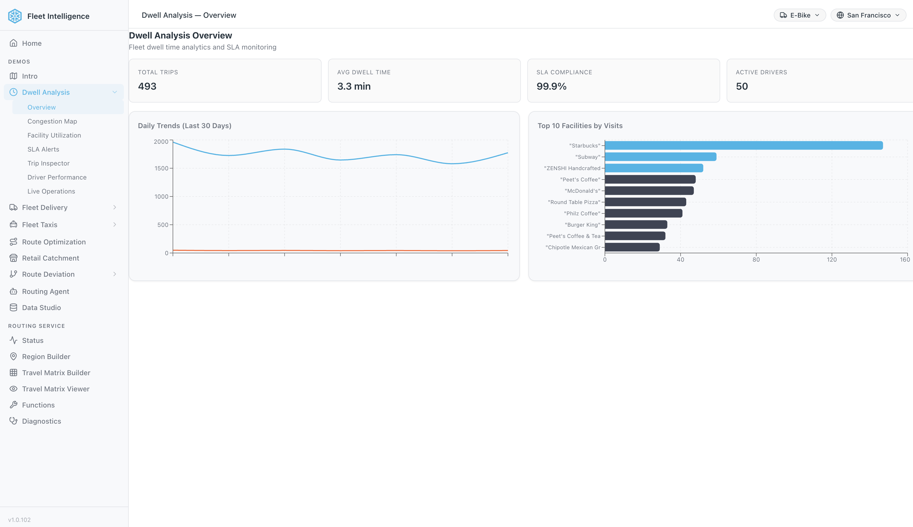

The **Dwell Analysis** demo monitors how long fleet vehicles stop at facilities and tracks SLA compliance across the entire operation. It uses a Dynamic Table pipeline to detect vehicle states, sessionize dwell events, and surface H3 congestion heatmaps.

**Key features:**
- KPI tiles: total trips, average dwell time, SLA compliance rate, active drivers
- Daily Trends chart showing dwell events over the last 30 days
- Top 10 Facilities by Visits ranked bar chart
- Sub-pages: Congestion Map, Facility Utilization, SLA Alerts, Trip Inspector, Driver Performance, Live Operations

To deploy:
```
$dwell-analysis
```

### Fleet Delivery


The **Fleet Delivery** demo provides fleet-wide delivery analytics for courier operations. 

**Key features:**
- KPI tiles: total couriers, deliveries, average delivery time and distance
- Live map of active courier positions across the city
- Deliveries by Hour histogram showing demand patterns
- Top Couriers leaderboard by trip volume
- Sub-pages: Fleet Map, Catchment Panel, Courier Heatmap

To deploy:
```
$deploy-fleet-intelligence-food-delivery
```

### Fleet Taxis

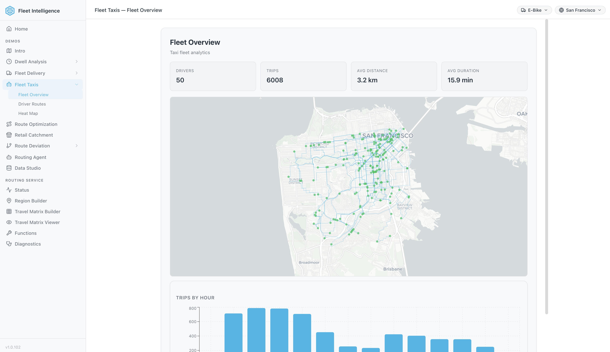

The **Fleet Taxis** demo generates realistic taxi driver location data using Overture Maps and OpenRouteService for actual road routes, then visualizes fleet-wide operations across a configurable city and number of drivers.

**Key features:**
- KPI tiles: total drivers, trips, average distance and duration
- Live map of all active taxi routes across the city
- Trips by Hour histogram showing demand patterns throughout the day
- Sub-pages: Driver Routes, Heat Map

To deploy:
```
$fleet-intelligence-taxis
```

### Route Deviation

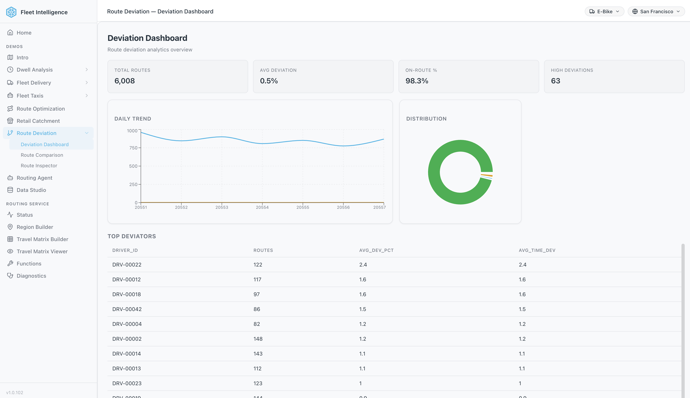

The **Route Deviation** demo identifies drivers and routes that deviate from the planned path. It runs a 3-step ETL pipeline to compute deviation percentages and registers analytical dashboard pages directly into the ORS Control App.

**Key features:**
- KPI tiles: total routes, average deviation %, on-route %, high deviation count
- Daily Trend chart of deviation events over time
- Deviation Distribution donut chart
- Top Deviators table ranked by average deviation percentage
- Sub-pages: Route Comparison, Route Inspector

To deploy:
```
$route-deviation
```

### Retail Catchment

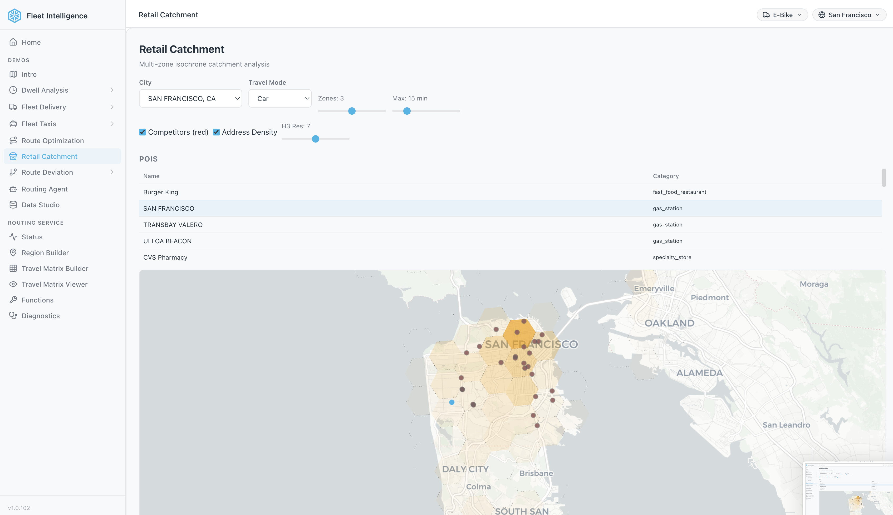

The **Retail Catchment** demo uses isochrone analysis with Overture Maps POI data to visualize how many customers, competitors, and addresses fall within a configurable travel-time zone around any retail location.

**Key features:**
- City and travel mode selectors (Car, Cycling, Walking)
- Configurable zone count and maximum travel time sliders
- H3 resolution control for address density overlays
- Competitor overlay (red markers) and address density heatmap
- POI table listing nearby points of interest by category
- Multi-zone isochrone map with overlapping catchment rings

To deploy:
```
$retail-catchment
```

### Routing Agent

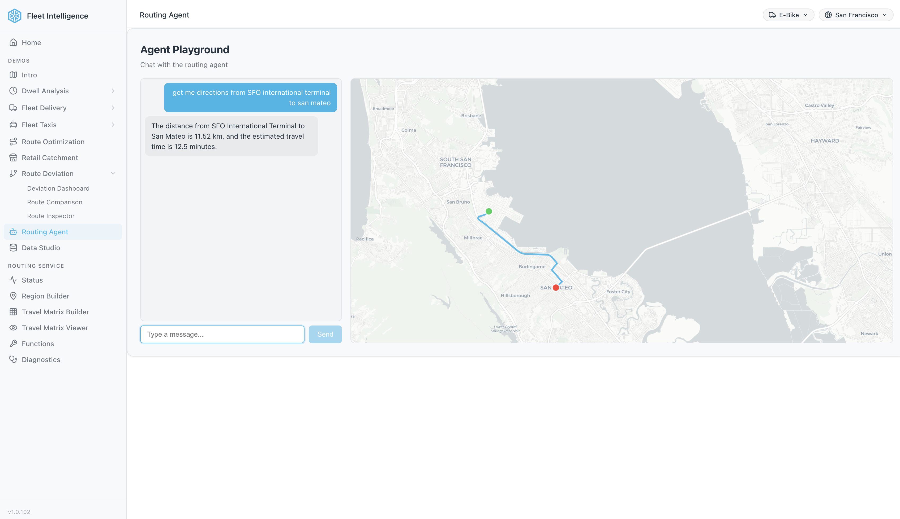

The **Routing Agent** demo creates a Snowflake Intelligence (Cortex) agent that answers natural language routing queries. Users can ask for directions, estimate travel times, or explore isochrones through a conversational interface with the route rendered live on a map.

**Key features:**
- Natural language chat interface connected to the ORS routing functions
- Route results visualized on an interactive map alongside the text response
- Supports directions, isochrones, and time-distance queries in plain English

To deploy:
```
$routing-agent
```

<!-- ------------------------ -->
## SQL Function Reference

All routing functions are deployed as SQL functions inside the `OPENROUTESERVICE_APP` database and can be called directly from any Snowflake worksheet, notebook, or application. The functions live under `OPENROUTESERVICE_APP.CORE`.

### Function Overview

| Function | Signature | Returns | Description |
|----------|-----------|---------|-------------|
| `DIRECTIONS` | `(method VARCHAR, jstart ARRAY, jend ARRAY [, region VARCHAR])` | `TABLE(RESPONSE VARIANT, GEOJSON GEOGRAPHY, DISTANCE FLOAT, DURATION FLOAT)` | Point-to-point directions with route geometry |
| `DIRECTIONS` | `(method VARCHAR, locations VARIANT [, region VARCHAR])` | `TABLE(RESPONSE VARIANT, GEOJSON GEOGRAPHY, DISTANCE FLOAT, DURATION FLOAT)` | Multi-waypoint directions with route geometry |
| `ISOCHRONES` | `(method VARCHAR, lon FLOAT, lat FLOAT, range NUMBER [, region VARCHAR])` | `TABLE(RESPONSE VARIANT, GEOJSON GEOGRAPHY)` | Catchment area polygon |
| `OPTIMIZATION` | `(jobs ARRAY, vehicles ARRAY, matrices ARRAY [, region VARCHAR])` | `TABLE(RESPONSE VARIANT, GEOJSON GEOGRAPHY, VEHICLE NUMBER, DURATION NUMBER, STEPS VARIANT)` | Route optimization (tabular) |
| `OPTIMIZATION` | `(challenge VARIANT [, region VARCHAR])` | `TABLE(RESPONSE VARIANT, GEOJSON GEOGRAPHY, VEHICLE NUMBER, DURATION NUMBER, STEPS VARIANT)` | Route optimization (raw) |
| `MATRIX` | `(method VARCHAR, locations ARRAY [, region VARCHAR])` | `VARIANT` | Time-distance matrix (tabular) |
| `MATRIX` | `(method VARCHAR, options VARIANT [, region VARCHAR])` | `VARIANT` | Time-distance matrix (raw) |
| `ORS_STATUS` | `([region VARCHAR])` | `VARIANT` | Service health and graph info |

### SQL Examples

> **_NOTE:_** All functions accept an optional `REGION VARCHAR` parameter (defaults to `NULL` = current region). `DIRECTIONS`, `ISOCHRONES`, and `OPTIMIZATION` are table functions — call them with `SELECT * FROM TABLE(func(...))`. `MATRIX` and `ORS_STATUS` are scalar functions — call them with `SELECT func(...)`.

**Directions: Point-to-Point**

Calculate a driving route between two coordinates (longitude, latitude):

```sql
SELECT * FROM TABLE(OPENROUTESERVICE_APP.CORE.DIRECTIONS(
    'driving-car',
    [-122.4194, 37.7749],   -- start: [lon, lat]
    [-122.4783, 37.8199]    -- end:   [lon, lat]
));
-- Returns: RESPONSE (variant), GEOJSON (geography), DISTANCE (float, meters), DURATION (float, seconds)
```

**Directions: Multi-Waypoint**

Route through multiple stops by passing a `locations` object as VARIANT using `PARSE_JSON`:

```sql
SELECT * FROM TABLE(OPENROUTESERVICE_APP.CORE.DIRECTIONS(
    'driving-car',
    PARSE_JSON('{"coordinates": [
        [-122.4194, 37.7749],
        [-122.4078, 37.7941],
        [-122.4783, 37.8199]
    ]}')
));
-- Returns: RESPONSE (variant), GEOJSON (geography), DISTANCE (float, meters), DURATION (float, seconds)
```

**Isochrones**

Generate a polygon showing the area reachable within 10 minutes of driving. Cast `lon` and `lat` to `FLOAT`:

```sql
SELECT * FROM TABLE(OPENROUTESERVICE_APP.CORE.ISOCHRONES(
    'driving-car',
    -122.4194::FLOAT,   -- longitude
    37.7749::FLOAT,     -- latitude
    10                  -- range in minutes
));
-- Returns: RESPONSE (variant), GEOJSON (geography)
```

**Optimization: Tabular**

Match delivery jobs to vehicles using arrays of jobs and vehicles:

```sql
SELECT * FROM TABLE(OPENROUTESERVICE_APP.CORE.OPTIMIZATION(
    -- jobs: array of delivery tasks
    [
        {'id': 1, 'location': [-122.4194, 37.7749], 'service': 300},
        {'id': 2, 'location': [-122.4078, 37.7941], 'service': 300},
        {'id': 3, 'location': [-122.4350, 37.7609], 'service': 300}
    ],
    -- vehicles: array of available vehicles
    [
        {'id': 1, 'profile': 'driving-car', 'start': [-122.4177, 37.8080], 'end': [-122.4177, 37.8080], 'capacity': [4], 'time_window': [28800, 43200]},
        {'id': 2, 'profile': 'driving-car', 'start': [-122.3950, 37.7785], 'end': [-122.3950, 37.7785], 'capacity': [4], 'time_window': [28800, 43200]}
    ],
    -- matrices (optional, empty array uses ORS to calculate)
    []
));
-- Returns: RESPONSE (variant), GEOJSON (geography), VEHICLE (int), DURATION (int), STEPS (variant)
```

**Optimization: Raw Variant**

Pass a full VROOM-compatible JSON challenge:

```sql
SELECT * FROM TABLE(OPENROUTESERVICE_APP.CORE.OPTIMIZATION(
    PARSE_JSON('{
        "jobs": [
            {"id": 1, "location": [-122.4194, 37.7749], "service": 300},
            {"id": 2, "location": [-122.4078, 37.7941], "service": 300}
        ],
        "vehicles": [
            {"id": 1, "profile": "driving-car", "start": [-122.4177, 37.8080], "end": [-122.4177, 37.8080], "capacity": [4]}
        ]
    }')
));
-- Returns: RESPONSE (variant), GEOJSON (geography), VEHICLE (int), DURATION (int), STEPS (variant)
```

**Matrix: Tabular**

Calculate the time and distance matrix between multiple locations:

```sql
SELECT OPENROUTESERVICE_APP.CORE.MATRIX(
    'driving-car',
    ARRAY_CONSTRUCT(
        ARRAY_CONSTRUCT(-122.4194, 37.7749),
        ARRAY_CONSTRUCT(-122.4078, 37.7941),
        ARRAY_CONSTRUCT(-122.4783, 37.8199)
    )
) AS matrix;
```

**Matrix: Raw Variant**

Pass full matrix options for advanced control (sources, destinations, metrics):

```sql
SELECT OPENROUTESERVICE_APP.CORE.MATRIX(
    'driving-car',
    PARSE_JSON('{
        "locations": [[-122.4194, 37.7749], [-122.4078, 37.7941], [-122.4783, 37.8199]],
        "metrics": ["distance", "duration"],
        "resolve_locations": true,
        "sources": [0],
        "destinations": [1, 2]
    }')
) AS matrix;
```

**ORS Status**

Check service health and available routing profiles:

```sql
SELECT OPENROUTESERVICE_APP.CORE.ORS_STATUS() AS status;
```

### Native GEOGRAPHY Output

`DIRECTIONS`, `ISOCHRONES`, and `OPTIMIZATION` are table functions that return a `GEOJSON GEOGRAPHY` column directly alongside the full `RESPONSE VARIANT`. There are no separate `_GEO` wrapper functions — geography output is built in.

| Function | GEOGRAPHY column | Additional columns |
|----------|------------------|--------------------|
| `DIRECTIONS` | `GEOJSON` — route LineString | `DISTANCE` (meters), `DURATION` (seconds) |
| `ISOCHRONES` | `GEOJSON` — catchment Polygon | — |
| `OPTIMIZATION` | `GEOJSON` — vehicle route LineString | `VEHICLE` (id), `DURATION` (seconds), `STEPS` (variant) |

### Geospatial Integration Patterns

The `GEOJSON GEOGRAPHY` column returned by `DIRECTIONS`, `ISOCHRONES`, and `OPTIMIZATION` can be chained directly with Snowflake's built-in geospatial functions:

**Route length in kilometers:**

```sql
SELECT
    ST_LENGTH(GEOJSON) / 1000 AS route_length_km,
    DISTANCE / 1000 AS ors_distance_km,
    DURATION / 60 AS duration_minutes
FROM TABLE(OPENROUTESERVICE_APP.CORE.DIRECTIONS(
    'driving-car', [-122.4194, 37.7749], [-122.4783, 37.8199]
));
```

**Isochrone area in square kilometers:**

```sql
SELECT
    ST_AREA(GEOJSON) / 1000000 AS catchment_area_sq_km
FROM TABLE(OPENROUTESERVICE_APP.CORE.ISOCHRONES(
    'driving-car', -122.4194::FLOAT, 37.7749::FLOAT, 15
));
```

**Check if a point falls within an isochrone:**

```sql
SELECT
    ST_WITHIN(
        ST_MAKEPOINT(-122.4078, 37.7941),
        GEOJSON
    ) AS is_reachable
FROM TABLE(OPENROUTESERVICE_APP.CORE.ISOCHRONES(
    'driving-car', -122.4194::FLOAT, 37.7749::FLOAT, 10
));
```

<!-- ------------------------ -->
## ORS Configuration

The routing solution is configured via the `ors-config.yml` file which controls:

**Map Source File**
```yml
ors:
  engine:
    profile_default:
      build:  
        source_file: /home/ors/files/SanFrancisco.osm.pbf
```
The default deployment uses San Francisco. When you customize the map region, this path is updated automatically.

**Routing Profiles**

The configuration defines which routing profiles are available for routing:

| Profile | Description | Default |
|---------|-------------|---------|
| `driving-car` | Standard passenger vehicle | ✅ Enabled |
| `driving-hgv` | Heavy goods vehicle (trucks) | ✅ Enabled |
| `cycling-road` | Road bicycle | ❌ Disabled |
| `cycling-regular` | Regular bicycle | ❌ Disabled |
| `cycling-mountain` | Mountain bicycle | ❌ Disabled |
| `cycling-electric` | Electric bicycle | ✅ Enabled |
| `foot-walking` | Pedestrian walking | ❌ Disabled |
| `foot-hiking` | Hiking trails | ❌ Disabled |
| `wheelchair` | Wheelchair accessible | ❌ Disabled |

> **_NOTE:_** Enabling more profiles increases graph build time and compute resource usage. The default configuration covers most delivery and logistics use cases.

**Optimization Limits**

The config also controls route optimization capacity:
```yml
    matrix:
      maximum_visited_nodes: 100000000
      maximum_routes: 250000
```
These settings support complex route optimizations with many vehicles and delivery points.

<!-- ------------------------ -->
## Customize Your Deployment

All the customization (location, routing profiles) can be managed via the application itself in the region builder section.
[region_builder](assets/region_builder.png)

Just use the UI to configure different locations and vehicle. Below example for New York. 
[region_builder_example](assets/region_builder_example.png)

<!-- ------------------------ -->
## Uninstall the Route Optimizer

Cortex Code makes uninstallation simple with natural language commands.

### Uninstall demo

To remove the Snowflake objects installed as part of the demo you can type in Cortex Code CLI:

```
$routing-solution-cleanup
```

Or drop the objects manually:

```sql
DROP DATABASE IF EXISTS OPENROUTESERVICE_APP;
DROP DATABASE IF EXISTS SYNTHETIC_DATASETS;
DROP DATABASE IF EXISTS FLEET_INTELLIGENCE;
DROP WAREHOUSE IF EXISTS ROUTING_ANALYTICS;
```

This will remove:
- The `OPENROUTESERVICE_APP` database (including all stages, functions, and SPCS services)
- The `SYNTHETIC_DATASETS` and `FLEET_INTELLIGENCE` databases (seed data and fleet demos)
- The `ROUTING_ANALYTICS` warehouse

> **_NOTE:_** The `routing-solution-cleanup` skill auto-discovers all objects created by the skills via COMMENT tracking tags, so it will also clean up any demo objects (fleet intelligence, route deviation, retail catchment, etc.).

<!-- ------------------------ -->
## Conclusion and Resources
### Conclusion

You've just deployed a **self-contained routing solution** in Snowflake using natural language commands - no complex configuration files, no external API dependencies, and no data leaving your Snowflake environment.

This solution demonstrates the power of combining:
- **Cortex Code** - AI-powered CLI that turns natural language into automated workflows
- **Snowpark Container Services** - Running OpenRouteService as a self-managed routing engine
- **SQL-Callable Functions** - Routing functions for directions, optimization, isochrones, and time-distance matrix

The key advantage of this approach is **flexibility without complexity**. Want to switch from San Francisco to Paris? Just run the location customization skill. Need to add walking or cycling routes? Enable additional routing profiles. The skill-based approach means you only run the steps you need.

### What You Learned

- **Deploy with Cortex Code** - Use natural language skills to automate complex Snowflake deployments including container services, stages, and compute pools

- **Self-Managed Route Optimization** - Run OpenRouteService entirely within Snowflake with no external API calls, giving you unlimited routing requests and complete data privacy

- **Flexible Customization** - Use skills to customize location (any city in the world) and vehicle types (car, HGV, bicycle, walking)

- **Four Routing Functions:**
    - **Directions** - Point-to-point and multi-waypoint routing
    - **Optimization** - Match delivery jobs to vehicles based on time windows, capacity, and skills
    - **Isochrones** - Generate catchment polygons showing reachable areas
    - **Time-Distance Matrix** - Calculate travel time and distance matrices between multiple locations

- **Native GEOGRAPHY Output** — `DIRECTIONS`, `ISOCHRONES`, and `OPTIMIZATION` return route and polygon geometry as a native `GEOGRAPHY` column directly — no JSON parsing or wrapper functions needed

### Next Steps

Deploy the demo to see the routing functions in action with real-world POI data:

👉 **[Deploy Route Optimization Demo](../oss-deploy-route-optimization-demo/)**

### Related Resources

#### Source code

- [Source Code on Github](https://github.com/Snowflake-Labs/sfguide-Create-a-Route-Optimisation-and-Vehicle-Route-Plan-Simulator)

#### OpenRouteService Resources

- [OpenRouteService Official Website](https://openrouteservice.org/) - Documentation, API reference, and community resources
- [OpenRouteService on GitHub](https://github.com/GIScience/openrouteservice) - Source code and technical documentation
- [VROOM Project](https://github.com/VROOM-Project/vroom) - Vehicle Routing Open-source Optimization Machine powering route optimization

#### Cortex Code

- [Cortex Code](https://docs.snowflake.com/en/user-guide/cortex-code/cortex-code) - Snowflake's AI-powered CLI and agentic interface
- [Snowpark Container Services](https://docs.snowflake.com/en/developer-guide/snowpark-container-services/overview) - Run containerized workloads natively in Snowflake

#### Map Data Sources

- [Geofabrik Downloads](https://download.geofabrik.de/) - Country and region OpenStreetMap extracts
- [BBBike Extracts](https://extract.bbbike.org/) - City-specific OpenStreetMap extracts for faster processing