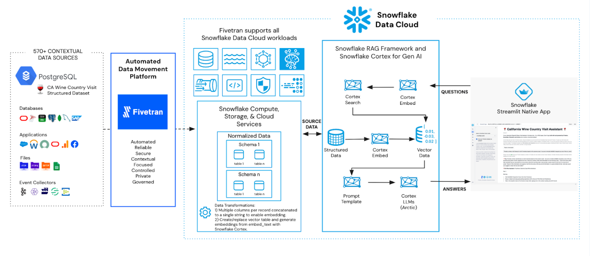

author: Fivetran Staff
id: rag-chatbot-on-structured-data-with-fivetran
summary: This solution architecture helps you understand how to build a retrieval augmented generation (RAG) application in Snowflake using structured PostgreSQL data.
categories: snowflake-site:taxonomy/solution-center/certification/partner-solution
environments: web
language: en
status: Published
feedback link: https://github.com/Snowflake-Labs/sfguides/issues
fork repo link: https://github.com/Snowflake-Labs/sfguide-rag-chatbot-using-snowflake-and-fivetran/

# Build a RAG-based Chatbot using Fivetran and Snowflake
<!-- ------------------------ -->
## Overview

This solution architecture helps you understand how to build a retrieval augmented generation (RAG) application in Snowflake using structured PostgreSQL data. Some of the use cases are described below.

* Leverage Fivetran to connect to and sync PostgreSQL data into Snowflake
* Process structured data for RAG applications
* Build a chatbot to interact with your data to plan California wine country visits

<!-- ------------------------ -->
## Solution Architecture: RAG-based California Wine Country Visit Assistant

* Fivetran reliably and securely moves PostgreSQL data into Snowflake
* Structured data is processed and Cortex is used to create embeddings for downstream RAG application
* Streamlit application provides a question/answer chat capability powered by Snowflake Cortex

<!-- ------------------------ -->
## Get Started

- [view quickstart](https://quickstarts.snowflake.com/guide/fivetran_vineyard_assistant_chatbot/#0)
- [fork repo](https://github.com/Snowflake-Labs/sfguide-rag-chatbot-using-snowflake-and-fivetran/)
- [Download reference architecture](https://www.snowflake.com/content/dam/snowflake-site/developers/2024/10/RAG-based-Chatbot-using-Structured-Data-with-Fivetran-and-Snowflake.pdf)
- [Read the blog](https://medium.com/snowflake/rethinking-the-use-of-structured-data-in-rag-an-example-with-fivetran-and-snowflake-d524f939d6ba)
