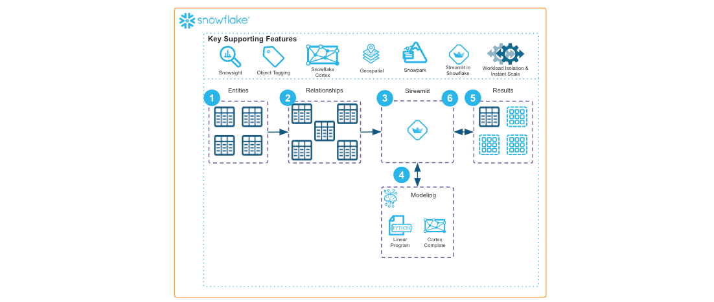

author: Brett Klein
id: supply-chain-network-optimization-using-snowpark-and-cortex
summary: The solution architecture shows how to optimize supply chain networks by solving for production planning, inbound purchasing, outbound selling, and transportation logistics decisions using Linear Programming.
categories: snowflake-site:taxonomy/solution-center/certification/community-solution
environments: web
language: en
status: Published
feedback link: https://github.com/Snowflake-Labs/sfguides/issues
fork repo link: https://github.com/Snowflake-Labs/sfquickstarts/tree/master/site/sfguides/src/supply-chain-network-optimization-using-snowpark-and-cortex

# Supply chain network optimization using Linear Programming
<!-- ------------------------ -->
## Overview

The solution architecture shows how to optimize supply chain networks by solving for production planning, inbound purchasing, outbound selling, and transportation logistics decisions using Linear Programming.

* Use Faker() library to create datasets for Factory, Distributor, and Customer entities
* Leverage Snowpark dataframes to create views for shipments, distributor\_rates and so on
* Invoke Snowflake Cortex LLM SQL functions to enrich the dataset with additional fields
* Using the PuLP package (a Linear Programming modeler) and CBC solver for minimizing distance, minimizing freight costs and minimizing total fulfillment costs
* Build a Streamlit application to serve as a web interface for supply chain decision makers to use this solution

<!-- ------------------------ -->
## Solution Architecture: Supply Chain Network Optimization using Snowpark

* Demonstrates Supply Chain Network Optimization entirely on Snowflake
* Explains linear programming and how it can benefit customers
* Demonstrates using Snowflake Cortex LLM functions to enrich supply chain data
* Includes geospatial analytics and Streamlit UI

<!-- ------------------------ -->
## Get Started

- [view quickstart](https://medium.com/snowflake/supply-chain-network-optimization-on-snowflake-%EF%B8%8F-521bfc05d4ce)
- [fork repo](https://github.com/Snowflake-Labs/emerging-solutions-toolbox/tree/main/sfguide-supply-chain-network-optimization)
- [Download reference architecture](https://www.snowflake.com/content/dam/snowflake-site/developers/2024/05/Supply-Chain-Network-Optimization-Reference-Architecture.pdf)
- [Explore emerging solutions toolbox](https://emerging-solutions-toolbox.streamlit.app/)
