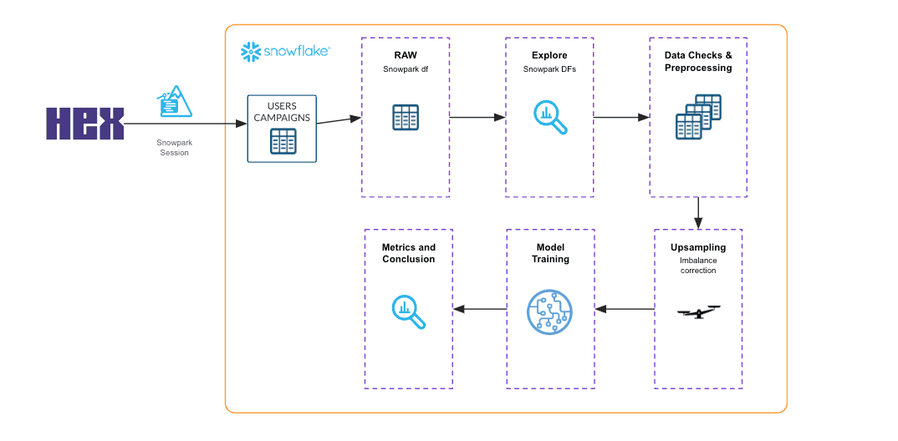

author: Hex Staff
id: time-series-forecasting-using-snowpark-and-hex
summary: This solution architecture shows how to use Snowpark User-Defined Table Functions to forecast the foot traffic of a restaurant chain by locations.
categories: snowflake-site:taxonomy/solution-center/certification/partner-solution
environments: web
language: en
status: Published
feedback link: https://github.com/Snowflake-Labs/sfguides/issues
fork repo link: https://app.hex.tech/hex-public/app/7f067f-89e8-a12-94ea-0ef4f5b1c0b5/latest

# Parallelized Time Series Analysis of Restaurant Foot Traffic
<!-- ------------------------ -->
## Overview

This solution architecture shows how to use Snowpark User-Defined Table Functions to forecast the foot traffic of a restaurant chain by locations. 

* Run pre-processing and feature engineering using Snowpark
* Use Snowpark UDTF to train several forecasting models in parallel for different store locations

<!-- ------------------------ -->
## Solution Architecture: Time series forecasting with Snowpark UDTF and Hex

* In this use-case, you learn how to use Snowpark to analyze the store locations and customer traffic data.
* The solution shows how to use Snowpark UDTFs to train several ML models in parallel.

<!-- ------------------------ -->
## Get Started

- [view quickstart](https://app.hex.tech/hex-public/app/ef7f067f-89e8-4b12-94ea-0ef4f5b1c0b5/latest)
- [Download reference architecture](https://www.snowflake.com/content/dam/snowflake-site/developers/2024/04/Partitioned-and-parallelized-time-series-forecasting-for-store-locations.pdf)
- [Read the blog](https://medium.com/snowflake/time-series-analysis-using-snowpark-be49786b381e)
